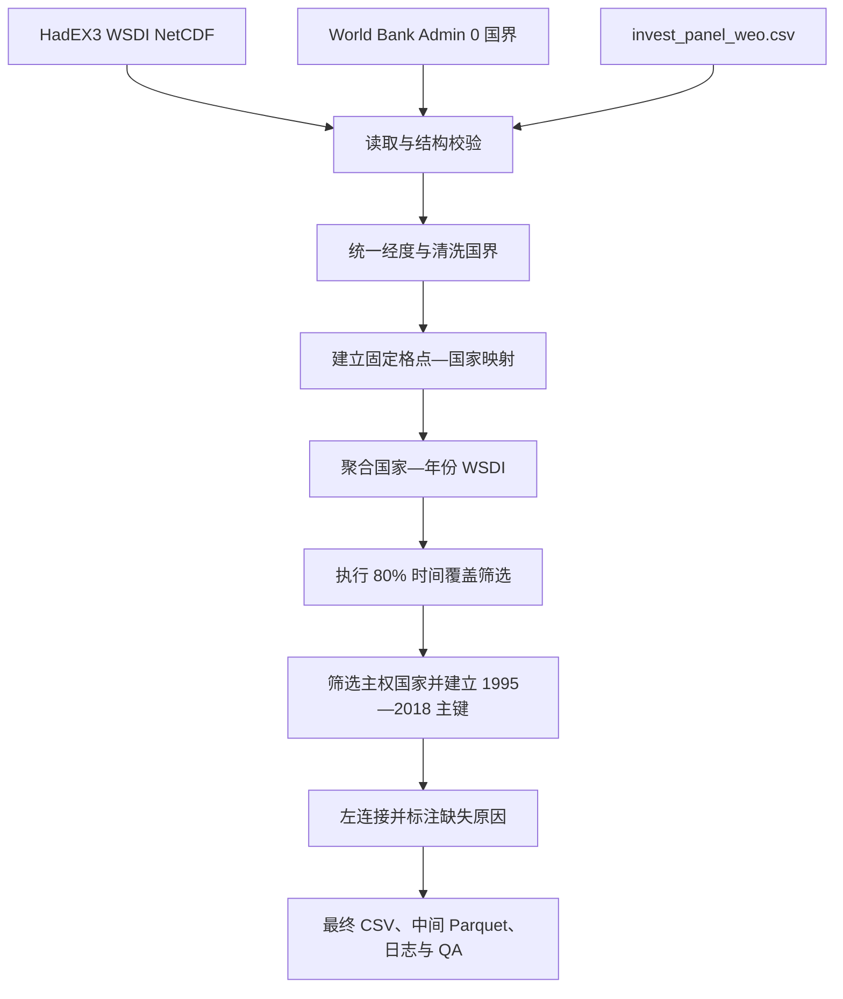

# WSDI 指标构建 Workflow 与字段解读

本文档说明如何将 HadEX3 的网格化 WSDI 数据构建为国家—年份指标，并逐项解释最终面板、中间结果、日志和 QA 文件中的所有字段。本文档对应当前项目中的正式实现与实际产物，目标样本为 `invest_panel_weo.csv` 中剔除香港和台湾后的 61 个主权国家，实证期为 1995—2018 年。

最终合并主键为 **`iso3 + year`**，回归中使用的核心气候指标为 **`wsdi_days`**。

## 1. 文档目的与最终产物

本 Workflow 有三个用途：

1. 复现从 HadEX3 NetCDF 到国家—年份 WSDI 的完整处理过程；
2. 区分核心气候指标、数据覆盖指标、来源元数据和审计指标；
3. 为实证合并、缺失处理、质量检查和研究复核提供统一口径。

### 1.1 主要产物

| 文件 | 层级 | 作用 |
|---|---|---|
| `data/processed/wsdi_sovereign61_1995_2018.csv` | 最终数据 | 61 个主权国家 × 1995—2018 年的平衡主键面板，共 1,464 行；WSDI 不可用时仍保留主键并标明原因 |
| `data/processed/wsdi_country_year_1951_2018.parquet` | 中间数据 | 通过 80% 时间覆盖筛选的 109 个国家或地区的国家—年份 WSDI，共 7,352 行 |
| `logs/country_grid_membership.csv` | 空间审计 | 固定的“网格中心点—国家”归属表 |
| `logs/country_coverage.csv` | 时间覆盖审计 | 每个具有网格中心点的国家的有效年份数和覆盖率 |
| `logs/spatial_join_conflicts.csv` | 空间审计 | 同一网格中心点被分配给多个国家时的冲突记录 |
| `logs/countries_without_grid.csv` | 空间审计 | 没有任何 HadEX3 网格中心落入其边界的国家或地区 |
| `logs/excluded_non_sovereign.csv` | 样本审计 | 从目标面板剔除的香港和台湾记录 |
| `logs/input_hashes.csv` | 来源审计 | 四个原始输入文件的大小和 SHA256 指纹 |
| `logs/qa_summary.json` | 总体 QA | 参数、数据规模、空间匹配、时间覆盖、目标输出及文件路径汇总 |

### 1.2 指标分层

| 类型 | 字段示例 | 应如何使用 |
|---|---|---|
| 核心气候指标 | `wsdi_days` | 表示国家年度暖持续事件日数，是实证分析的主要解释变量或冲击变量 |
| 年度空间覆盖指标 | `n_valid_cells`、`n_total_cells`、`grid_coverage_rate` | 判断某国某年的国家均值由多少有效网格支持，不应替代 WSDI 本身 |
| 长期时间覆盖指标 | `n_valid_years_1951_2018`、`time_coverage_rate`、`passes_time_coverage` | 判断一个国家是否满足长期数据完整性门槛 |
| 来源与方法元数据 | `wsdi_source_dataset`、`wsdi_source_version`、`base_period`、`aggregation` | 固化数据版本和聚合口径，保证结果可复现 |
| 状态与缺失指标 | `wsdi_source_status`、`wsdi_missing_reason` | 区分可用观测与不同类型的结构性缺失 |
| 审计指标 | 日志字段、`qa_summary.json` | 验证构建过程、输入一致性和输出规模，不直接作为气候冲击变量 |

## 2. WSDI 指标的定义与正确解读

### 2.1 网格层面的定义

HadEX3 文件中的 WSDI 全称为 **Warm Spell Duration Index（暖持续指数）**，单位为天。其 NetCDF 元数据定义为：在每日最高气温 `TX` 高于相应日历日第 90 百分位阈值的事件中，连续达到或超过 6 天的事件所贡献的总天数。当前文件使用 1961—1990 年作为百分位阈值的基准期。

令：

- (g) 表示 HadEX3 网格；
- (t) 表示年份；
- (d) 表示日历日；
- (TX_{gtd}) 表示网格 (g) 在年份 (t)、日期 (d) 的日最高气温；
- (TX90_{gd}^{1961-1990}) 表示基于 1961—1990 年计算的相应日历日第 90 百分位阈值；
- (I_{gtd}=1) 表示该日属于一段至少连续 6 天满足 (TX>TX90) 的暖事件，否则为 0。

则网格年度 WSDI 为：

\[
WSDI_{g,t}=\sum_d I_{gtd}
\]

### 2.2 国家层面的构建指标

当前方案先用网格中心点判断国家归属，然后对一个国家在某年的所有有效网格 WSDI 做非加权算术平均：

\[
WSDI_{c,t}=\frac{1}{N^{valid}_{c,t}}\sum_{g\in G_c,\ valid}WSDI_{g,t}
\]

其中：

- (G_c) 是中心点位于国家 (c) 边界内的网格集合；
- (N^{valid}_{c,t}) 是国家 (c) 在年份 (t) 有非缺失 WSDI 的网格数；
- 输出中的 (WSDI_{c,t}) 即 `wsdi_days`。

虽然原始网格 WSDI 是“天数”，国家均值可以为小数。例如 `wsdi_days = 8.27` 表示该国有效网格在该年的 WSDI 平均约为 8.27 天，并不表示全国共同经历了精确的 8.27 天。

### 2.3 正确解读与常见误区

- 数值越高，说明该国网格平均经历的暖持续事件日数越多。
- WSDI 统计的是符合条件的**总日数**，不是暖事件的发生次数。
- WSDI 不表示超过阈值的温度幅度；两国可以有相同日数但不同的升温强度。
- WSDI 不是人口加权暴露，也不是受影响人口、灾害损失或经济损失。
- `wsdi_days = 0` 表示有观测且该年没有符合定义的暖持续日；缺失值表示数据不可用。两者不能互换。
- 当前国家均值不是面积加权。经纬网格在不同纬度代表的实际面积不同，因此该口径更准确地称为“有效网格中心的算术平均”。

## 3. 数据输入与分析范围

| 输入文件 | 当前口径 | 在 Workflow 中的作用 |
|---|---|---|
| `HadEX3-0-4_wsdi_ann_1961-1990.nc` | HadEX3 3.0.4；原始年份 1901—2018；144 个纬度、192 个经度；基准期 1961—1990；单位为天 | 提供年度网格 WSDI；构建时选择 1951—2018 共 68 年 |
| `World Bank Official Boundaries - Admin 0.gpkg` | 图层 `WB_GAD_ADM0`；251 条原始要素，按 ISO3 融合后 245 个边界对象 | 判断网格中心属于哪个国家 |
| `invest_panel_weo.csv` | 1,827 行、63 个 ISO3、1995—2023 年 | 提供国家名称和目标主键；剔除 `HKG`、`TWN`，再截取 1995—2018 年 |
| `WSDI指标.pdf` | 研究方法参考材料 | 固化指标构建背景与研究口径，并纳入输入文件指纹 |

### 3.1 时间范围为何分成两层

- **气候覆盖期 1951—2018**：用于判断一个国家是否具有足够长期的 HadEX3 数据，并生成中间国家年度数据。
- **实证期 1995—2018**：与研究所需面板期一致，用于最终 61 国面板。
- **基准期 1961—1990**：用于定义每个日历日的第 90 百分位温度阈值，不是最终实证样本期。

### 3.2 主权国家处理

`invest_panel_weo.csv` 原有 63 个 ISO3。构建脚本明确剔除：

- `HKG`：Hong Kong SAR；
- `TWN`：Taiwan Province of China。

剔除后保留 61 个目标国家。`logs/excluded_non_sovereign.csv` 保存被剔除的全部 58 条源面板记录，即 2 个代码 × 1995—2023 共 29 年；该日志不只包含最终实证期。

## 4. 软件环境与复现命令

### 4.1 环境创建或更新

首次配置：

```powershell
conda env create -f environment.yml
```

已有 `wsdi` 环境时更新：

```powershell
conda env update -n wsdi -f environment.yml --prune
```

### 4.2 正式构建

推荐从项目根目录通过 Conda 启动，以确保 `GDAL_DATA` 和 `PROJ_DATA` 等地理库变量被正确加载：

```powershell
conda run -n wsdi --no-capture-output python scripts/build_wsdi_country.py
```

默认参数等价于：

```powershell
conda run -n wsdi --no-capture-output python scripts/build_wsdi_country.py `
  --climate-start-year 1951 `
  --climate-end-year 2018 `
  --empirical-start-year 1995 `
  --empirical-end-year 2018 `
  --coverage-threshold 0.80 `
  --boundary-layer WB_GAD_ADM0
```

### 4.3 自动化测试

测试文件使用 Python 标准库 `unittest`，当前 `environment.yml` 不要求安装 `pytest`。运行全部 17 项测试：

```powershell
conda run -n wsdi --no-capture-output python -W error -m unittest discover `
  -s tests -p "test_build_wsdi_country.py" -v
```

使用 `conda run` 很重要：直接调用 `C:\Users\chenyu\miniforge3\envs\wsdi\python.exe` 不会自动设置 GDAL/PROJ 数据目录，可能在 `-W error` 下把 `pyogrio` 的环境警告升级为错误。

## 5. 端到端数据流



核心数据关系如下：

```text
网格年度 WSDI
    + 固定的网格中心—国家映射
    ↓
国家年度算术平均 + 年度网格覆盖指标
    + 1951—2018 时间覆盖率筛选
    ↓
通过筛选的中间国家年度数据
    + 61 国 × 1995—2018 平衡主键（左连接）
    ↓
最终面板 + 缺失原因 + QA
```

## 6. 分步骤构建与指标解读

### 步骤 1：读取并验证 HadEX3 NetCDF

脚本检查以下条件：

- `dataset_version = 3.0.4`；
- `base_period = 1961-1990`；
- 存在变量 `WSDI`，维度为 `time × latitude × longitude`，单位为 `days`；
- 原文件包含 1901—2018 共 118 个年度时间点；
- 选择后的气候期为 1951—2018，共 68 年；
- 将填充值 `-99.9` 转为缺失值；
- 有效 WSDI 不得为负数。

这里的 68 年是长期覆盖筛选的分母，并不意味着最终回归使用 1951 年以来的所有年份。

### 步骤 2：统一经度坐标

HadEX3 原始经度为 0—360 度。脚本将其转换为 `[-180, 180)` 并升序排列：

\[
lon^{*}=((lon+180)\bmod 360)-180
\]

转换后检查经度是否唯一、严格递增并处于规定范围内。这一步保证网格点和世界银行国界使用相同的经度表达。

### 步骤 3：读取并清洗国家边界

脚本读取 `WB_GAD_ADM0` 图层，执行：

1. 清除列名和值中的 BOM 和首尾空格；
2. 检查 `ISO_A3`、`NAM_0` 和 `geometry`；
3. 转换为 EPSG:4326；
4. 对无效几何执行 `make_valid()`；
5. 只保留标准三位大写 ISO3；
6. 按 `ISO_A3` 融合多部件边界。

当前结果为 251 条源边界要素、245 个融合后 ISO3，需修复的无效几何数为 0。

### 步骤 4：建立固定的网格—国家映射

HadEX3 共有：

\[
144\times192=27,648
\]

个网格中心。脚本为每个中心创建点，并使用空间关系 `within` 判断其是否严格位于某一国家边界内。得到 `country_grid_membership.csv` 后，同一映射用于全部年份，避免年度间国家空间口径变化。

该步骤生成或影响的指标：

- `latitude`、`longitude`：网格中心坐标；
- `ISO_A3`、`NAM_0`：网格归属国家；
- `n_total_cells`：一个国家固定拥有的网格中心数；
- `countries_without_grid`：没有网格中心落入边界的国家数；
- `conflict_grid_points`：同时归属多个国家的网格中心数。

当前共有 6,524 条网格—国家成员关系，空间冲突为 0。245 个边界对象中，157 个至少有一个网格中心，88 个没有网格中心。目标 61 国中的毛里求斯 `MUS` 和新加坡 `SGP` 没有网格中心，这主要反映 HadEX3 网格分辨率和“中心点落入”规则，并不表示两国不存在暖持续事件。

### 步骤 5：计算国家年度均值和空间覆盖率

脚本把 WSDI 转为长表，只保留非缺失的网格年度值，再按 `ISO_A3 + NAM_0 + year` 聚合：

- `wsdi_days`：有效网格 WSDI 的算术平均；
- `n_valid_cells`：该国该年具有有效 WSDI 的网格中心数；
- `n_total_cells`：该国固定网格中心总数；
- `grid_coverage_rate`：该年有效网格占固定网格总数的比例。

\[
grid\_coverage\_rate_{c,t}=\frac{n\_valid\_cells_{c,t}}{n\_total\_cells_c}
\]

`grid_coverage_rate = 1` 表示该国全部成员网格在该年都有值；接近 0 表示国家均值仅由少量成员网格支持。它是**网格计数覆盖率**，不是国土面积覆盖率。

为避免 `float32` 累加带来的国家均值精度损失，聚合前将 WSDI 提升为 `float64`。

### 步骤 6：执行 80% 长期时间覆盖筛选

对每个具有网格中心的国家，先计算 1951—2018 年中存在国家年度记录的年份数。只要某一年至少有一个有效网格，该年就计入有效年份：

\[
time\_coverage\_rate_c=\frac{n\_valid\_years\_1951\_2018_c}{68}
\]

\[
passes\_time\_coverage_c=\mathbb{1}(time\_coverage\_rate_c\geq0.80)
\]

由于有效年份数必须是整数，68 年的 80% 为 54.4，因此实际至少需要 55 个有效年份。例如哥伦比亚 `COL` 有 54 个有效年份，覆盖率为 0.794118，仍未达到阈值。

该筛选在国家层面执行：一个国家一旦未通过，最终实证期内所有年份均不提供 `wsdi_days`，并标记为 `failed_time_coverage`。当前 157 个有网格中心的国家中，109 个通过、48 个未通过。

### 步骤 7：生成 61 国 × 1995—2018 年目标主键

脚本验证 `invest_panel_weo.csv` 的行数、ISO3 数、年份范围、主键唯一性和国家名称一致性，然后：

1. 剔除 `HKG`、`TWN`；
2. 截取 1995—2018；
3. 按 `iso3 + year` 排序；
4. 验证平衡面板规模：

\[
61\text{ 国}\times24\text{ 年}=1,464\text{ 行}
\]

### 步骤 8：左连接 WSDI 并标注状态

最终面板以 61 国 × 24 年主键为左表。即使 WSDI 不可用，也保留该国家—年份记录。`wsdi_source_status` 的规则为：

| 条件 | `wsdi_source_status` |
|---|---|
| `wsdi_days` 非缺失 | `available` |
| `wsdi_days` 缺失 | `missing_in_source_or_coverage_filter` |

缺失原因按以下优先级依次判断，先命中的原因不会被后续规则覆盖：

1. `no_grid_center`：目标国家没有任何 HadEX3 网格中心；
2. `failed_time_coverage`：有网格中心，但 1951—2018 时间覆盖率低于 0.80；
3. `missing_annual_value`：国家通过长期覆盖筛选，但目标年份没有可聚合的年度 WSDI；
4. 否则为 `available`，此时 `wsdi_missing_reason` 留空。

### 步骤 9：验证并写出结果

正式脚本验证：

- 最终主键为 1,464 行、61 国、24 年且无重复；
- `HKG`、`TWN` 不在最终面板；
- 61 个目标 ISO3 均匹配世界银行边界；
- 中间 WSDI 非负；
- `0 < n_valid_cells ≤ n_total_cells`；
- `grid_coverage_rate` 位于 `(0, 1]`；
- 中间数据全部满足 `time_coverage_rate ≥ 0.80`；
- 状态与缺失原因符合允许取值。

CSV 使用 UTF-8 BOM 编码以方便 Windows 软件识别中文；Parquet 保留更稳定的数据类型。所有输出在写入前按固定主键排序。

## 7. 当前构建结果与缺失分布

当前 `qa_summary.json` 对应的构建时间为 `2026-08-16T14:10:41.371581+00:00`。重新运行后时间戳会变化。

### 7.1 总体结果

| 指标 | 当前值 | 解读 |
|---|---:|---|
| 目标国家数 | 61 | 与剔除非主权对象后的实证国家清单一致 |
| 目标年份数 | 24 | 1995—2018，首尾年份均包含 |
| 最终面板行数 | 1,464 | 61 × 24 的平衡主键 |
| 可用 WSDI 行数 | 1,233 | `wsdi_source_status = available` |
| 缺失 WSDI 行数 | 231 | 主键仍保留，并有缺失原因 |
| 目标边界匹配 | 61/61 | 所有目标 ISO3 均找到边界 |
| 空间冲突网格 | 0 | 没有中心点被分配到多个国家 |

### 7.2 缺失原因明细

| 原因 | 国家与年份 | 行数 | 应如何理解 |
|---|---|---:|---|
| `failed_time_coverage` | `CIV`、`COL`、`KEN`、`LKA`、`NGA`、`UGA`、`ZMB`，各 24 年 | 168 | 国家未达到 1951—2018 的 80% 长期覆盖要求，因此整个实证期不进入可用 WSDI |
| `no_grid_center` | `MUS`、`SGP`，各 24 年 | 48 | 没有 HadEX3 网格中心严格落入其国界 |
| `missing_annual_value` | `IDN` 2012—2018、`MYS` 2012—2018、`NZL` 2018 | 15 | 国家总体通过长期覆盖筛选，但这些具体年份没有可用国家年度值 |
| 合计 | — | 231 | 不能将这些缺失值解释或填充为 0 |

## 8. 完整字段字典

### 8.1 最终面板：`wsdi_sovereign61_1995_2018.csv`

CSV 文本本身不强制数据类型。下表给出字段的逻辑类型；带缺失的整数或布尔字段被 pandas 从 CSV 读入时可能表现为 `float64` 或 `object`。

| 字段 | 逻辑类型 | 单位/取值 | 生成方式 | 解读与使用注意 |
|---|---|---|---|---|
| `country_name` | 字符串 | 面板国家名 | 直接取自 `invest_panel_weo.csv` | 用于展示；跨表合并应优先使用 `iso3`，不要只按名称合并 |
| `iso3` | 三位字符串 | ISO3 代码 | 来自目标面板并经过格式和唯一性检查 | 与 `year` 共同构成最终主键 |
| `year` | 整数 | 1995—2018 | 来自目标面板 | 与 `iso3` 共同构成最终主键 |
| `boundary_name` | 可空字符串 | 世界银行边界名称 | 由 `ISO_A3` 对应的 `NAM_0` 映射 | 主要用于核查边界；可能与面板国家名的写法不同 |
| `wsdi_days` | 可空浮点数 | 天 | 国家当年有效 HadEX3 网格 WSDI 的非加权算术平均 | 核心气候指标；可为小数；缺失不等于 0 |
| `n_valid_cells` | 可空整数 | 个网格 | 当年进入 `wsdi_days` 平均值的非缺失网格数 | 越少表示年度国家均值由越少网格支持；无年度值时为空 |
| `n_total_cells` | 可空整数 | 个网格 | 固定网格—国家映射中属于该国的中心点数量 | 有网格国家一般为固定值；`MUS`、`SGP` 因无中心点而为空 |
| `grid_coverage_rate` | 可空浮点数 | 0—1 | `n_valid_cells / n_total_cells` | 年度网格计数覆盖率，不是国土面积或人口覆盖率 |
| `wsdi_source_dataset` | 字符串 | `HadEX3` | 脚本写入固定元数据 | 即使 WSDI 缺失也保留，用于说明计划使用的数据源 |
| `wsdi_source_version` | 字符串 | `3.0.4` | 从经验证的数据版本口径写入 | 不同版本重算结果可能不同 |
| `base_period` | 字符串 | `1961-1990` | 从 NetCDF 经验证的基准期写入 | 表示温度百分位阈值基准期，不是实证期 |
| `aggregation` | 字符串 | `grid_center_arithmetic_mean` | 脚本写入固定方法标签 | 表示中心点归属后的非面积、非人口加权算术平均 |
| `n_valid_years_1951_2018` | 可空整数 | 0—68 年 | 该国在 1951—2018 中具有国家年度 WSDI 的不同年份数 | 对无网格中心国家为空；同一国家各目标年份取值相同 |
| `time_coverage_rate` | 可空浮点数 | 0—1 | `n_valid_years_1951_2018 / 68` | 长期时间完整性指标；不是年度空间覆盖率 |
| `passes_time_coverage` | 可空布尔值 | `True`、`False`、空 | 判断 `time_coverage_rate >= 0.80` | 无网格中心时为空；只有 `True` 的国家才进入中间正式国家年度数据 |
| `wsdi_source_status` | 字符串 | `available` 或 `missing_in_source_or_coverage_filter` | 根据 `wsdi_days` 是否非缺失生成 | 先用它区分可用与不可用记录，再结合缺失原因诊断 |
| `wsdi_missing_reason` | 可空字符串 | `no_grid_center`、`failed_time_coverage`、`missing_annual_value` 或空 | 按固定优先级为缺失 WSDI 赋值 | `available` 行必须为空；不要将原因编码成气候强度 |

### 8.2 中间数据：`wsdi_country_year_1951_2018.parquet`

该文件只包含通过 80% 时间覆盖筛选的国家年度记录。当前有 7,352 行、109 个 ISO3，年份范围为 1951—2018。它不是最终 61 国平衡面板：部分国家在个别年份仍可能没有记录。

| 字段 | 存储类型 | 单位/取值 | 生成方式 | 解读与使用注意 |
|---|---|---|---|---|
| `iso3` | 字符串 | ISO3 代码 | 世界银行 `ISO_A3` 在聚合后重命名 | 国家年度主键的一部分；范围大于最终 61 国样本 |
| `boundary_name` | 字符串 | 世界银行 `NAM_0` | 网格所属边界名称 | 用于空间来源核查 |
| `year` | `int32` | 1951—2018 | 从 NetCDF 时间坐标提取 | 与 `iso3` 构成中间数据唯一主键 |
| `wsdi_days` | `float64` | 天 | 有效网格 WSDI 算术平均 | 已在聚合前提升为双精度；非缺失且非负 |
| `n_valid_cells` | `int64` | 个网格 | 该国该年的有效网格计数 | 必须大于 0 且不超过 `n_total_cells` |
| `n_total_cells` | `int64` | 个网格 | 固定网格归属表中的国家网格总数 | 同一国家跨年固定 |
| `grid_coverage_rate` | `float64` | `(0,1]` | `n_valid_cells / n_total_cells` | 衡量该年度国家平均的网格数据支持度 |
| `n_valid_years_1951_2018` | `int64` | 55—68 年 | 国家在整个气候期的有效年份数 | 因文件已筛选，理论最低整数为 55 |
| `time_coverage_rate` | `float64` | `[0.80,1]` | 有效年份数除以 68 | 同一国家跨年固定 |
| `passes_time_coverage` | 布尔值 | `True` | `time_coverage_rate >= 0.80` | 该文件中应全部为 `True` |
| `wsdi_source_dataset` | 字符串 | `HadEX3` | 固定来源标签 | 数据来源审计字段 |
| `wsdi_source_version` | 字符串 | `3.0.4` | 固定版本标签 | 数据版本审计字段 |
| `base_period` | 字符串 | `1961-1990` | 固定基准期标签 | WSDI 百分位阈值的基准期 |
| `aggregation` | 字符串 | `grid_center_arithmetic_mean` | 固定聚合标签 | 非面积、非人口加权算术平均 |

## 9. 日志与 QA 指标字典

### 9.1 `country_grid_membership.csv`

当前 6,524 行，每行是一条固定网格中心—国家归属关系。

| 字段 | 类型/单位 | 解读 |
|---|---|---|
| `latitude` | 浮点数，纬度 | HadEX3 网格中心纬度，EPSG:4326 |
| `longitude` | 浮点数，经度 | 规范化到 `[-180,180)` 的 HadEX3 网格中心经度 |
| `ISO_A3` | 三位字符串 | 世界银行边界中的国家 ISO3 |
| `NAM_0` | 字符串 | 世界银行边界中的国家名称 |

用途：复核任意国家由哪些格点组成，并保证所有年份使用同一空间映射。

### 9.2 `country_coverage.csv`

当前 157 行，对应至少拥有一个网格中心的国家或地区；其中 109 个通过长期覆盖筛选，48 个未通过。

| 字段 | 类型/单位 | 解读 |
|---|---|---|
| `ISO_A3` | 三位字符串 | 被评估时间覆盖率的国家 ISO3 |
| `n_valid_years_1951_2018` | 整数，0—68 年 | 1951—2018 中至少有一个有效网格 WSDI 的年份数 |
| `time_coverage_rate` | 浮点数，0—1 | 有效年份数除以 68 |
| `passes_time_coverage` | 布尔值 | 覆盖率是否不低于 0.80；至少 55 年才为 `True` |

### 9.3 `spatial_join_conflicts.csv`

当前为空表，保留 5 个字段。若出现记录，构建会停止，而不会任意选择一个国家。

| 字段 | 类型/单位 | 解读 |
|---|---|---|
| `latitude` | 浮点数，纬度 | 发生多重归属的网格中心纬度 |
| `longitude` | 浮点数，经度 | 发生多重归属的网格中心经度 |
| `ISO_A3` | 三位字符串 | 该冲突行对应的候选国家 ISO3 |
| `NAM_0` | 字符串 | 候选国家边界名称 |
| `n_iso3` | 整数 | 同一中心点匹配到的不同 ISO3 数量；大于 1 才构成冲突 |

### 9.4 `countries_without_grid.csv`

当前 88 行，列出 245 个边界对象中没有任何 HadEX3 网格中心严格落入边界的对象。

| 字段 | 类型/单位 | 解读 |
|---|---|---|
| `ISO_A3` | 三位字符串 | 无网格中心国家或地区的 ISO3 |
| `NAM_0` | 字符串 | 世界银行边界名称 |

该日志的 88 个对象不限于最终目标样本；目标 61 国中只有 `MUS` 和 `SGP` 属于此类。

### 9.5 `excluded_non_sovereign.csv`

当前 58 行，记录源面板中的 `HKG` 和 `TWN` 在 1995—2023 年的全部记录。

| 字段 | 类型/单位 | 解读 |
|---|---|---|
| `country_name` | 字符串 | 源面板国家或地区名称 |
| `iso3` | 三位字符串 | 被排除的 `HKG` 或 `TWN` |
| `year` | 整数，年份 | 被排除的源面板年份 |

该日志证明非主权对象是显式剔除，而不是在空间匹配或缺失处理中意外丢失。

### 9.6 `input_hashes.csv`

每次构建记录 4 个输入文件，可用来判断后来使用的文件是否与本次构建完全一致。

| 字段 | 类型/单位 | 解读 |
|---|---|---|
| `file` | 字符串 | 输入文件名 |
| `bytes` | 整数，字节 | 文件大小；可用于快速完整性检查 |
| `sha256` | 64 位十六进制字符串 | 对文件字节计算的 SHA256；只要文件内容变化，哈希通常就会变化 |

### 9.7 `qa_summary.json`

#### 顶层字段

| JSON 路径 | 当前值 | 解读 |
|---|---|---|
| `built_at_utc` | `2026-08-16T14:10:41.371581+00:00` | 产物写出时的 UTC 时间；重新构建会变化 |

#### `parameters`：构建参数

| JSON 路径 | 当前值 | 解读 |
|---|---:|---|
| `parameters.climate_start_year` | 1951 | 长期气候覆盖期起点 |
| `parameters.climate_end_year` | 2018 | 长期气候覆盖期终点 |
| `parameters.empirical_start_year` | 1995 | 最终实证期起点 |
| `parameters.empirical_end_year` | 2018 | 最终实证期终点 |
| `parameters.coverage_threshold` | 0.8 | 国家长期时间覆盖率门槛 |
| `parameters.boundary_layer` | `WB_GAD_ADM0` | 使用的 GeoPackage 图层 |
| `parameters.excluded_iso3` | `HKG`, `TWN` | 显式排除的非主权对象代码 |

#### `source`：输入规模与结构

| JSON 路径 | 当前值 | 解读 |
|---|---:|---|
| `source.panel_rows` | 1,827 | 原始 `invest_panel_weo.csv` 行数 |
| `source.panel_iso3` | 63 | 原始面板 ISO3 数 |
| `source.netcdf_time_values` | 68 | 选择 1951—2018 后进入构建的年度时间点数，不是原文件的 118 |
| `source.netcdf_latitude_values` | 144 | HadEX3 纬度中心数 |
| `source.netcdf_longitude_values` | 192 | HadEX3 经度中心数 |
| `source.boundary_features` | 251 | 世界银行图层的原始边界要素数 |
| `source.boundary_iso3_after_dissolve` | 245 | 按 ISO3 融合后的边界对象数 |
| `source.boundary_invalid_geometry_repairs` | 0 | 清洗前检测到并交由 `make_valid()` 处理的无效几何数 |

#### `spatial`：空间匹配质量

| JSON 路径 | 当前值 | 解读 |
|---|---:|---|
| `spatial.grid_points` | 27,648 | 144 × 192 的全部 HadEX3 网格中心数 |
| `spatial.membership_rows` | 6,524 | 成功落入某一有效国家边界的网格中心—国家关系数 |
| `spatial.conflict_rows` | 0 | 冲突日志中的候选国家记录数；一个冲突点可能对应多行 |
| `spatial.conflict_grid_points` | 0 | 匹配多个 ISO3 的不同网格中心数 |
| `spatial.countries_without_grid` | 88 | 245 个边界对象中无网格中心的对象数 |
| `spatial.target_countries_without_grid` | `MUS`, `SGP` | 61 个目标国家中无网格中心的 ISO3 列表 |
| `spatial.target_boundary_matches` | 61 | 成功匹配边界的目标国家数 |
| `spatial.target_boundary_unmatched` | 空列表 | 未匹配边界的目标 ISO3；当前没有 |

#### `coverage`：长期覆盖筛选

| JSON 路径 | 当前值 | 解读 |
|---|---:|---|
| `coverage.raw_country_year_rows` | 7,793 | 时间覆盖筛选前，有至少一个有效网格的国家—年份记录数 |
| `coverage.countries_with_grid` | 157 | 至少有一个网格中心、因而进入时间覆盖评估的国家数 |
| `coverage.countries_passing_time_coverage` | 109 | 时间覆盖率不低于 0.80 的国家数 |
| `coverage.countries_failing_time_coverage` | 48 | 时间覆盖率低于 0.80 的国家数 |
| `coverage.filtered_country_year_rows` | 7,352 | 只保留通过国家后的国家—年份记录数，即中间 Parquet 行数 |

#### `target`：最终目标面板 QA

| JSON 路径 | 当前值 | 解读 |
|---|---:|---|
| `target.target_rows` | 1,464 | 最终目标面板总行数 |
| `target.target_iso3` | 61 | 最终目标国家数 |
| `target.target_years` | 24 | 最终年份数 |
| `target.available_rows` | 1,233 | `wsdi_days` 非缺失的行数 |
| `target.missing_rows` | 231 | `wsdi_days` 缺失的行数 |
| `target.duplicate_target_keys` | 0 | 重复 `iso3 + year` 主键数；必须为 0 |
| `target.country_year_rows` | 7,352 | 中间 Parquet 的国家—年份行数 |
| `target.country_year_iso3` | 109 | 中间 Parquet 的不同 ISO3 数 |
| `target.status_counts.available` | 1,233 | 状态为 `available` 的行数 |
| `target.status_counts.missing_in_source_or_coverage_filter` | 231 | 状态为不可用的行数 |
| `target.missing_reason_counts.<NA>` | 1,233 | 缺失原因本身为空的行数；这些正是可用 WSDI 行 |
| `target.missing_reason_counts.failed_time_coverage` | 168 | 因国家未通过长期覆盖筛选而缺失的行数 |
| `target.missing_reason_counts.missing_annual_value` | 15 | 通过长期筛选但具体年度值缺失的行数 |
| `target.missing_reason_counts.no_grid_center` | 48 | 因目标国家没有网格中心而缺失的行数 |

#### `outputs`：产物路径索引

| JSON 路径 | 当前路径 | 解读 |
|---|---|---|
| `outputs.country_year` | `data/processed/wsdi_country_year_1951_2018.parquet` | 中间国家年度数据 |
| `outputs.target` | `data/processed/wsdi_sovereign61_1995_2018.csv` | 最终 61 国实证面板 |
| `outputs.membership` | `logs/country_grid_membership.csv` | 网格—国家映射 |
| `outputs.coverage` | `logs/country_coverage.csv` | 国家时间覆盖表 |
| `outputs.conflicts` | `logs/spatial_join_conflicts.csv` | 空间冲突日志 |
| `outputs.countries_without_grid` | `logs/countries_without_grid.csv` | 无网格中心对象日志 |
| `outputs.excluded` | `logs/excluded_non_sovereign.csv` | 非主权对象排除日志 |
| `outputs.input_hashes` | `logs/input_hashes.csv` | 输入文件哈希日志 |
| `outputs.qa_summary` | `logs/qa_summary.json` | QA 汇总文件自身路径 |

## 10. 实证数据合并与使用建议

### 10.1 合并方法

最终 WSDI 文件已经以目标面板主键构建。合并时使用 `iso3 + year`，并验证一对一关系：

```python
import pandas as pd

panel = pd.read_csv("invest_panel_weo.csv")
wsdi = pd.read_csv("data/processed/wsdi_sovereign61_1995_2018.csv")

panel_1995_2018 = panel[
    panel["year"].between(1995, 2018)
    & ~panel["iso3"].isin(["HKG", "TWN"])
].copy()

analysis = panel_1995_2018.merge(
    wsdi,
    on=["iso3", "year"],
    how="left",
    validate="one_to_one",
    suffixes=("", "_wsdi"),
)

assert len(analysis) == 1464
assert not analysis.duplicated(["iso3", "year"]).any()
```

如果两个文件都含 `country_name`，应以 ISO3 和年份为主键，国家名仅用于人工核对。

### 10.2 缺失值处理

- **不能将缺失值填充为 0**。0 表示实际观测到零个暖持续日，缺失表示无法构建。
- 基准回归可使用 `wsdi_source_status == "available"` 的记录，并清楚报告样本减少情况。
- 建议按 `wsdi_missing_reason` 报告被排除国家和年份，区分结构性无网格、长期覆盖不合格和个别年度缺失。
- 不建议仅依据最终回归样本重新计算时间覆盖率，因为这会改变预先设定的 1951—2018 数据质量门槛。

### 10.3 辅助指标的使用

- `grid_coverage_rate` 可用于描述性统计、低空间覆盖敏感性检验或最低年度网格覆盖门槛的稳健性分析。
- `time_coverage_rate` 是国家层面的长期数据质量指标；在通过筛选的样本中变异有限，不应被误当作气候冲击。
- `n_total_cells` 与国土大小、形状和网格分辨率相关，不是直接的经济规模变量。
- 来源字段应随最终数据保留，特别是在不同 HadEX3 版本或不同基准期结果之间比较时。

### 10.4 研究解释限制

当前 `aggregation = grid_center_arithmetic_mean`。因此结果对以下选择敏感：

- 网格分辨率；
- 中心点空间归属规则；
- 未使用面积权重或人口权重；
- HadEX3 本身的站点和网格数据可用性；
- 80% 时间覆盖阈值；
- 1961—1990 百分位基准期。

若研究问题关注人口暴露，应另行构建人口加权 WSDI；若关注国土平均气候，应考虑网格面积权重。二者都属于稳健性或替代口径，不能与当前基准指标混称。

## 11. 验收清单与故障定位

### 11.1 构建完成后的验收清单

- [ ] 最终文件恰有 1,464 行、61 个 ISO3、24 个年份。
- [ ] `iso3 + year` 没有重复。
- [ ] 年份集合严格为 1995—2018。
- [ ] `HKG` 和 `TWN` 不在最终文件。
- [ ] 目标边界匹配为 61/61，未匹配列表为空。
- [ ] 空间冲突网格数为 0。
- [ ] 中间 Parquet 中所有 `wsdi_days` 非负且非缺失。
- [ ] `0 < n_valid_cells ≤ n_total_cells`。
- [ ] `grid_coverage_rate` 位于 `(0,1]`。
- [ ] 中间 Parquet 的 `passes_time_coverage` 全为 `True`。
- [ ] 可用行的 `wsdi_missing_reason` 为空，缺失行的原因属于三个允许值。
- [ ] 当前统计为 1,233 个可用值和 231 个缺失值。
- [ ] 自动化测试 17 项全部通过。

### 11.2 根据症状定位文件

| 症状或问题 | 首先检查 | 判断思路 |
|---|---|---|
| 某目标国家所有年份均缺失 | `wsdi_missing_reason`、`country_coverage.csv`、`countries_without_grid.csv` | 区分无网格中心与长期覆盖不足 |
| 某国只有少数年份缺失 | `missing_annual_value`、中间 Parquet | 检查该年度是否完全没有有效网格值 |
| 国家年度值由很少网格支持 | `n_valid_cells`、`n_total_cells`、`grid_coverage_rate` | 判断是否需要设定年度空间覆盖稳健性门槛 |
| 同一格点可能跨国 | `spatial_join_conflicts.csv` | 正常构建必须为空；非空时脚本会停止 |
| 结果与此前版本不同 | `input_hashes.csv`、来源元数据字段 | 比较输入字节哈希、HadEX3 版本和参数 |
| GeoPackage 读取时报告 GDAL/PROJ 警告 | 使用 `conda run -n wsdi ...` | 确保 Conda 为地理库设置数据目录环境变量 |
| 最终合并后行数增加 | 检查双方 `iso3 + year` 重复 | 合并前对双方主键执行唯一性验证 |

### 11.3 最小复核命令

```powershell
conda run -n wsdi --no-capture-output python scripts/build_wsdi_country.py

conda run -n wsdi --no-capture-output python -W error -m unittest discover `
  -s tests -p "test_build_wsdi_country.py" -v

Get-FileHash -Algorithm SHA256 `
  -LiteralPath "data\processed\wsdi_sovereign61_1995_2018.csv"
```

当构建参数、输入文件哈希、QA 统计和测试结果均一致时，当前 WSDI 国家—年份指标可视为完成复现。
