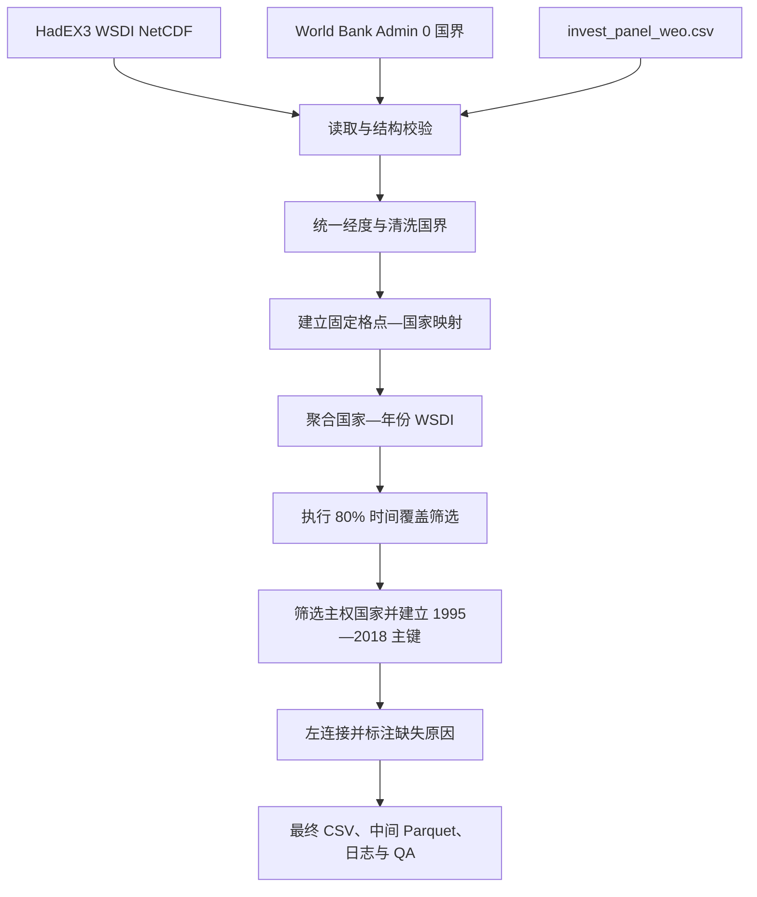

# WSDI Workflow Document Implementation Plan

> **For agentic workers:** REQUIRED SUB-SKILL: Use superpowers:subagent-driven-development (recommended) or superpowers:executing-plans to implement this plan task-by-task. Steps use checkbox (`- [ ]`) syntax for tracking.

**Goal:** Create a complete Chinese Workflow document that explains the WSDI country-year construction process and every field in the final output, intermediate output, logs, and QA summary.

**Architecture:** Build one durable Markdown document organized in construction order, with field explanations adjacent to the steps that generate them and comprehensive file-level dictionaries near the end. Source all names, formulas, status rules, commands, and result counts from the existing script and generated artifacts, then validate the document mechanically against those artifacts.

**Tech Stack:** Markdown, Mermaid, PowerShell, Python 3.11, pandas, xarray, GeoPandas, pytest

## Global Constraints

- Create the formal document at `WSDI指标构建Workflow与字段解读.md`.
- Write in Chinese and make the document independently readable and reproducible.
- Explain all 17 final CSV fields, all 14 intermediate Parquet fields, every CSV log field, and every `qa_summary.json` node group.
- Use actual output statistics: 61 ISO3, 24 years, 1,464 rows, 1,233 available rows, and 231 missing rows.
- Explain the 168 `failed_time_coverage`, 48 `no_grid_center`, and 15 `missing_annual_value` rows.
- Preserve the current methodology: grid-center membership and unweighted arithmetic mean, not population weighting or area weighting.
- Treat `wsdi_days` as the core climate indicator; coverage, provenance, status, and QA fields are supporting indicators.
- Do not change the construction script, tests, environment, or generated datasets.
- The workspace is not a Git repository, so commit steps are replaced by file and hash verification.

---

### Task 1: Establish the authoritative field and rule inventory

**Files:**
- Read: `scripts/build_wsdi_country.py`
- Read: `data/processed/wsdi_sovereign61_1995_2018.csv`
- Read: `data/processed/wsdi_country_year_1951_2018.parquet`
- Read: `logs/country_grid_membership.csv`
- Read: `logs/country_coverage.csv`
- Read: `logs/spatial_join_conflicts.csv`
- Read: `logs/countries_without_grid.csv`
- Read: `logs/excluded_non_sovereign.csv`
- Read: `logs/input_hashes.csv`
- Read: `logs/qa_summary.json`
- Read: `WSDI指标构建步骤.md`

**Interfaces:**
- Consumes: Existing generated artifacts and construction rules.
- Produces: A verified inventory of exact field names, data types, formulas, status precedence, commands, and current result counts for Task 2.

- [ ] **Step 1: Print exact schemas and result counts from generated artifacts**

Run from the project root:

```powershell
$py = 'C:\Users\chenyu\miniforge3\envs\wsdi\python.exe'
@'
from pathlib import Path
import json
import pandas as pd

root = Path.cwd()
final = pd.read_csv(root / "data/processed/wsdi_sovereign61_1995_2018.csv")
middle = pd.read_parquet(root / "data/processed/wsdi_country_year_1951_2018.parquet")

print("FINAL", final.shape, list(final.columns))
print("FINAL_DTYPES", {c: str(t) for c, t in final.dtypes.items()})
print("STATUS", final["wsdi_source_status"].value_counts(dropna=False).to_dict())
print("REASONS", final["wsdi_missing_reason"].value_counts(dropna=False).to_dict())
print("MIDDLE", middle.shape, list(middle.columns))

for path in sorted((root / "logs").glob("*.csv")):
    frame = pd.read_csv(path)
    print(path.name, frame.shape, list(frame.columns))

qa = json.loads((root / "logs/qa_summary.json").read_text(encoding="utf-8"))
print("QA_GROUPS", list(qa))
'@ | & $py -
```

Expected evidence includes:

```text
FINAL (1464, 17)
MIDDLE (7352, 14)
available = 1233
failed_time_coverage = 168
no_grid_center = 48
missing_annual_value = 15
```

- [ ] **Step 2: Inspect the implementation rules and command-line defaults**

Run:

```powershell
rg -n "^def |coverage_threshold|missing_reason|source_status|grid_coverage_rate|time_coverage_rate|aggregation|add_argument" scripts/build_wsdi_country.py
```

Confirm these exact rules before writing:

```text
climate period = 1951-2018 (68 years)
empirical period = 1995-2018 (24 years)
coverage threshold = 0.80
excluded ISO3 = HKG, TWN
aggregation = grid_center_arithmetic_mean
final join = target panel keys left-joined to filtered climate data
```

- [ ] **Step 3: Verify that every referenced path exists**

Run:

```powershell
$required = @(
  'HadEX3-0-4_wsdi_ann_1961-1990.nc',
  'World Bank Official Boundaries - Admin 0.gpkg',
  'invest_panel_weo.csv',
  'environment.yml',
  'scripts\build_wsdi_country.py',
  'tests\test_build_wsdi_country.py',
  'data\processed\wsdi_sovereign61_1995_2018.csv',
  'data\processed\wsdi_country_year_1951_2018.parquet',
  'logs\qa_summary.json'
)
$required | ForEach-Object { [pscustomobject]@{Path=$_; Exists=Test-Path -LiteralPath $_} }
```

Expected: every `Exists` value is `True`.

### Task 2: Write the complete Workflow and field interpretation document

**Files:**
- Create: `WSDI指标构建Workflow与字段解读.md`
- Reference: `docs/superpowers/specs/2026-08-16-wsdi-workflow-document-design.md`

**Interfaces:**
- Consumes: The authoritative inventory produced in Task 1.
- Produces: A standalone Markdown Workflow containing the complete methodology, commands, actual results, field dictionaries, and empirical-use guidance.

- [ ] **Step 1: Create the document framework and scope statement**

Create these top-level sections in this order:

```markdown
# WSDI 指标构建 Workflow 与字段解读
## 1. 文档目的与最终产物
## 2. WSDI 指标的定义与正确解读
## 3. 数据输入与分析范围
## 4. 软件环境与复现命令
## 5. 端到端数据流
## 6. 分步骤构建与指标解读
## 7. 当前构建结果与缺失分布
## 8. 完整字段字典
## 9. 日志与 QA 指标字典
## 10. 实证数据合并与使用建议
## 11. 验收清单与故障定位
```

The opening must identify the target as 61 sovereign countries for 1995–2018 and the final merge key as `iso3 + year`.

- [ ] **Step 2: Document the WSDI definition and formulas**

Include the following mathematical definitions with symbol explanations:

```text
Grid-cell annual WSDI: number of days in runs of at least 6 consecutive days
where daily maximum temperature exceeds the calendar-day 90th percentile
computed using the 1961-1990 base period.

Country-year WSDI(c,t) = sum over valid grid cells of WSDI(g,t) / n_valid_cells(c,t)
grid_coverage_rate(c,t) = n_valid_cells(c,t) / n_total_cells(c)
time_coverage_rate(c) = n_valid_years_1951_2018(c) / 68
passes_time_coverage(c) = [time_coverage_rate(c) >= 0.80]
```

State that `wsdi_days` may be fractional after country averaging and does not measure event counts, temperature magnitude, population exposure, or economic loss.

- [ ] **Step 3: Add the reproducible data flow and commands**

Use this Mermaid sequence:



Include these Windows commands:

```powershell
conda activate wsdi
python scripts/build_wsdi_country.py
python -m pytest tests/test_build_wsdi_country.py -q -W error
```

- [ ] **Step 4: Explain all construction steps and status precedence**

Describe, in order:

1. NetCDF validation and 1951–2018 selection;
2. longitude normalization;
3. World Bank boundary cleanup and ISO3 dissolve;
4. static grid-center-to-country spatial membership;
5. valid-cell arithmetic mean by `iso3 + year`;
6. 80% time-coverage filter using 68 climate years;
7. exclusion of `HKG` and `TWN`, selection of 61 sovereign target countries, and creation of the 1995–2018 balanced key grid;
8. left join and missing-state assignment;
9. deterministic output and QA writing.

Document the missing-reason decision order exactly:

```text
1. no_grid_center
2. failed_time_coverage
3. missing_annual_value
4. otherwise available
```

- [ ] **Step 5: Add the complete final and intermediate field dictionaries**

For `data/processed/wsdi_sovereign61_1995_2018.csv`, create a 17-row table with columns:

```text
字段 | 类型 | 单位/取值 | 生成方式 | 解读与使用注意
```

For `data/processed/wsdi_country_year_1951_2018.parquet`, create a 14-row table using the same explanatory standard. Where the same field exists in both files, explain that its definition is identical and still include the row so the table is complete.

- [ ] **Step 6: Add every log and QA field dictionary**

Create one subsection per log file and explain these exact schemas:

```text
country_grid_membership.csv: latitude, longitude, ISO_A3, NAM_0
country_coverage.csv: ISO_A3, n_valid_years_1951_2018, time_coverage_rate, passes_time_coverage
spatial_join_conflicts.csv: latitude, longitude, ISO_A3, NAM_0, n_iso3
countries_without_grid.csv: ISO_A3, NAM_0
excluded_non_sovereign.csv: country_name, iso3, year
input_hashes.csv: file, bytes, sha256
```

For `qa_summary.json`, explain `built_at_utc` and every node under:

```text
coverage, outputs, parameters, source, spatial, target
```

The document must distinguish observed build counts from general field definitions.

- [ ] **Step 7: Add actual results, empirical guidance, and acceptance checks**

Include this current result summary:

```text
61 countries × 24 years = 1,464 rows
1,233 available rows
231 missing rows
168 failed_time_coverage
48 no_grid_center
15 missing_annual_value
61/61 target boundary matches
0 spatial conflict grid points
```

State that the empirical merge must preserve the target panel and use `iso3 + year`; missing `wsdi_days` must remain missing rather than being filled with zero. Explain that coverage indicators are diagnostic/quality variables, while provenance fields support reproducibility.

- [ ] **Step 8: Verify the created file without a Git commit**

Run:

```powershell
Get-Item -LiteralPath 'WSDI指标构建Workflow与字段解读.md' | Select-Object FullName,Length,LastWriteTime
Get-FileHash -Algorithm SHA256 -LiteralPath 'WSDI指标构建Workflow与字段解读.md'
```

Expected: the file exists, has non-zero length, and a SHA256 hash is printed.

### Task 3: Mechanically validate completeness and consistency

**Files:**
- Validate: `WSDI指标构建Workflow与字段解读.md`
- Validate against: `data/processed/wsdi_sovereign61_1995_2018.csv`
- Validate against: `data/processed/wsdi_country_year_1951_2018.parquet`
- Validate against: `logs/*.csv`
- Validate against: `logs/qa_summary.json`
- Test: `tests/test_build_wsdi_country.py`

**Interfaces:**
- Consumes: The formal Workflow from Task 2 and all authoritative artifacts.
- Produces: Evidence that every real field and QA path appears in the document, commands remain valid, and the construction test suite still passes.

- [ ] **Step 1: Check that every structured-data field appears in the document**

Run:

```powershell
$py = 'C:\Users\chenyu\miniforge3\envs\wsdi\python.exe'
@'
from pathlib import Path
import json
import pandas as pd

root = Path.cwd()
doc = (root / "WSDI指标构建Workflow与字段解读.md").read_text(encoding="utf-8")
missing = []

tables = [
    root / "data/processed/wsdi_sovereign61_1995_2018.csv",
    root / "data/processed/wsdi_country_year_1951_2018.parquet",
    *sorted((root / "logs").glob("*.csv")),
]
for path in tables:
    frame = pd.read_parquet(path) if path.suffix == ".parquet" else pd.read_csv(path)
    for column in frame.columns:
        if f"`{column}`" not in doc:
            missing.append(f"{path.name}:{column}")

qa = json.loads((root / "logs/qa_summary.json").read_text(encoding="utf-8"))
for key in qa:
    if f"`{key}`" not in doc:
        missing.append(f"qa_summary.json:{key}")

assert not missing, "Undocumented fields: " + ", ".join(missing)
print("PASS: every table field and top-level QA group is documented")
'@ | & $py -
```

Expected: `PASS: every table field and top-level QA group is documented`.

- [ ] **Step 2: Check required definitions, counts, and cautions**

Run:

```powershell
$doc = Get-Content -Raw -Encoding UTF8 'WSDI指标构建Workflow与字段解读.md'
$required = @(
  '1961-1990', '1951—2018', '1995—2018', '1,464', '1,233', '231',
  'failed_time_coverage', 'no_grid_center', 'missing_annual_value',
  'grid_center_arithmetic_mean', 'iso3 + year', '不能将缺失值填充为 0'
)
$missing = $required | Where-Object { -not $doc.Contains($_) }
if ($missing.Count -gt 0) { throw "Missing required text: $($missing -join ', ')" }
'PASS: required definitions, counts, and cautions are present'
```

Expected: `PASS: required definitions, counts, and cautions are present`.

- [ ] **Step 3: Run the existing construction tests**

Run:

```powershell
& 'C:\Users\chenyu\miniforge3\envs\wsdi\python.exe' -m pytest tests/test_build_wsdi_country.py -q -W error
```

Expected: all 17 tests pass and warnings are treated as errors.

- [ ] **Step 4: Review rendered Markdown structure and final file hash**

Run:

```powershell
rg -n '^#{1,4} |^```mermaid|^\| 字段 ' 'WSDI指标构建Workflow与字段解读.md'
Get-FileHash -Algorithm SHA256 -LiteralPath 'WSDI指标构建Workflow与字段解读.md'
```

Confirm that headings are in the planned order, the Mermaid block is closed, field tables render with header separators, and retain the printed SHA256 as the final handoff checksum.
