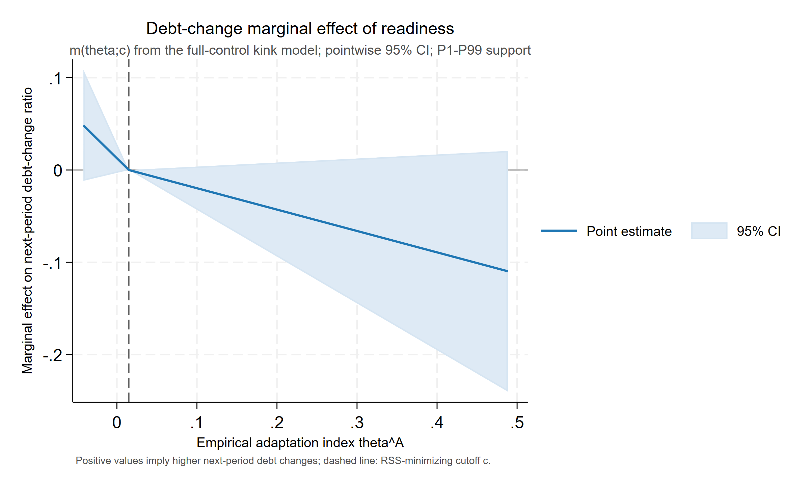
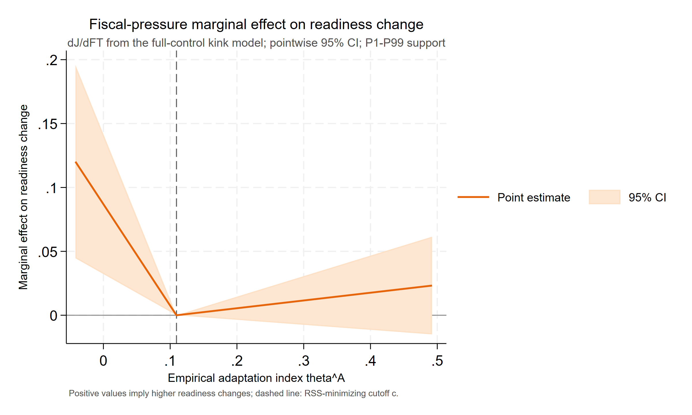
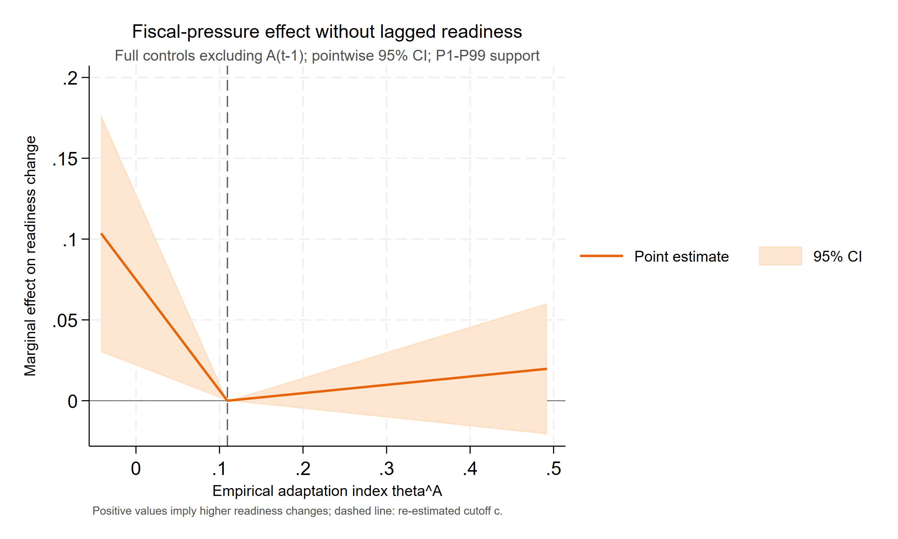

# Paper B：统一回归公式与结果表

> 数据：`data0804/invest_panel_weo.csv`；整合生成时间：2026-08-06 00:35（Asia/Shanghai）。
> 本文档只放回归公式、正式系数表、边际效应、cutoff 与经验指标构造结果。数据检查和统计检验见 `paperB_diagnostics.md`。所有源比率、百分数和 0—100 指数均先除以 100，以 0—1 比率进入回归；`CurrentGDP` 保留原始金额尺度。

## 技术摘要

- Baseline 完整二阶模型中，$\beta_{AA}$=0.4416（p=0.001）、$\beta_{Ab}$=-0.1514（p<0.001）、$\beta_{AX}$=0.5085（p=0.034）；六个二阶项联合检验 p<0.001。
- 全控制税基模型的原始尺度适应能力系数为 -0.1314（p=0.076），A×X 系数为 0.3423（p=0.049）。
- Kink 全控制模型中，原始债务方程两支联合检验 p=0.181，原始 readiness 方程 p=0.008；去状态变量后分别为 p=0.447 和 p=0.022。
- 所有结果均为双向固定效应相关性估计。theta 和 cutoff 都是生成量，当前常规稳健标准误未覆盖完整上游估计与 cutoff 搜索不确定性。

## 1. 统一符号、控制变量与估计口径

令 $s_{it}$ 为主权利差比率，$A_{it}$ 为适应能力比率，$X_{it}$ 为气候脆弱性比率，$b_{it}=debt\_gdp_{it}$。宏观控制为 Growth、$\ln(CurrentGDP)$、Inflation；外部控制为 Reserves、Terms of trade。全部模型含国家固定效应与年份固定效应，推断采用观测层面异方差稳健标准误（不是国家聚类标准误）。

## 2. Baseline：主权利差回归

### 2.1 回归公式

$$\begin{aligned}s_{it}^{g}={}&\alpha_i+\lambda_t+\beta_A A_{it}^{c}+\beta_b b_{it}^{c}+\beta_X X_{it}^{c} \\ &+\frac{1}{2}\beta_{AA}(A_{it}^{c})^2+\frac{1}{2}\beta_{bb}(b_{it}^{c})^2+\frac{1}{2}\beta_{XX}(X_{it}^{c})^2 \\ &+\beta_{Ab}A_{it}^{c}b_{it}^{c}+\beta_{AX}A_{it}^{c}X_{it}^{c}+\beta_{bX}b_{it}^{c}X_{it}^{c}+\Gamma_s^{\prime}W_{it}^{s}+\varepsilon_{it}^{s}.\end{aligned}$$

完整二阶回归使用 baseline 固定样本均值中心化：$A^c=A-\bar A_s$、$b^c=b-\bar b_s$、$X^c=X-\bar X_s$。二阶项采用 $\frac12\beta_{jj}(j^c)^2$ 记法，因此对 $j$ 求导后的系数直接是 $\beta_{jj}j^c$。从中心化系数还原原始尺度线性系数：

$$\begin{aligned}\widehat\beta_A^{raw}&=\widehat\beta_A^c-\widehat\beta_{AA}\bar A_s-\widehat\beta_{Ab}\bar b_s-\widehat\beta_{AX}\bar X_s,\\ \widehat\beta_b^{raw}&=\widehat\beta_b^c-\widehat\beta_{bb}\bar b_s-\widehat\beta_{Ab}\bar A_s-\widehat\beta_{bX}\bar X_s,\\ \widehat\beta_X^{raw}&=\widehat\beta_X^c-\widehat\beta_{XX}\bar X_s-\widehat\beta_{AX}\bar A_s-\widehat\beta_{bX}\bar b_s.\end{aligned}$$

二阶和交叉项系数在中心化前后不变；常数平移由固定效应吸收。适应能力的边际利差节约为

$$\widehat m^A_{it}=-\left(\widehat\beta_A^{raw}+\widehat\beta_{AA}A_{it}+\widehat\beta_{Ab}b_{it}+\widehat\beta_{AX}X_{it}\right)=-\left(\widehat\beta_A^c+\widehat\beta_{AA}A^c_{it}+\widehat\beta_{Ab}b^c_{it}+\widehat\beta_{AX}X^c_{it}\right).$$

### 2.2 逐步回归表

系数下方括号为稳健 t 值；`***`、`**`、`*` 分别表示 1%、5%、10% 显著性。所有列使用同一共同样本。

**Panel A：核心变量与控制变量逐步检验**

| 变量/统计量 | (A_X_only) 仅 X | (A_A_only) 仅 A | (A_b_only) 仅 b | (B_all_core) 三核心 | (C_macro) +宏观 | (Layer1_X) 第一层 | (Layer2_A) 第二层 |
| --- | ---: | ---: | ---: | ---: | ---: | ---: | ---: |
| 气候脆弱性 $X_{it}$ | -0.2679*** (-2.777) | — | — | -0.2138** (-2.44) | 0.1427** (1.975) | 0.1971*** (2.64) | 0.2019*** (2.732) |
| 适应能力 $A_{it}$ | — | -0.0627*** (-3.391) | — | -0.0717*** (-3.931) | -0.0593*** (-3.983) | — | -0.0619*** (-4.126) |
| 债务/GDP $b_{it}$ | — | — | 0.0493*** (8.474) | 0.0496*** (8.557) | 0.0515*** (9.971) | 0.0519*** (9.978) | 0.0527*** (10.156) |
| Growth | — | — | — | — | -0.1752*** (-5.39) | -0.1783*** (-5.397) | -0.1731*** (-5.387) |
| $\ln(CurrentGDP_{it})$ | — | — | — | — | 0.022*** (7.47) | 0.0239*** (7.682) | 0.0237*** (7.77) |
| Inflation | — | — | — | — | 0.1592*** (5.452) | 0.1544*** (5.097) | 0.1557*** (5.297) |
| Reserves | — | — | — | — | — | 0.018*** (3.784) | 0.0197*** (4.418) |
| Terms of trade | — | — | — | — | — | 0.001 (0.265) | 0.0004 (0.108) |
| 宏观控制 | 否 | 否 | 否 | 否 | 是 | 是 | 是 |
| 外部控制 | 否 | 否 | 否 | 否 | 否 | 是 | 是 |
| 国家固定效应 | 是 | 是 | 是 | 是 | 是 | 是 | 是 |
| 年份固定效应 | 是 | 是 | 是 | 是 | 是 | 是 | 是 |
| 国家数 | 65 | 65 | 65 | 65 | 65 | 65 | 65 |
| 年份数 | 26 | 26 | 26 | 26 | 26 | 26 | 26 |
| 样本量 | 1,286 | 1,286 | 1,286 | 1,286 | 1,286 | 1,286 | 1,286 |
| Within $R^2$ | 0.134 | 0.135 | 0.235 | 0.253 | 0.47 | 0.466 | 0.475 |
| Overall $R^2$ | 0.312 | 0.368 | 0.006 | 0.04 | 0.148 | 0.112 | 0.156 |

**Panel B：交互模型**

| 变量/统计量 | (Interact_AB) A×b | (Interact_AX) A×X | (Interact_all) 双交互 |
| --- | ---: | ---: | ---: |
| $A^c_{it}$ | -0.0806*** (-4.98) | -0.0639*** (-3.997) | -0.0819*** (-4.867) |
| $b^c_{it}$ | 0.0553*** (12.793) | 0.0527*** (10.152) | 0.0553*** (12.784) |
| $X^c_{it}$ | 0.2416*** (3.292) | 0.2071*** (2.868) | 0.2448*** (3.422) |
| $A^c_{it}\times b^c_{it}$ | -0.1862*** (-6.487) | — | -0.1862*** (-6.489) |
| $A^c_{it}\times X^c_{it}$ | — | 0.058 (0.366) | 0.0365 (0.226) |
| Growth | -0.1574*** (-5.167) | -0.1734*** (-5.358) | -0.1577*** (-5.138) |
| $\ln(CurrentGDP_{it})$ | 0.0185*** (6.314) | 0.0236*** (7.626) | 0.0184*** (6.151) |
| Inflation | 0.1629*** (5.974) | 0.1561*** (5.338) | 0.1631*** (6.004) |
| Reserves | 0.0228*** (4.845) | 0.02*** (4.458) | 0.023*** (4.842) |
| Terms of trade | -0.0018 (-0.472) | 0.0004 (0.109) | -0.0018 (-0.47) |
| 宏观控制 | 是 | 是 | 是 |
| 外部控制 | 是 | 是 | 是 |
| 国家固定效应 | 是 | 是 | 是 |
| 年份固定效应 | 是 | 是 | 是 |
| 国家数 | 65 | 65 | 65 |
| 年份数 | 26 | 26 | 26 |
| 样本量 | 1,286 | 1,286 | 1,286 |
| Within $R^2$ | 0.518 | 0.475 | 0.518 |
| Overall $R^2$ | 0.235 | 0.158 | 0.237 |

**Panel C：用于构造 $m^A_{it}$ 的完整二阶模型**

| 变量/统计量 | (Quadratic_all) 完整二阶 |
| --- | ---: |
| $A^c_{it}$ | -0.0756*** (-4.618) |
| $b^c_{it}$ | 0.0482*** (12.668) |
| $X^c_{it}$ | 0.2842*** (4.467) |
| $\frac{1}{2}(A^c_{it})^2$ | 0.4416*** (3.209) |
| $\frac{1}{2}(b^c_{it})^2$ | 0.0255** (2.452) |
| $\frac{1}{2}(X^c_{it})^2$ | -0.0844 (-0.115) |
| $A^c_{it}\times b^c_{it}$ | -0.1514*** (-4.349) |
| $A^c_{it}\times X^c_{it}$ | 0.5085** (2.123) |
| $b^c_{it}\times X^c_{it}$ | 0.2785*** (3.324) |
| Growth | -0.1529*** (-4.93) |
| $\ln(CurrentGDP_{it})$ | 0.0146*** (4.441) |
| Inflation | 0.1638*** (6.644) |
| Reserves | 0.0189*** (4.017) |
| Terms of trade | 0.0011 (0.285) |
| 宏观控制 | 是 |
| 外部控制 | 是 |
| 国家固定效应 | 是 |
| 年份固定效应 | 是 |
| 国家数 | 65 |
| 年份数 | 26 |
| 样本量 | 1,286 |
| Within $R^2$ | 0.546 |
| Overall $R^2$ | 0.268 |

### 2.3 构造用原始尺度系数

| 参数 | 估计值 | 稳健 SE | t | p | 95% CI |
| --- | ---: | ---: | ---: | ---: | ---: |
| beta_A_raw | -0.4061 | 0.1464 | -2.774 | 0.006 | [-0.6933, -0.1189] |
| beta_b_raw | 0.0118 | 0.0413 | 0.285 | 0.776 | [-0.0693, 0.0928] |
| beta_X_raw | -0.1262 | 0.3361 | -0.376 | 0.707 | [-0.7857, 0.5332] |
| beta_AA | 0.4416 | 0.1376 | 3.209 | 0.001 | [0.1716, 0.7116] |
| beta_bb | 0.0255 | 0.0104 | 2.452 | 0.014 | [0.0051, 0.046] |
| beta_XX | -0.0844 | 0.7316 | -0.115 | 0.908 | [-1.5198, 1.351] |
| beta_AB | -0.1514 | 0.0348 | -4.349 | <0.001 | [-0.2196, -0.0831] |
| beta_AX | 0.5085 | 0.2396 | 2.123 | 0.034 | [0.0385, 0.9785] |
| beta_bX | 0.2785 | 0.0838 | 3.324 | <0.001 | [0.1141, 0.4428] |

展开：baseline 交互模型的点边际效应

| 模型 | 调节变量 | 点 | 调节变量/$\theta$ | 边际效应 | 稳健 SE | p 值 | 95% CI |
| --- | ---: | ---: | ---: | ---: | ---: | ---: | ---: |
| Interact_AB | debt_gdp | P10 | 0.2477 | -0.0137 | 0.0156 | 0.382 | [-0.0443, 0.017] |
| Interact_AB | debt_gdp | P25 | 0.3758 | -0.0375 | 0.015 | 0.013 | [-0.067, -0.008] |
| Interact_AB | debt_gdp | P50 | 0.5327 | -0.0667 | 0.0155 | <0.001 | [-0.0972, -0.0363] |
| Interact_AB | debt_gdp | P75 | 0.7729 | -0.1115 | 0.0185 | <0.001 | [-0.1478, -0.0752] |
| Interact_AB | debt_gdp | P90 | 1.0507 | -0.1632 | 0.024 | <0.001 | [-0.2104, -0.1161] |
| Interact_AB | debt_gdp | Mean_minus_1SD | 0.2543 | -0.0149 | 0.0156 | 0.339 | [-0.0455, 0.0157] |
| Interact_AB | debt_gdp | Mean | 0.6073 | -0.0806 | 0.0162 | <0.001 | [-0.1124, -0.0489] |
| Interact_AB | debt_gdp | Mean_plus_1SD | 0.9603 | -0.1464 | 0.0221 | <0.001 | [-0.1897, -0.1031] |
| Interact_AX | vulnerability100 | P10 | 0.2871 | -0.0685 | 0.0234 | 0.004 | [-0.1144, -0.0225] |
| Interact_AX | vulnerability100 | P25 | 0.3122 | -0.067 | 0.0205 | 0.001 | [-0.1073, -0.0267] |
| Interact_AX | vulnerability100 | P50 | 0.3494 | -0.0648 | 0.0171 | <0.001 | [-0.0983, -0.0314] |
| Interact_AX | vulnerability100 | P75 | 0.4034 | -0.0617 | 0.015 | <0.001 | [-0.0912, -0.0322] |
| Interact_AX | vulnerability100 | P90 | 0.4836 | -0.0571 | 0.02 | 0.004 | [-0.0962, -0.0179] |
| Interact_AX | vulnerability100 | Mean_minus_1SD | 0.295 | -0.068 | 0.0225 | 0.003 | [-0.1121, -0.0239] |
| Interact_AX | vulnerability100 | Mean | 0.366 | -0.0639 | 0.016 | <0.001 | [-0.0952, -0.0325] |
| Interact_AX | vulnerability100 | Mean_plus_1SD | 0.437 | -0.0598 | 0.0161 | <0.001 | [-0.0913, -0.0282] |
| Interact_all | debt_gdp | P10 | 0.2477 | -0.0149 | 0.0159 | 0.348 | [-0.0461, 0.0162] |
| Interact_all | debt_gdp | P25 | 0.3758 | -0.0388 | 0.0155 | 0.012 | [-0.0691, -0.0084] |
| Interact_all | debt_gdp | P50 | 0.5327 | -0.068 | 0.0161 | <0.001 | [-0.0996, -0.0364] |
| Interact_all | debt_gdp | P75 | 0.7729 | -0.1127 | 0.0192 | <0.001 | [-0.1504, -0.075] |
| Interact_all | debt_gdp | P90 | 1.0507 | -0.1644 | 0.0248 | <0.001 | [-0.213, -0.1158] |
| Interact_all | debt_gdp | Mean_minus_1SD | 0.2543 | -0.0162 | 0.0158 | 0.308 | [-0.0473, 0.0149] |
| Interact_all | debt_gdp | Mean | 0.6073 | -0.0819 | 0.0168 | <0.001 | [-0.1149, -0.0489] |
| Interact_all | debt_gdp | Mean_plus_1SD | 0.9603 | -0.1476 | 0.0228 | <0.001 | [-0.1923, -0.1029] |
| Interact_all | vulnerability100 | P10 | 0.2871 | -0.0848 | 0.0237 | <0.001 | [-0.1313, -0.0382] |
| Interact_all | vulnerability100 | P25 | 0.3122 | -0.0838 | 0.0209 | <0.001 | [-0.1249, -0.0428] |
| Interact_all | vulnerability100 | P50 | 0.3494 | -0.0825 | 0.0177 | <0.001 | [-0.1173, -0.0477] |
| Interact_all | vulnerability100 | P75 | 0.4034 | -0.0805 | 0.0162 | <0.001 | [-0.1124, -0.0487] |
| Interact_all | vulnerability100 | P90 | 0.4836 | -0.0776 | 0.0216 | <0.001 | [-0.12, -0.0351] |
| Interact_all | vulnerability100 | Mean_minus_1SD | 0.295 | -0.0845 | 0.0228 | <0.001 | [-0.1292, -0.0397] |
| Interact_all | vulnerability100 | Mean | 0.366 | -0.0819 | 0.0168 | <0.001 | [-0.1149, -0.0489] |
| Interact_all | vulnerability100 | Mean_plus_1SD | 0.437 | -0.0793 | 0.0176 | <0.001 | [-0.1138, -0.0448] |
| Quadratic_all | readiness100 | P10 | 0.3449 | -0.1596 | 0.0359 | <0.001 | [-0.2301, -0.0892] |
| Quadratic_all | readiness100 | P25 | 0.4307 | -0.1218 | 0.0257 | <0.001 | [-0.1721, -0.0714] |
| Quadratic_all | readiness100 | P50 | 0.5296 | -0.0781 | 0.0167 | <0.001 | [-0.1108, -0.0454] |
| Quadratic_all | readiness100 | P75 | 0.6629 | -0.0192 | 0.0188 | 0.307 | [-0.056, 0.0176] |
| Quadratic_all | readiness100 | P90 | 0.7172 | 0.0048 | 0.024 | 0.842 | [-0.0423, 0.0519] |
| Quadratic_all | readiness100 | Mean_minus_1SD | 0.3943 | -0.1378 | 0.0298 | <0.001 | [-0.1964, -0.0792] |
| Quadratic_all | readiness100 | Mean | 0.5353 | -0.0756 | 0.0164 | <0.001 | [-0.1077, -0.0435] |
| Quadratic_all | readiness100 | Mean_plus_1SD | 0.6763 | -0.0133 | 0.0199 | 0.505 | [-0.0524, 0.0258] |
| Quadratic_all | debt_gdp | P10 | 0.2477 | -0.0211 | 0.0158 | 0.182 | [-0.0522, 0.0099] |
| Quadratic_all | debt_gdp | P25 | 0.3758 | -0.0405 | 0.0149 | 0.006 | [-0.0696, -0.0114] |
| Quadratic_all | debt_gdp | P50 | 0.5327 | -0.0643 | 0.0154 | <0.001 | [-0.0946, -0.034] |
| Quadratic_all | debt_gdp | P75 | 0.7729 | -0.1006 | 0.0195 | <0.001 | [-0.1389, -0.0623] |
| Quadratic_all | debt_gdp | P90 | 1.0507 | -0.1427 | 0.0268 | <0.001 | [-0.1953, -0.09] |
| Quadratic_all | debt_gdp | Mean_minus_1SD | 0.2543 | -0.0221 | 0.0157 | 0.160 | [-0.053, 0.0088] |
| Quadratic_all | debt_gdp | Mean | 0.6073 | -0.0756 | 0.0164 | <0.001 | [-0.1077, -0.0435] |
| Quadratic_all | debt_gdp | Mean_plus_1SD | 0.9603 | -0.129 | 0.0243 | <0.001 | [-0.1766, -0.0814] |
| Quadratic_all | vulnerability100 | P10 | 0.2871 | -0.1157 | 0.03 | <0.001 | [-0.1745, -0.0568] |
| Quadratic_all | vulnerability100 | P25 | 0.3122 | -0.1029 | 0.0249 | <0.001 | [-0.1518, -0.054] |
| Quadratic_all | vulnerability100 | P50 | 0.3494 | -0.084 | 0.0185 | <0.001 | [-0.1203, -0.0478] |
| Quadratic_all | vulnerability100 | P75 | 0.4034 | -0.0565 | 0.0148 | <0.001 | [-0.0855, -0.0276] |
| Quadratic_all | vulnerability100 | P90 | 0.4836 | -0.0158 | 0.0255 | 0.537 | [-0.0658, 0.0343] |
| Quadratic_all | vulnerability100 | Mean_minus_1SD | 0.295 | -0.1117 | 0.0284 | <0.001 | [-0.1673, -0.056] |
| Quadratic_all | vulnerability100 | Mean | 0.366 | -0.0756 | 0.0164 | <0.001 | [-0.1077, -0.0435] |
| Quadratic_all | vulnerability100 | Mean_plus_1SD | 0.437 | -0.0394 | 0.0176 | 0.025 | [-0.074, -0.0049] |

## 3. Empirical theta：边际税基收益与经验指标

### 3.1 税基回归公式与时序

$$\widetilde T_{i,t+1}^{(t)}=\frac{revenue_{i,t+1}}{CurrentGDP_{it}},\qquad \widetilde T_{it}^{(t-1)}=\frac{revenue_{it}}{CurrentGDP_{i,t-1}}.$$

以上两个税基变量都不乘 100，直接以比率进入回归。

$$\widetilde T_{i,t+1}^{(t)}=\alpha_i+\lambda_t+\gamma_AA_{it}+\gamma_XX_{it}+\gamma_{AX}A_{it}X_{it}+\rho_T\widetilde T_{it}^{(t-1)}+\Gamma_T'W^T_{it}+\varepsilon^T_{i,t+1}.$$

税基交互模型也在税基固定样本内中心化。原始尺度截距斜率为 $\widehat\gamma_A^{raw}=\widehat\gamma_A^c-\widehat\gamma_{AX}\bar X_T$，故

$$\widehat T^A_{it}=\widehat\gamma_A^{raw}+\widehat\gamma_{AX}X_{it}=\widehat\gamma_A^c+\widehat\gamma_{AX}X^c_{it}.$$

### 3.2 税基逐步回归表

**Panel A：核心变量与控制变量逐步检验**

| 变量/统计量 | (T1_X_only) 仅 X | (T2_A_only) 仅 A | (T3_persistence) 仅滞后税基 | (T4_all_core) 核心项 | (T5_macro) +宏观 | (T6_layer1_X) 第一层 | (T7_layer2_A) 第二层 |
| --- | ---: | ---: | ---: | ---: | ---: | ---: | ---: |
| 气候脆弱性 $X_{it}$ | 0.2279** (2.016) | — | — | 0.1071 (1.396) | -0.0681 (-0.75) | -0.0755 (-0.834) | -0.0781 (-0.865) |
| 适应能力 $A_{it}$ | — | 0.085*** (3.281) | — | 0.0287* (1.746) | 0.0123 (0.716) | — | 0.0078 (0.462) |
| $\widetilde T_{it}^{(t-1)}$ | — | — | 0.6761*** (14.483) | 0.6721*** (14.348) | 0.6885*** (12.234) | 0.6965*** (13.174) | 0.6957*** (13.065) |
| Growth | — | — | — | — | -0.1018*** (-3.331) | -0.1032*** (-3.44) | -0.1027*** (-3.396) |
| $\ln(CurrentGDP_{it})$ | — | — | — | — | -0.0112*** (-4.106) | -0.0089*** (-3.415) | -0.0088*** (-3.327) |
| Inflation | — | — | — | — | -0.0378* (-1.669) | -0.0492** (-2.312) | -0.0489** (-2.278) |
| Reserves | — | — | — | — | — | -0.0036 (-0.563) | -0.0038 (-0.596) |
| Terms of trade | — | — | — | — | — | -0.019*** (-3.395) | -0.0189*** (-3.385) |
| 宏观控制 | 否 | 否 | 否 | 否 | 是 | 是 | 是 |
| 外部控制 | 否 | 否 | 否 | 否 | 否 | 是 | 是 |
| 国家固定效应 | 是 | 是 | 是 | 是 | 是 | 是 | 是 |
| 年份固定效应 | 是 | 是 | 是 | 是 | 是 | 是 | 是 |
| 国家数 | 65 | 65 | 65 | 65 | 65 | 65 | 65 |
| 年份数 | 27 | 27 | 27 | 27 | 27 | 27 | 27 |
| 样本量 | 1,549 | 1,549 | 1,549 | 1,549 | 1,549 | 1,549 | 1,549 |
| Within $R^2$ | 0.199 | 0.204 | 0.572 | 0.574 | 0.59 | 0.598 | 0.598 |
| Overall $R^2$ | 0.257 | 0.287 | 0.968 | 0.964 | 0.911 | 0.931 | 0.932 |

**Panel B：交互模型**

| 变量/统计量 | (T8_interact_core) 交互核心 | (T9_interact_macro) 交互+宏观 | (T10_interact_full) 交互+全控制 |
| --- | ---: | ---: | ---: |
| $A^c_{it}$ | 0.0263 (1.573) | 0.0032 (0.18) | -0.0004 (-0.022) |
| $X^c_{it}$ | 0.1263 (1.594) | -0.0225 (-0.253) | -0.0353 (-0.4) |
| $A^c_{it}\times X^c_{it}$ | 0.1132 (0.679) | 0.3864** (2.165) | 0.3423** (1.969) |
| $\widetilde T_{it}^{(t-1)}$ | 0.6712*** (14.204) | 0.6838*** (12.025) | 0.6915*** (12.848) |
| Growth | — | -0.1031*** (-3.402) | -0.1038*** (-3.462) |
| $\ln(CurrentGDP_{it})$ | — | -0.0123*** (-4.214) | -0.0098*** (-3.489) |
| Inflation | — | -0.0375 (-1.634) | -0.0484** (-2.232) |
| Reserves | — | — | -0.0022 (-0.345) |
| Terms of trade | — | — | -0.0186*** (-3.361) |
| 宏观控制 | 否 | 是 | 是 |
| 外部控制 | 否 | 否 | 是 |
| 国家固定效应 | 是 | 是 | 是 |
| 年份固定效应 | 是 | 是 | 是 |
| 国家数 | 65 | 65 | 65 |
| 年份数 | 27 | 27 | 27 |
| 样本量 | 1,549 | 1,549 | 1,549 |
| Within $R^2$ | 0.574 | 0.591 | 0.599 |
| Overall $R^2$ | 0.963 | 0.896 | 0.921 |

### 3.3 边际税基收益与 theta 构造

| 参数 | 估计值 | 稳健 SE | t | p | 95% CI |
| --- | ---: | ---: | ---: | ---: | ---: |
| gamma_A_raw | -0.1314 | 0.0739 | -1.777 | 0.076 | [-0.2764, 0.0136] |
| gamma_AX | 0.3423 | 0.1739 | 1.969 | 0.049 | [0.0013, 0.6834] |

最终经验指标为

$$\widehat\theta^A_{it}=b_{it}\widehat m^A_{it}+\widehat T^A_{it},\qquad b_{it}=debt\_gdp_{it}.$$

| 构造量 | 样本 | N | 均值 | SD | P10 | P50 | P90 |
| --- | ---: | ---: | ---: | ---: | ---: | ---: | ---: |
| mA_hat | theta_support | 1,221 | 0.0747 | 0.0625 | -0.0094 | 0.076 | 0.1534 |
| spread_saving_component | theta_support | 1,221 | 0.0615 | 0.0864 | -0.0014 | 0.0361 | 0.1545 |
| TA_hat | theta_support | 1,221 | -0.0061 | 0.0243 | -0.0331 | -0.012 | 0.0342 |
| theta_hat_A | theta_support | 1,221 | 0.0553 | 0.0891 | -0.0256 | 0.0393 | 0.1449 |
| theta_hat_A | all_constructible | 1,819 | 0.0588 | 0.0892 | -0.0206 | 0.0433 | 0.1444 |

`theta_support` 是 spread 与 tax 估计样本的交集；`all_constructible` 是三项构造输入均非缺失的所有观测。联合 theta 标准误未报告，因为跨方程协方差需要联合 bootstrap 或系统估计。

展开：税基交互模型的点边际效应

| 模型 | 调节变量 | 点 | 调节变量/$\theta$ | 边际效应 | 稳健 SE | p 值 | 95% CI |
| --- | ---: | ---: | ---: | ---: | ---: | ---: | ---: |
| T8_interact_core | vulnerability100 | P10 | 0.3011 | 0.0171 | 0.0235 | 0.467 | [-0.029, 0.0632] |
| T8_interact_core | vulnerability100 | P25 | 0.3179 | 0.019 | 0.0216 | 0.379 | [-0.0233, 0.0613] |
| T8_interact_core | vulnerability100 | P50 | 0.3673 | 0.0246 | 0.0174 | 0.158 | [-0.0096, 0.0587] |
| T8_interact_core | vulnerability100 | P75 | 0.4343 | 0.0322 | 0.0173 | 0.063 | [-0.0018, 0.0661] |
| T8_interact_core | vulnerability100 | P90 | 0.5057 | 0.0403 | 0.0239 | 0.092 | [-0.0066, 0.0871] |
| T8_interact_core | vulnerability100 | Mean_minus_1SD | 0.3039 | 0.0174 | 0.0232 | 0.452 | [-0.028, 0.0628] |
| T8_interact_core | vulnerability100 | Mean | 0.3827 | 0.0263 | 0.0167 | 0.116 | [-0.0065, 0.0592] |
| T8_interact_core | vulnerability100 | Mean_plus_1SD | 0.4615 | 0.0352 | 0.0192 | 0.067 | [-0.0024, 0.0729] |
| T9_interact_macro | vulnerability100 | P10 | 0.3011 | -0.0283 | 0.0259 | 0.274 | [-0.0791, 0.0225] |
| T9_interact_macro | vulnerability100 | P25 | 0.3179 | -0.0218 | 0.0237 | 0.358 | [-0.0683, 0.0248] |
| T9_interact_macro | vulnerability100 | P50 | 0.3673 | -0.0027 | 0.0188 | 0.885 | [-0.0397, 0.0342] |
| T9_interact_macro | vulnerability100 | P75 | 0.4343 | 0.0232 | 0.0179 | 0.197 | [-0.012, 0.0583] |
| T9_interact_macro | vulnerability100 | P90 | 0.5057 | 0.0508 | 0.0245 | 0.038 | [0.0027, 0.0988] |
| T9_interact_macro | vulnerability100 | Mean_minus_1SD | 0.3039 | -0.0272 | 0.0255 | 0.286 | [-0.0772, 0.0228] |
| T9_interact_macro | vulnerability100 | Mean | 0.3827 | 0.0032 | 0.0179 | 0.857 | [-0.032, 0.0384] |
| T9_interact_macro | vulnerability100 | Mean_plus_1SD | 0.4615 | 0.0337 | 0.0197 | 0.088 | [-0.005, 0.0724] |
| T10_interact_full | vulnerability100 | P10 | 0.3011 | -0.0283 | 0.0259 | 0.274 | [-0.0791, 0.0224] |
| T10_interact_full | vulnerability100 | P25 | 0.3179 | -0.0226 | 0.0237 | 0.342 | [-0.0691, 0.024] |
| T10_interact_full | vulnerability100 | P50 | 0.3673 | -0.0057 | 0.0187 | 0.762 | [-0.0423, 0.031] |
| T10_interact_full | vulnerability100 | P75 | 0.4343 | 0.0173 | 0.0172 | 0.316 | [-0.0165, 0.051] |
| T10_interact_full | vulnerability100 | P90 | 0.5057 | 0.0417 | 0.0232 | 0.072 | [-0.0038, 0.0872] |
| T10_interact_full | vulnerability100 | Mean_minus_1SD | 0.3039 | -0.0273 | 0.0255 | 0.284 | [-0.0774, 0.0227] |
| T10_interact_full | vulnerability100 | Mean | 0.3827 | -0.0004 | 0.0177 | 0.983 | [-0.0351, 0.0343] |
| T10_interact_full | vulnerability100 | Mean_plus_1SD | 0.4615 | 0.0266 | 0.0188 | 0.157 | [-0.0102, 0.0634] |

## 4. Doomloop：Single-Crossing Kink Marginal-Effect Model

### 4.1 两个方程与四组规格

$$\Delta d_{i,t+1}^{(t)}=\frac{debt_{i,t+1}-debt_{it}}{CurrentGDP_{it}}.$$

$$\Delta d_{i,t+1}^{(t)}=\alpha_i+\lambda_t+\beta_LA_{it}(c-\widehat\theta^A_{it})_++\beta_HA_{it}(\widehat\theta^A_{it}-c)_++\rho_bb_{it}+\gamma_XX_{it}+\Gamma_B'W^B_{it}+\varepsilon^B_{i,t+1}.$$

$$J_{it}=A_{it}-A_{i,t-1}.$$

$$J_{it}=\alpha_i+\lambda_t+\delta_LFT_{it}(c-\widehat\theta^A_{it})_++\delta_HFT_{it}(\widehat\theta^A_{it}-c)_++\rho_AA_{i,t-1}+\gamma_XX_{it}+\Gamma_A'W^A_{it}+\varepsilon^A_{it}.$$

第二个方程的低、高两支都只乘 `FT=interest_revenue`，不再乘适应能力 A。四组回归都显式控制 (X_{it})：原始债务方程、去 (b_{it}) 债务方程、原始 readiness 方程、去 (A_{i,t-1}) readiness 方程。每组先在本组全控制固定样本上最小化 RSS 估计 cutoff，再固定该 cutoff 完成核心、宏观、全控制三列回归。

**债务变化方程（含 b）**

| 变量/统计量 | (D1_core) 核心项 | (D2_macro) +宏观 | (D3_full) +全控制 |
| --- | ---: | ---: | ---: |
| $A_{it}(c-\widehat\theta^A_{it})_+$ | 1.0067* (1.939) | 0.8366 (1.578) | 0.8529 (1.58) |
| $A_{it}(\widehat\theta^A_{it}-c)_+$ | -0.3257** (-2.394) | -0.2306* (-1.647) | -0.2317* (-1.65) |
| $b_{it}$ | 0.0463* (1.84) | 0.0371 (1.475) | 0.0372 (1.473) |
| $X_{it}$ | -0.5289*** (-2.642) | -0.1894 (-1.003) | -0.198 (-1.015) |
| Growth | — | -0.2153*** (-3.083) | -0.2155*** (-3.087) |
| $\ln(CurrentGDP_{it})$ | — | 0.0188** (2.215) | 0.0185** (2.13) |
| Inflation | — | 0.1465* (1.833) | 0.147* (1.787) |
| Reserves | — | — | -0.007 (-0.392) |
| Terms of trade | — | — | 0.0013 (0.114) |
| 宏观控制 | 否 | 是 | 是 |
| 外部控制 | 否 | 否 | 是 |
| 国家固定效应 | 是 | 是 | 是 |
| 年份固定效应 | 是 | 是 | 是 |
| 国家数 | 65 | 65 | 65 |
| 年份数 | 28 | 28 | 28 |
| 样本量 | 1,552 | 1,552 | 1,552 |
| Within $R^2$ | 0.14 | 0.169 | 0.169 |
| Overall $R^2$ | 0.006 | 0.006 | 0.006 |

**债务变化方程（去 b）**

| 变量/统计量 | (DN1_core) 核心项（无 b） | (DN2_macro) +宏观（无 b） | (DN3_full) +全控制（无 b） |
| --- | ---: | ---: | ---: |
| $A_{it}(c-\widehat\theta^A_{it})_+$ | 0.5841 (1.368) | 0.4892 (1.142) | 0.502 (1.15) |
| $A_{it}(\widehat\theta^A_{it}-c)_+$ | -0.0733 (-0.999) | -0.0433 (-0.522) | -0.0448 (-0.536) |
| $X_{it}$ | -0.5446*** (-2.676) | -0.2341 (-1.211) | -0.2454 (-1.228) |
| Growth | — | -0.2408*** (-3.577) | -0.2408*** (-3.583) |
| $\ln(CurrentGDP_{it})$ | — | 0.0167** (1.98) | 0.0166* (1.921) |
| Inflation | — | 0.1515* (1.886) | 0.1511* (1.825) |
| Reserves | — | — | -0.0077 (-0.426) |
| Terms of trade | — | — | -0.0008 (-0.073) |
| 宏观控制 | 否 | 是 | 是 |
| 外部控制 | 否 | 否 | 是 |
| 国家固定效应 | 是 | 是 | 是 |
| 年份固定效应 | 是 | 是 | 是 |
| 国家数 | 65 | 65 | 65 |
| 年份数 | 28 | 28 | 28 |
| 样本量 | 1,552 | 1,552 | 1,552 |
| Within $R^2$ | 0.136 | 0.166 | 0.166 |
| Overall $R^2$ | 0.009 | 0.004 | 0.004 |

**Readiness 变化方程（含 A 滞后）**

| 变量/统计量 | (R1_core) 核心项 | (R2_macro) +宏观 | (R3_full) +全控制 |
| --- | ---: | ---: | ---: |
| $FT_{it}(c-\widehat\theta^A_{it})_+$ | 0.7739*** (3.192) | 0.8091*** (3.202) | 0.7942*** (3.119) |
| $FT_{it}(\widehat\theta^A_{it}-c)_+$ | 0.0463 (0.974) | 0.0663 (1.357) | 0.0607 (1.192) |
| $A_{i,t-1}$ | -0.1479*** (-5.849) | -0.1508*** (-5.672) | -0.1515*** (-5.676) |
| $X_{it}$ | -0.0339 (-0.8) | -0.0775* (-1.797) | -0.077* (-1.729) |
| Growth | — | 0.0177 (1.232) | 0.0182 (1.28) |
| $\ln(CurrentGDP_{it})$ | — | -0.0024 (-1.556) | -0.002 (-1.305) |
| Inflation | — | -0.0062 (-0.705) | -0.0072 (-0.865) |
| Reserves | — | — | 0.0023 (0.454) |
| Terms of trade | — | — | -0.0028 (-0.789) |
| 宏观控制 | 否 | 是 | 是 |
| 外部控制 | 否 | 否 | 是 |
| 国家固定效应 | 是 | 是 | 是 |
| 年份固定效应 | 是 | 是 | 是 |
| 国家数 | 64 | 64 | 64 |
| 年份数 | 28 | 28 | 28 |
| 样本量 | 1,571 | 1,571 | 1,571 |
| Within $R^2$ | 0.207 | 0.21 | 0.21 |
| Overall $R^2$ | 0.02 | 0.026 | 0.027 |

**Readiness 变化方程（去 A 滞后）**

| 变量/统计量 | (RN1_core) 核心项（无 A 滞后） | (RN2_macro) +宏观（无 A 滞后） | (RN3_full) +全控制（无 A 滞后） |
| --- | ---: | ---: | ---: |
| $FT_{it}(c-\widehat\theta^A_{it})_+$ | 0.684*** (2.905) | 0.6905*** (2.832) | 0.6847*** (2.766) |
| $FT_{it}(\widehat\theta^A_{it}-c)_+$ | 0.0305 (0.626) | 0.0535 (1.04) | 0.0516 (0.955) |
| $X_{it}$ | -0.1113*** (-2.824) | -0.1161*** (-2.61) | -0.1145** (-2.481) |
| Growth | — | 0.0226 (1.599) | 0.0228 (1.632) |
| $\ln(CurrentGDP_{it})$ | — | -0.0001 (-0.105) | 0.0001 (0.041) |
| Inflation | — | -0.0031 (-0.396) | -0.0035 (-0.473) |
| Reserves | — | — | 0.0019 (0.371) |
| Terms of trade | — | — | -0.0011 (-0.312) |
| 宏观控制 | 否 | 是 | 是 |
| 外部控制 | 否 | 否 | 是 |
| 国家固定效应 | 是 | 是 | 是 |
| 年份固定效应 | 是 | 是 | 是 |
| 国家数 | 64 | 64 | 64 |
| 年份数 | 28 | 28 | 28 |
| 样本量 | 1,571 | 1,571 | 1,571 |
| Within $R^2$ | 0.144 | 0.145 | 0.145 |
| Overall $R^2$ | 0.076 | 0.075 | 0.077 |

### 4.2 Cutoff 与全控制分支系数

| 规格 | 方程 | cutoff | 最小 RSS | 候选数 | 低支 N | 高支 N | a | b | 异号 |
| --- | ---: | ---: | ---: | ---: | ---: | ---: | ---: | ---: | ---: |
| 原始 | debt | 0.015 | 3.9138 | 1,241 | 470 | 1,082 | 0.8529 | -0.2317 | 是 |
| 原始 | ready | 0.1095 | 0.4115 | 1,256 | 1,305 | 266 | 0.7942 | 0.0607 | 否 |
| 去状态变量 | debt | 0.0148 | 3.9268 | 1,241 | 468 | 1,084 | 0.502 | -0.0448 | 是 |
| 去状态变量 | ready | 0.1095 | 0.4455 | 1,256 | 1,305 | 266 | 0.6847 | 0.0516 | 否 |

点边际效应统一按 $m(\theta;c)=a(c-\theta)_++b(\theta-c)_+$ 计算；在 cutoff 处定义为 0。正值表示当前解释变量改善与更高的结果变量变化相关，负值表示与更低的结果变量变化相关。

展开：四组 kink 点边际效应

| 方程/规格 | 点 | 调节变量/$\theta$ | 边际效应 | 稳健 SE | p 值 | 95% CI |
| --- | ---: | ---: | ---: | ---: | ---: | ---: |
| 原始-debt | P10 | -0.0209 | 0.0306 | 0.0194 | 0.114 | [-0.0074, 0.0685] |
| 原始-debt | P25 | 0.0042 | 0.0092 | 0.0058 | 0.114 | [-0.0022, 0.0206] |
| 原始-debt | P50 | 0.0435 | -0.0066 | 0.004 | 0.099 | [-0.0144, 0.0012] |
| 原始-debt | Mean | 0.0583 | -0.01 | 0.0061 | 0.099 | [-0.022, 0.0019] |
| 原始-debt | Cutoff | 0.015 | 0 | 0 | — | [0, 0] |
| 原始-debt | P75 | 0.0812 | -0.0153 | 0.0093 | 0.099 | [-0.0336, 0.0029] |
| 原始-debt | P90 | 0.1396 | -0.0289 | 0.0175 | 0.099 | [-0.0632, 0.0054] |
| 原始-ready | P10 | -0.0215 | 0.104 | 0.0333 | 0.002 | [0.0386, 0.1694] |
| 原始-ready | P25 | 0.0035 | 0.0841 | 0.027 | 0.002 | [0.0312, 0.1371] |
| 原始-ready | P50 | 0.0435 | 0.0524 | 0.0168 | 0.002 | [0.0194, 0.0853] |
| 原始-ready | Mean | 0.059 | 0.04 | 0.0128 | 0.002 | [0.0149, 0.0652] |
| 原始-ready | Cutoff | 0.1095 | 0 | 0 | — | [0, 0] |
| 原始-ready | P75 | 0.0828 | 0.0211 | 0.0068 | 0.002 | [0.0078, 0.0344] |
| 原始-ready | P90 | 0.1439 | 0.0021 | 0.0018 | 0.233 | [-0.0014, 0.0055] |
| 去状态-debt | P10 | -0.0209 | 0.0179 | 0.0156 | 0.250 | [-0.0127, 0.0485] |
| 去状态-debt | P25 | 0.0042 | 0.0054 | 0.0047 | 0.250 | [-0.0038, 0.0145] |
| 去状态-debt | P50 | 0.0435 | -0.0013 | 0.0024 | 0.592 | [-0.006, 0.0034] |
| 去状态-debt | Mean | 0.0583 | -0.0019 | 0.0036 | 0.592 | [-0.0091, 0.0052] |
| 去状态-debt | Cutoff | 0.0148 | 0 | 0 | — | [0, 0] |
| 去状态-debt | P75 | 0.0812 | -0.003 | 0.0055 | 0.592 | [-0.0138, 0.0079] |
| 去状态-debt | P90 | 0.1396 | -0.0056 | 0.0104 | 0.592 | [-0.026, 0.0149] |
| 去状态-ready | P10 | -0.0215 | 0.0896 | 0.0324 | 0.006 | [0.0261, 0.1532] |
| 去状态-ready | P25 | 0.0035 | 0.0725 | 0.0262 | 0.006 | [0.0211, 0.124] |
| 去状态-ready | P50 | 0.0435 | 0.0452 | 0.0163 | 0.006 | [0.0131, 0.0772] |
| 去状态-ready | Mean | 0.059 | 0.0345 | 0.0125 | 0.006 | [0.01, 0.059] |
| 去状态-ready | Cutoff | 0.1095 | 0 | 0 | — | [0, 0] |
| 去状态-ready | P75 | 0.0828 | 0.0182 | 0.0066 | 0.006 | [0.0053, 0.0311] |
| 去状态-ready | P90 | 0.1439 | 0.0018 | 0.0019 | 0.340 | [-0.0019, 0.0054] |

### 4.3 边际效应图

每张图绘制同一分段线性函数；竖直虚线是相应规格单独估计的经验 cutoff。横轴与 theta 均为统一比率尺度。

| 原始状态变量规格 | 去状态变量规格 |
| --- | --- |
|  |  |
|  |  |

## 5. 结果解释边界

这些是双向固定效应相关性估计，不应表述为因果效应。cutoff 是同一样本内按 RSS 选择的生成参数，常规条件于 cutoff 的稳健标准误没有计入搜索不确定性；theta 也是两条上游回归生成的指标。正式推断应进一步采用完整流程 bootstrap，并考虑国家层面聚类或其他适合面板依赖结构的推断。
