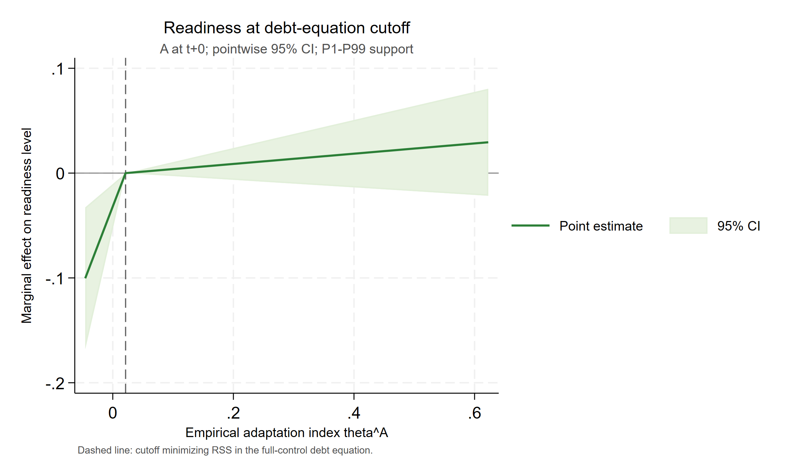
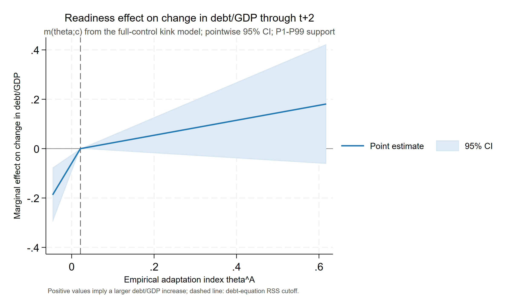
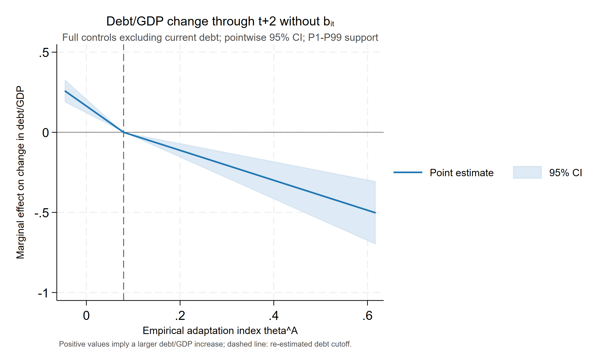
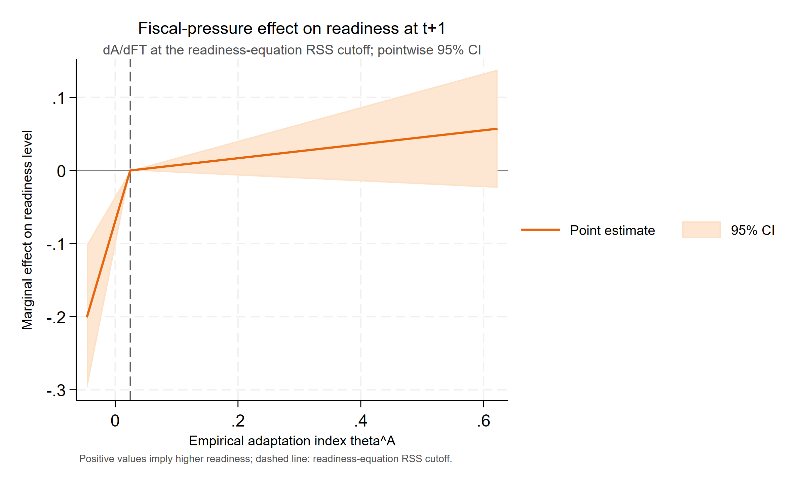
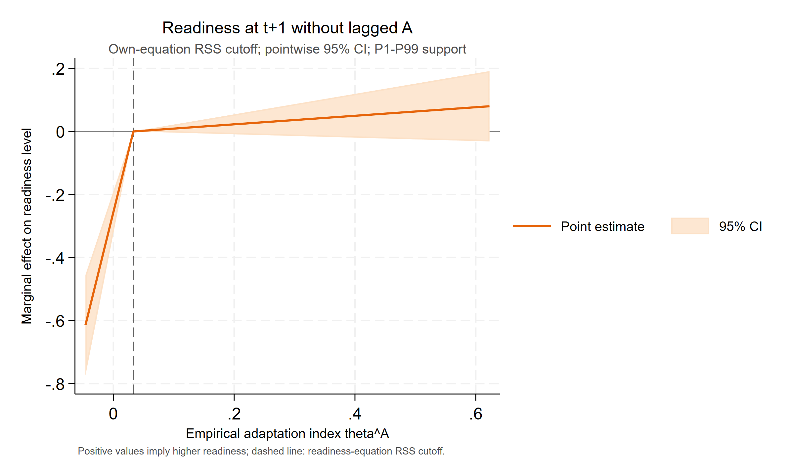
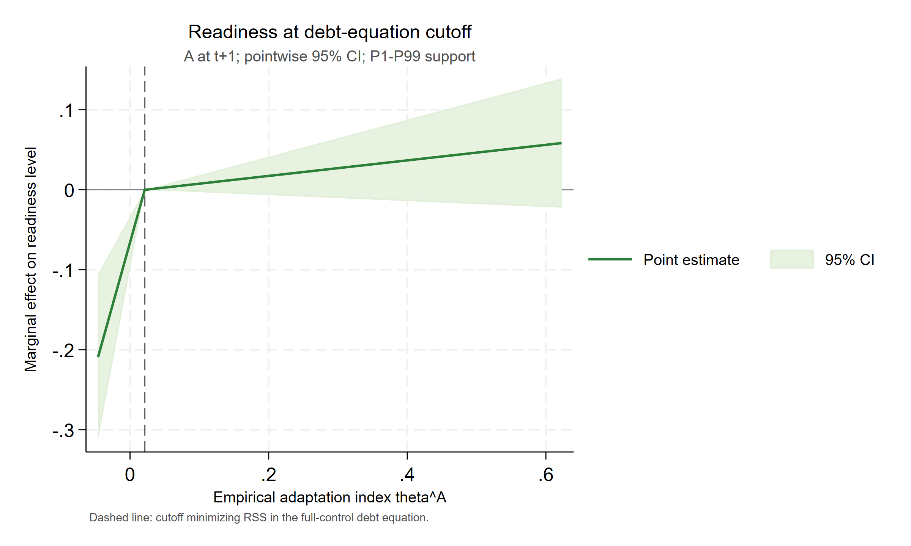
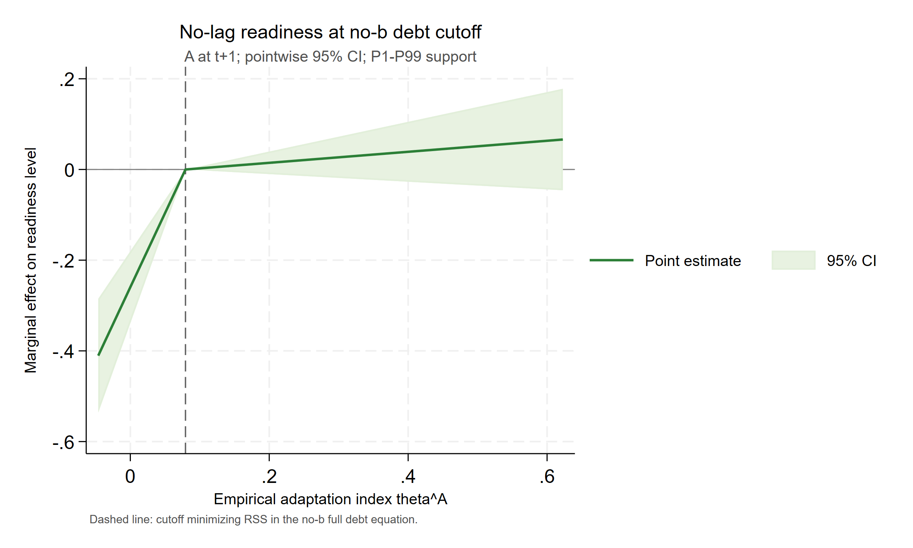

# Paper B：统一回归公式与结果表

> 数据：`data0804/invest_panel_weo.csv`；整合生成时间：2026-08-07 16:33（Asia/Shanghai）。
> 本文档只放回归公式、正式系数表、边际效应、cutoff 与经验指标构造结果。数据检查和统计检验见 `paperB_diagnostics.md`。所有源比率、百分数和 0—100 指数均先除以 100，以 0—1 比率进入回归；`CurrentGDP` 保留原始金额尺度。

## 技术摘要

- Baseline 全交互模型中，A×b 系数为 -0.1898（p <0.001），A×X 系数为 -0.0261（p=0.879）。
- 全控制税基模型的原始尺度适应能力系数为 -0.1012（p=0.039），A×X 系数为 0.2044（p=0.060）。
- 第四节全控制水平模型中，债务方程两支联合检验 p=0.001，readiness 自身 cutoff 规格 p=0.011；第五节对应两期前瞻结果分别为 p=0.002 和 p=<0.001。
- 所有结果均为双向固定效应相关性估计。theta 和 cutoff 都是生成量，当前常规稳健标准误未覆盖完整上游估计与 cutoff 搜索不确定性。

## 1. 统一符号、控制变量与估计口径

令 $s_{it}$ 为主权利差比率，$A_{it}$ 为适应能力比率，$X_{it}$ 为气候脆弱性比率，$b_{it}=debt\_gdp_{it}$。Baseline 的宏观控制为 Growth、$\ln(CurrentGDP)$、Inflation；税基和第四、第五节全部 Doomloop 规格不控制 `CurrentGDP` 或 `ln_currentgdp`，宏观控制仅为 Growth、Inflation。外部控制均为 Reserves、Terms of trade。全部模型含国家固定效应与年份固定效应，推断采用观测层面异方差稳健标准误（不是国家聚类标准误）。

## 2. Baseline：主权利差回归

### 2.1 回归公式

$$s_{it}=\alpha_i+\lambda_t+\beta_AA_{it}+\beta_Bb_{it}+\beta_XX_{it}+\beta_{AB}A_{it}b_{it}+\beta_{AX}A_{it}X_{it}+\Gamma_m'W^m_{it}+\varepsilon^m_{it}.$$

交互回归实际用各自固定样本均值进行中心化：$A^c=A-\bar A_s$、$b^c=b-\bar b_s$、$X^c=X-\bar X_s$。为构造原始尺度边际效应，使用

$$\widehat\beta_A^{raw}=\widehat\beta_A^c-\widehat\beta_{AB}\bar b_s-\widehat\beta_{AX}\bar X_s,$$

$$\widehat m^A_{it}=-\left(\widehat\beta_A^{raw}+\widehat\beta_{AB}b_{it}+\widehat\beta_{AX}X_{it}\right)=-\left(\widehat\beta_A^c+\widehat\beta_{AB}b^c_{it}+\widehat\beta_{AX}X^c_{it}\right).$$

### 2.2 逐步回归表

系数下方括号为稳健 t 值；`***`、`**`、`*` 分别表示 1%、5%、10% 显著性。所有列使用同一共同样本。

**Panel A：核心变量与控制变量逐步检验**

| 变量/统计量 | (A_X_only) 仅 X | (A_A_only) 仅 A | (A_b_only) 仅 b | (B_all_core) 三核心 | (C_macro) +宏观 | (Layer1_X) 第一层 | (Layer2_A) 第二层 |
| --- | ---: | ---: | ---: | ---: | ---: | ---: | ---: |
| 气候脆弱性 $X_{it}$ | -0.038 (-0.525) | — | — | -0.0423 (-0.615) | 0.1597** (2.245) | 0.2203*** (2.966) | 0.2263*** (3.076) |
| 适应能力 $A_{it}$ | — | -0.0615*** (-3.033) | — | -0.0673*** (-3.368) | -0.053*** (-3.309) | — | -0.0539*** (-3.369) |
| 债务/GDP $b_{it}$ | — | — | 0.0456*** (7.415) | 0.0461*** (7.505) | 0.0497*** (8.827) | 0.0511*** (8.958) | 0.0515*** (9.062) |
| Growth | — | — | — | — | -0.1799*** (-4.886) | -0.1876*** (-4.982) | -0.1814*** (-4.955) |
| $\ln(CurrentGDP_{it})$ | — | — | — | — | 0.0194*** (6.324) | 0.0219*** (6.703) | 0.0217*** (6.769) |
| Inflation | — | — | — | — | 0.154*** (5.147) | 0.1475*** (4.748) | 0.149*** (4.932) |
| Reserves | — | — | — | — | — | 0.0236*** (5.72) | 0.0241*** (5.945) |
| Terms of trade | — | — | — | — | — | 0.0007 (0.16) | 0.0005 (0.127) |
| 宏观控制 | 否 | 否 | 否 | 否 | 是 | 是 | 是 |
| 外部控制 | 否 | 否 | 否 | 否 | 否 | 是 | 是 |
| 国家固定效应 | 是 | 是 | 是 | 是 | 是 | 是 | 是 |
| 年份固定效应 | 是 | 是 | 是 | 是 | 是 | 是 | 是 |
| 国家数 | 60 | 60 | 60 | 60 | 60 | 60 | 60 |
| 年份数 | 26 | 26 | 26 | 26 | 26 | 26 | 26 |
| 样本量 | 1,174 | 1,174 | 1,174 | 1,174 | 1,174 | 1,174 | 1,174 |
| Within $R^2$ | 0.129 | 0.138 | 0.229 | 0.241 | 0.441 | 0.44 | 0.447 |
| Overall $R^2$ | 0.026 | 0.378 | 0.01 | 0.028 | 0.192 | 0.147 | 0.196 |

**Panel B：交互模型**

| 变量/统计量 | (Interact_AB) A×b | (Interact_AX) A×X | (Interact_all) 双交互 |
| --- | ---: | ---: | ---: |
| $A^c_{it}$ | -0.0731*** (-4.224) | -0.0547*** (-3.11) | -0.072*** (-3.909) |
| $X^c_{it}$ | 0.251*** (3.399) | 0.2279*** (3.167) | 0.2486*** (3.459) |
| $b^c_{it}$ | 0.0556*** (11.817) | 0.0515*** (9.062) | 0.0556*** (11.816) |
| $A^c_{it}\times b^c_{it}$ | -0.1897*** (-6.28) | — | -0.1898*** (-6.296) |
| $A^c_{it}\times X^c_{it}$ | — | 0.0185 (0.11) | -0.0261 (-0.152) |
| Growth | -0.165*** (-4.806) | -0.1815*** (-4.923) | -0.1649*** (-4.77) |
| $\ln(CurrentGDP_{it})$ | 0.0175*** (5.779) | 0.0216*** (6.69) | 0.0175*** (5.693) |
| Inflation | 0.1569*** (5.511) | 0.1492*** (4.955) | 0.1567*** (5.512) |
| Reserves | 0.0271*** (5.796) | 0.0242*** (5.954) | 0.027*** (5.764) |
| Terms of trade | -0.0031 (-0.758) | 0.0006 (0.131) | -0.0031 (-0.762) |
| 宏观控制 | 是 | 是 | 是 |
| 外部控制 | 是 | 是 | 是 |
| 国家固定效应 | 是 | 是 | 是 |
| 年份固定效应 | 是 | 是 | 是 |
| 国家数 | 60 | 60 | 60 |
| 年份数 | 26 | 26 | 26 |
| 样本量 | 1,174 | 1,174 | 1,174 |
| Within $R^2$ | 0.498 | 0.447 | 0.498 |
| Overall $R^2$ | 0.274 | 0.196 | 0.273 |

### 2.3 构造用原始尺度系数

| 参数 | 估计值 | 稳健 SE | t | p | 95% CI |
| --- | ---: | ---: | ---: | ---: | ---: |
| beta_A_raw | 0.0553 | 0.0701 | 0.79 | 0.430 | [-0.0822, 0.1929] |
| beta_AB | -0.1898 | 0.0302 | -6.296 | <0.001 | [-0.249, -0.1307] |
| beta_AX | -0.0261 | 0.1715 | -0.152 | 0.879 | [-0.3625, 0.3103] |

展开：baseline 交互模型的点边际效应

| 模型 | 点 | 调节变量/$\theta$ | 边际效应 | 稳健 SE | p 值 | 95% CI |
| --- | ---: | ---: | ---: | ---: | ---: | ---: |
| Interact_AB | P10 | 0.2672 | -0.006 | 0.0167 | 0.718 | [-0.0387, 0.0267] |
| Interact_AB | P25 | 0.3801 | -0.0274 | 0.0161 | 0.089 | [-0.0591, 0.0042] |
| Interact_AB | P50 | 0.5408 | -0.0579 | 0.0166 | <0.001 | [-0.0904, -0.0254] |
| Interact_AB | P75 | 0.7869 | -0.1046 | 0.0197 | <0.001 | [-0.1433, -0.066] |
| Interact_AB | P90 | 1.0557 | -0.1556 | 0.0253 | <0.001 | [-0.2053, -0.106] |
| Interact_AB | Mean_minus_1SD | 0.2634 | -0.0053 | 0.0167 | 0.751 | [-0.038, 0.0274] |
| Interact_AB | Mean | 0.6205 | -0.0731 | 0.0173 | <0.001 | [-0.107, -0.0391] |
| Interact_AB | Mean_plus_1SD | 0.9777 | -0.1408 | 0.0235 | <0.001 | [-0.187, -0.0947] |
| Interact_AX | P10 | 0.2855 | -0.0562 | 0.0263 | 0.033 | [-0.1078, -0.0046] |
| Interact_AX | P25 | 0.3115 | -0.0557 | 0.023 | 0.015 | [-0.1008, -0.0106] |
| Interact_AX | P50 | 0.3476 | -0.055 | 0.0191 | 0.004 | [-0.0925, -0.0176] |
| Interact_AX | P75 | 0.4058 | -0.054 | 0.016 | <0.001 | [-0.0854, -0.0225] |
| Interact_AX | P90 | 0.4844 | -0.0525 | 0.0204 | 0.010 | [-0.0926, -0.0124] |
| Interact_AX | Mean_minus_1SD | 0.294 | -0.056 | 0.0252 | 0.026 | [-0.1054, -0.0066] |
| Interact_AX | Mean | 0.3662 | -0.0547 | 0.0176 | 0.002 | [-0.0892, -0.0202] |
| Interact_AX | Mean_plus_1SD | 0.4383 | -0.0534 | 0.0167 | 0.001 | [-0.0862, -0.0205] |
| Interact_all | P10 | 0.2672 | -0.0049 | 0.0173 | 0.777 | [-0.0389, 0.0291] |
| Interact_all | P25 | 0.3801 | -0.0264 | 0.017 | 0.121 | [-0.0597, 0.007] |
| Interact_all | P50 | 0.5408 | -0.0569 | 0.0176 | 0.001 | [-0.0915, -0.0223] |
| Interact_all | P75 | 0.7869 | -0.1036 | 0.0209 | <0.001 | [-0.1446, -0.0626] |
| Interact_all | P90 | 1.0557 | -0.1546 | 0.0264 | <0.001 | [-0.2065, -0.1027] |
| Interact_all | Mean_minus_1SD | 0.2634 | -0.0042 | 0.0174 | 0.809 | [-0.0383, 0.0299] |
| Interact_all | Mean | 0.6205 | -0.072 | 0.0184 | <0.001 | [-0.1082, -0.0359] |
| Interact_all | Mean_plus_1SD | 0.9777 | -0.1398 | 0.0247 | <0.001 | [-0.1882, -0.0914] |
| Interact_all | P10 | 0.2855 | -0.0699 | 0.0266 | 0.009 | [-0.1221, -0.0178] |
| Interact_all | P25 | 0.3115 | -0.0706 | 0.0234 | 0.003 | [-0.1164, -0.0247] |
| Interact_all | P50 | 0.3476 | -0.0715 | 0.0197 | <0.001 | [-0.1103, -0.0328] |
| Interact_all | P75 | 0.4058 | -0.073 | 0.0173 | <0.001 | [-0.107, -0.0391] |
| Interact_all | P90 | 0.4844 | -0.0751 | 0.0222 | <0.001 | [-0.1186, -0.0315] |
| Interact_all | Mean_minus_1SD | 0.294 | -0.0701 | 0.0255 | 0.006 | [-0.1201, -0.0201] |
| Interact_all | Mean | 0.3662 | -0.072 | 0.0184 | <0.001 | [-0.1082, -0.0359] |
| Interact_all | Mean_plus_1SD | 0.4383 | -0.0739 | 0.0183 | <0.001 | [-0.1098, -0.038] |

## 3. Empirical theta：边际税基收益与经验指标

### 3.1 税基回归公式与时序

$$\widetilde T_{i,t+1}^{(t)}=\frac{(taxgdp_{i,t+1}\times0.01)\,CurrentGDP_{i,t+1}}{CurrentGDP_{it}},\qquad \widetilde T_{it}^{(t-1)}=taxgdp_{it}\times0.01.$$

`taxgdp` 的源单位是 GDP 百分比，先乘 0.01 转成 0—1 比率。税基回归不把 `CurrentGDP` 或 `ln_currentgdp` 作为控制变量；`CurrentGDP` 仅用于构造前瞻因变量。

$$\widetilde T_{i,t+1}^{(t)}=\alpha_i+\lambda_t+\gamma_AA_{it}+\gamma_XX_{it}+\gamma_{AX}A_{it}X_{it}+\rho_T\widetilde T_{it}^{(t-1)}+\Gamma_T'W^T_{it}+\varepsilon^T_{i,t+1}.$$

税基交互模型也在税基固定样本内中心化。原始尺度截距斜率为 $\widehat\gamma_A^{raw}=\widehat\gamma_A^c-\widehat\gamma_{AX}\bar X_T$，故

$$\widehat T^A_{it}=\widehat\gamma_A^{raw}+\widehat\gamma_{AX}X_{it}=\widehat\gamma_A^c+\widehat\gamma_{AX}X^c_{it}.$$

### 3.2 税基逐步回归表

**Panel A：核心变量与控制变量逐步检验**

| 变量/统计量 | (T1_X_only) 仅 X | (T2_A_only) 仅 A | (T3_persistence) 仅滞后税基 | (T4_all_core) 核心项 | (T5_macro) +宏观 | (T6_layer1_X) 第一层 | (T7_layer2_A) 第二层 |
| --- | ---: | ---: | ---: | ---: | ---: | ---: | ---: |
| 气候脆弱性 $X_{it}$ | 0.0627 (0.777) | — | — | 0.182*** (2.995) | 0.1121* (1.879) | 0.0934 (1.575) | 0.1035* (1.725) |
| 适应能力 $A_{it}$ | — | -0.0589*** (-3.412) | — | -0.0157 (-1.377) | -0.0132 (-1.231) | — | -0.0169 (-1.54) |
| $\widetilde T_{it}^{(t-1)}$ | — | — | 0.8494*** (14.549) | 0.8502*** (14.405) | 0.8318*** (14.104) | 0.8356*** (14.221) | 0.8318*** (14.124) |
| Growth | — | — | — | — | 0.1162*** (6.289) | 0.1149*** (6.212) | 0.1148*** (6.207) |
| Inflation | — | — | — | — | 0.0974*** (6.026) | 0.0937*** (5.852) | 0.0931*** (5.715) |
| Reserves | — | — | — | — | — | -0.0004 (-0.091) | 0.0001 (0.031) |
| Terms of trade | — | — | — | — | — | -0.0088*** (-2.791) | -0.0091*** (-2.86) |
| 宏观控制 | 否 | 否 | 否 | 否 | 是 | 是 | 是 |
| 外部控制 | 否 | 否 | 否 | 否 | 否 | 是 | 是 |
| 国家固定效应 | 是 | 是 | 是 | 是 | 是 | 是 | 是 |
| 年份固定效应 | 是 | 是 | 是 | 是 | 是 | 是 | 是 |
| 国家数 | 60 | 60 | 60 | 60 | 60 | 60 | 60 |
| 年份数 | 28 | 28 | 28 | 28 | 28 | 28 | 28 |
| 样本量 | 1,414 | 1,414 | 1,414 | 1,414 | 1,414 | 1,414 | 1,414 |
| Within $R^2$ | 0.203 | 0.209 | 0.555 | 0.559 | 0.594 | 0.597 | 0.598 |
| Overall $R^2$ | 0.02 | 0.07 | 0.958 | 0.927 | 0.946 | 0.955 | 0.947 |

**Panel B：交互模型**

| 变量/统计量 | (T8_interact_core) 交互核心 | (T9_interact_macro) 交互+宏观 | (T10_interact_full) 交互+全控制 |
| --- | ---: | ---: | ---: |
| $A^c_{it}$ | -0.0225* (-1.791) | -0.0197* (-1.648) | -0.023* (-1.878) |
| $X^c_{it}$ | 0.2185*** (3.581) | 0.1467** (2.449) | 0.1366** (2.272) |
| $A^c_{it}\times X^c_{it}$ | 0.2329** (2.075) | 0.2198** (2.042) | 0.2044* (1.885) |
| $\widetilde T_{it}^{(t-1)}$ | 0.8416*** (14.022) | 0.8237*** (13.741) | 0.8241*** (13.759) |
| Growth | — | 0.1158*** (6.271) | 0.1142*** (6.183) |
| Inflation | — | 0.0974*** (6.002) | 0.0931*** (5.689) |
| Reserves | — | — | 0.0015 (0.3) |
| Terms of trade | — | — | -0.0089*** (-2.833) |
| 宏观控制 | 否 | 是 | 是 |
| 外部控制 | 否 | 否 | 是 |
| 国家固定效应 | 是 | 是 | 是 |
| 年份固定效应 | 是 | 是 | 是 |
| 国家数 | 60 | 60 | 60 |
| 年份数 | 28 | 28 | 28 |
| 样本量 | 1,414 | 1,414 | 1,414 |
| Within $R^2$ | 0.56 | 0.595 | 0.599 |
| Overall $R^2$ | 0.912 | 0.934 | 0.937 |

### 3.3 边际税基收益与 theta 构造

| 参数 | 估计值 | 稳健 SE | t | p | 95% CI |
| --- | ---: | ---: | ---: | ---: | ---: |
| gamma_A_raw | -0.1012 | 0.0488 | -2.071 | 0.039 | [-0.197, -0.0053] |
| gamma_AX | 0.2044 | 0.1084 | 1.885 | 0.060 | [-0.0083, 0.4171] |

最终经验指标为

$$\widehat\theta^A_{it}=b_{it}\widehat m^A_{it}+\widehat T^A_{it},\qquad b_{it}=debt\_gdp_{it}.$$

| 构造量 | 样本 | N | 均值 | SD | P10 | P50 | P90 |
| --- | ---: | ---: | ---: | ---: | ---: | ---: | ---: |
| mA_hat | theta_support | 1,103 | 0.0714 | 0.0675 | 0.0047 | 0.0557 | 0.154 |
| spread_saving_component | theta_support | 1,103 | 0.0681 | 0.1111 | 0.0013 | 0.0301 | 0.1624 |
| TA_hat | theta_support | 1,103 | -0.0264 | 0.0148 | -0.0428 | -0.0303 | -0.0022 |
| theta_hat_A | theta_support | 1,103 | 0.0417 | 0.111 | -0.0333 | 0.0102 | 0.1335 |
| theta_hat_A | all_constructible | 1,677 | 0.0381 | 0.1065 | -0.0326 | 0.0101 | 0.1236 |

`theta_support` 是 spread 与 tax 估计样本的交集；`all_constructible` 是三项构造输入均非缺失的所有观测。联合 theta 标准误未报告，因为跨方程协方差需要联合 bootstrap 或系统估计。

展开：税基交互模型的点边际效应

| 模型 | 点 | 调节变量/$\theta$ | 边际效应 | 稳健 SE | p 值 | 95% CI |
| --- | ---: | ---: | ---: | ---: | ---: | ---: |
| T8_interact_core | P10 | 0.2991 | -0.042 | 0.019 | 0.027 | [-0.0792, -0.0048] |
| T8_interact_core | P25 | 0.3169 | -0.0378 | 0.0174 | 0.030 | [-0.0719, -0.0037] |
| T8_interact_core | P50 | 0.3677 | -0.026 | 0.0135 | 0.054 | [-0.0524, 0.0004] |
| T8_interact_core | P75 | 0.4345 | -0.0104 | 0.011 | 0.344 | [-0.0321, 0.0112] |
| T8_interact_core | P90 | 0.504 | 0.0057 | 0.0134 | 0.667 | [-0.0205, 0.032] |
| T8_interact_core | Mean_minus_1SD | 0.3028 | -0.0411 | 0.0186 | 0.027 | [-0.0776, -0.0046] |
| T8_interact_core | Mean | 0.3826 | -0.0225 | 0.0126 | 0.074 | [-0.0472, 0.0022] |
| T8_interact_core | Mean_plus_1SD | 0.4623 | -0.004 | 0.0114 | 0.728 | [-0.0263, 0.0184] |
| T9_interact_macro | P10 | 0.2991 | -0.038 | 0.0181 | 0.036 | [-0.0736, -0.0025] |
| T9_interact_macro | P25 | 0.3169 | -0.0341 | 0.0166 | 0.040 | [-0.0667, -0.0016] |
| T9_interact_macro | P50 | 0.3677 | -0.0229 | 0.0128 | 0.073 | [-0.0481, 0.0022] |
| T9_interact_macro | P75 | 0.4345 | -0.0083 | 0.0104 | 0.427 | [-0.0287, 0.0121] |
| T9_interact_macro | P90 | 0.504 | 0.007 | 0.0127 | 0.579 | [-0.0178, 0.0319] |
| T9_interact_macro | Mean_minus_1SD | 0.3028 | -0.0372 | 0.0178 | 0.037 | [-0.0721, -0.0023] |
| T9_interact_macro | Mean | 0.3826 | -0.0197 | 0.0119 | 0.100 | [-0.0431, 0.0037] |
| T9_interact_macro | Mean_plus_1SD | 0.4623 | -0.0021 | 0.0108 | 0.842 | [-0.0232, 0.019] |
| T10_interact_full | P10 | 0.2991 | -0.04 | 0.0185 | 0.031 | [-0.0764, -0.0036] |
| T10_interact_full | P25 | 0.3169 | -0.0364 | 0.017 | 0.032 | [-0.0697, -0.003] |
| T10_interact_full | P50 | 0.3677 | -0.026 | 0.0131 | 0.048 | [-0.0518, -0.0003] |
| T10_interact_full | P75 | 0.4345 | -0.0124 | 0.0105 | 0.241 | [-0.0331, 0.0083] |
| T10_interact_full | P90 | 0.504 | 0.0018 | 0.0126 | 0.884 | [-0.0229, 0.0266] |
| T10_interact_full | Mean_minus_1SD | 0.3028 | -0.0393 | 0.0182 | 0.031 | [-0.075, -0.0035] |
| T10_interact_full | Mean | 0.3826 | -0.023 | 0.0122 | 0.061 | [-0.047, 0.001] |
| T10_interact_full | Mean_plus_1SD | 0.4623 | -0.0067 | 0.0108 | 0.537 | [-0.0279, 0.0145] |

## 4. Doomloop：Single-Crossing Kink Marginal-Effect Model

### 4.1 方程、控制变量与 cutoff 口径

$$\Delta b_{i,t+1}=b_{i,t+1}-b_{it}.$$

$$\Delta b_{i,t+1}=\alpha_i+\lambda_t+\beta_LA_{it}(c-\widehat\theta^A_{it})_++\beta_HA_{it}(\widehat\theta^A_{it}-c)_++\rho_bb_{it}+\gamma_XX_{it}+\Gamma_B'W^B_{it}+\varepsilon^B_{i,t+1}.$$

$$A_{it}=\alpha_i+\lambda_t+\delta_LFT_{it}(c-\widehat\theta^A_{it})_++\delta_HFT_{it}(\widehat\theta^A_{it}-c)_++\rho_AA_{i,t-1}+\gamma_XX_{it}+\Gamma_A'W^A_{it}+\varepsilon^A_{it}.$$

第二个方程的两支只乘 `FT=interest_revenue`。所有规格均显式控制 $X_{it}$，宏观控制仅为 Growth 与 Inflation，外部控制为 Reserves 与 Terms of trade；不加入 `CurrentGDP` 或 `ln_currentgdp`。每个方程先锁定全控制共同样本。readiness 同时报告两种 cutoff：自身全控制方程的 RSS 最小值，以及相应债务全控制方程的 RSS 最小值。去状态规格分别去掉 $b_{it}$ 与 $A_{i,t-1}$，并重新完成 cutoff 搜索。

**债务变化方程（含 b）**

| 变量/统计量 | (D1_core) 核心项 | (D2_macro) +宏观 | (D3_full) +全控制 |
| --- | ---: | ---: | ---: |
| $A_{it}(c-\widehat\theta^A_{it})_+$ | -1.3368*** (-2.658) | -1.701*** (-3.575) | -1.6801*** (-3.514) |
| $A_{it}(\widehat\theta^A_{it}-c)_+$ | 0.0374 (0.306) | 0.1284 (1.078) | 0.1354 (1.132) |
| $b_{it}$ | -0.1473*** (-4.441) | -0.1779*** (-5.634) | -0.1762*** (-5.604) |
| $X_{it}$ | -0.2475 (-1.28) | -0.124 (-0.659) | -0.0974 (-0.529) |
| Growth | — | -0.5426*** (-7.293) | -0.5408*** (-7.27) |
| Inflation | — | -0.126* (-1.85) | -0.121* (-1.76) |
| Reserves | — | — | -0.0075 (-0.459) |
| Terms of trade | — | — | 0.0125 (1.317) |
| 宏观控制 | 否 | 是 | 是 |
| 外部控制 | 否 | 否 | 是 |
| 国家固定效应 | 是 | 是 | 是 |
| 年份固定效应 | 是 | 是 | 是 |
| 国家数 | 60 | 60 | 60 |
| 年份数 | 28 | 28 | 28 |
| 样本量 | 1,433 | 1,433 | 1,433 |
| Within $R^2$ | 0.342 | 0.387 | 0.388 |
| Overall $R^2$ | 0.141 | 0.181 | 0.184 |

**债务变化方程（去 b）**

| 变量/统计量 | (DN1_core) 核心项（无 b） | (DN2_macro) +宏观（无 b） | (DN3_full) +全控制（无 b） |
| --- | ---: | ---: | ---: |
| $A_{it}(c-\widehat\theta^A_{it})_+$ | 0.7941*** (3.792) | 0.8606*** (4.376) | 0.8514*** (4.335) |
| $A_{it}(\widehat\theta^A_{it}-c)_+$ | -0.481*** (-4.166) | -0.4894*** (-4.33) | -0.4703*** (-4.163) |
| $X_{it}$ | 0.0318 (0.148) | 0.1937 (0.909) | 0.2307 (1.09) |
| Growth | — | -0.4401*** (-6.149) | -0.4395*** (-6.156) |
| Inflation | — | -0.1449** (-2.047) | -0.1375* (-1.932) |
| Reserves | — | — | -0.0077 (-0.454) |
| Terms of trade | — | — | 0.0183* (1.872) |
| 宏观控制 | 否 | 是 | 是 |
| 外部控制 | 否 | 否 | 是 |
| 国家固定效应 | 是 | 是 | 是 |
| 年份固定效应 | 是 | 是 | 是 |
| 国家数 | 60 | 60 | 60 |
| 年份数 | 28 | 28 | 28 |
| 样本量 | 1,433 | 1,433 | 1,433 |
| Within $R^2$ | 0.312 | 0.345 | 0.348 |
| Overall $R^2$ | 0.129 | 0.164 | 0.167 |

**Readiness 水平方程（自身 cutoff，含 A 滞后）**

| 变量/统计量 | (R1_core) 核心项 | (R2_macro) +宏观 | (R3_full) +全控制 |
| --- | ---: | ---: | ---: |
| $FT_{it}(c-\widehat\theta^A_{it})_+$ | -1.3866*** (-2.724) | -1.345*** (-2.676) | -1.4212*** (-2.861) |
| $FT_{it}(\widehat\theta^A_{it}-c)_+$ | 0.0333 (0.829) | 0.0563 (1.329) | 0.0487 (1.122) |
| $A_{i,t-1}$ | 0.8536*** (31.985) | 0.8535*** (31.953) | 0.852*** (31.509) |
| $X_{it}$ | -0.0744* (-1.692) | -0.0763* (-1.721) | -0.093** (-2.096) |
| Growth | — | 0.0264* (1.852) | 0.027* (1.898) |
| Inflation | — | -0.0037 (-0.432) | -0.0048 (-0.586) |
| Reserves | — | — | -0.0062* (-1.796) |
| Terms of trade | — | — | -0.0036 (-1.022) |
| 宏观控制 | 否 | 是 | 是 |
| 外部控制 | 否 | 否 | 是 |
| 国家固定效应 | 是 | 是 | 是 |
| 年份固定效应 | 是 | 是 | 是 |
| 国家数 | 59 | 59 | 59 |
| 年份数 | 28 | 28 | 28 |
| 样本量 | 1,448 | 1,448 | 1,448 |
| Within $R^2$ | 0.83 | 0.831 | 0.831 |
| Overall $R^2$ | 0.986 | 0.986 | 0.986 |

**Readiness 水平方程（债务 cutoff，含 A 滞后）**

| 变量/统计量 | (RD1_core) 核心项（债务 cutoff） | (RD2_macro) +宏观（债务 cutoff） | (RD3_full) +全控制（债务 cutoff） |
| --- | ---: | ---: | ---: |
| $FT_{it}(c_B-\widehat\theta^A_{it})_+$ | -1.4641*** (-2.781) | -1.4184*** (-2.725) | -1.4986*** (-2.91) |
| $FT_{it}(\widehat\theta^A_{it}-c_B)_+$ | 0.0333 (0.831) | 0.0564 (1.334) | 0.0489 (1.131) |
| $A_{i,t-1}$ | 0.8538*** (32.047) | 0.8537*** (32.007) | 0.8522*** (31.561) |
| $X_{it}$ | -0.0744* (-1.696) | -0.0762* (-1.723) | -0.0929** (-2.096) |
| Growth | — | 0.0263* (1.845) | 0.0269* (1.891) |
| Inflation | — | -0.0039 (-0.449) | -0.005 (-0.605) |
| Reserves | — | — | -0.0062* (-1.794) |
| Terms of trade | — | — | -0.0036 (-1.022) |
| 宏观控制 | 否 | 是 | 是 |
| 外部控制 | 否 | 否 | 是 |
| 国家固定效应 | 是 | 是 | 是 |
| 年份固定效应 | 是 | 是 | 是 |
| 国家数 | 59 | 59 | 59 |
| 年份数 | 28 | 28 | 28 |
| 样本量 | 1,448 | 1,448 | 1,448 |
| Within $R^2$ | 0.83 | 0.831 | 0.831 |
| Overall $R^2$ | 0.986 | 0.986 | 0.986 |

**Readiness 水平方程（自身 cutoff，去 A 滞后）**

| 变量/统计量 | (RN1_core) 核心项（无 A 滞后） | (RN2_macro) +宏观（无 A 滞后） | (RN3_full) +全控制（无 A 滞后） |
| --- | ---: | ---: | ---: |
| $FT_{it}(c-\widehat\theta^A_{it})_+$ | -6.4588*** (-7.685) | -6.423*** (-7.473) | -6.5779*** (-7.816) |
| $FT_{it}(\widehat\theta^A_{it}-c)_+$ | 0.082 (0.94) | 0.1054 (1.127) | 0.0619 (0.682) |
| $X_{it}$ | 0.2316** (2.086) | 0.2328** (2.065) | 0.1672 (1.448) |
| Growth | — | 0.02 (0.573) | 0.0218 (0.63) |
| Inflation | — | -0.0078 (-0.295) | -0.0137 (-0.523) |
| Reserves | — | — | -0.0098* (-1.646) |
| Terms of trade | — | — | -0.0183*** (-2.733) |
| 宏观控制 | 否 | 是 | 是 |
| 外部控制 | 否 | 否 | 是 |
| 国家固定效应 | 是 | 是 | 是 |
| 年份固定效应 | 是 | 是 | 是 |
| 国家数 | 59 | 59 | 59 |
| 年份数 | 29 | 29 | 29 |
| 样本量 | 1,458 | 1,458 | 1,458 |
| Within $R^2$ | 0.392 | 0.393 | 0.398 |
| Overall $R^2$ | 0.02 | 0.021 | 0 |

**Readiness 水平方程（债务 cutoff，去 A 滞后）**

| 变量/统计量 | (RDN1_core) 核心项（无滞后，债务 cutoff） | (RDN2_macro) +宏观（无滞后，债务 cutoff） | (RDN3_full) +全控制（无滞后，债务 cutoff） |
| --- | ---: | ---: | ---: |
| $FT_{it}(c_B-\widehat\theta^A_{it})_+$ | -4.901*** (-7.324) | -4.8676*** (-7.121) | -4.9427*** (-7.297) |
| $FT_{it}(\widehat\theta^A_{it}-c_B)_+$ | 0.1137 (1.3) | 0.1362 (1.45) | 0.0933 (1.024) |
| $X_{it}$ | 0.2755** (2.484) | 0.2767** (2.46) | 0.2174* (1.876) |
| Growth | — | 0.0182 (0.518) | 0.0199 (0.572) |
| Inflation | — | -0.0077 (-0.299) | -0.0132 (-0.516) |
| Reserves | — | — | -0.0105* (-1.723) |
| Terms of trade | — | — | -0.0167** (-2.401) |
| 宏观控制 | 否 | 是 | 是 |
| 外部控制 | 否 | 否 | 是 |
| 国家固定效应 | 是 | 是 | 是 |
| 年份固定效应 | 是 | 是 | 是 |
| 国家数 | 59 | 59 | 59 |
| 年份数 | 29 | 29 | 29 |
| 样本量 | 1,458 | 1,458 | 1,458 |
| Within $R^2$ | 0.389 | 0.389 | 0.394 |
| Overall $R^2$ | 0.042 | 0.044 | 0.01 |

### 4.2 Cutoff 与全控制分支系数

| 规格 | 结果方程 | cutoff 来源 | cutoff | 来源方程最小 RSS | 候选数 | 低支 N | 高支 N | a | b | 异号 |
| --- | ---: | ---: | ---: | ---: | ---: | ---: | ---: | ---: | ---: | ---: |
| 含状态 | 债务 | 债务方程 RSS | 0.0212 | 3.3681 | 1,146 | 867 | 566 | -1.6801 | 0.1354 | 是 |
| 含状态 | Readiness | Readiness 方程 RSS | 0.023 | 0.367 | 1,159 | 913 | 535 | -1.4212 | 0.0487 | 是 |
| 含状态 | Readiness | 债务方程 RSS | 0.0212 | 3.3681 | 1,146 | 867 | 566 | -1.4986 | 0.0489 | 是 |
| 去状态 | 债务 | 去 b 债务方程 RSS | 0.0537 | 3.5891 | 1,146 | 1,093 | 340 | 0.8514 | -0.4703 | 是 |
| 去状态 | Readiness | 去滞后 Readiness 方程 RSS | 0.0416 | 1.3245 | 1,166 | 1,052 | 406 | -6.5779 | 0.0619 | 是 |
| 去状态 | Readiness | 去 b 债务方程 RSS | 0.0537 | 3.5891 | 1,146 | 1,093 | 340 | -4.9427 | 0.0933 | 是 |

点边际效应统一按 $m(\theta;c)=a(c-\theta)_++b(\theta-c)_+$ 计算；在 cutoff 处定义为 0。

展开：第 4 节六组 kink 点边际效应

| 方程/规格 | 点 | 调节变量/$\theta$ | 边际效应 | 稳健 SE | p 值 | 95% CI |
| --- | ---: | ---: | ---: | ---: | ---: | ---: |
| 含状态-debt | P10 | -0.0328 | -0.0907 | 0.0258 | <0.001 | [-0.1414, -0.0401] |
| 含状态-debt | P25 | -0.0141 | -0.0594 | 0.0169 | <0.001 | [-0.0925, -0.0262] |
| 含状态-debt | P50 | 0.0101 | -0.0187 | 0.0053 | <0.001 | [-0.0291, -0.0083] |
| 含状态-debt | Mean | 0.0384 | 0.0023 | 0.0021 | 0.258 | [-0.0017, 0.0063] |
| 含状态-debt | Cutoff | 0.0212 | 0 | 0 | — | [0, 0] |
| 含状态-debt | P75 | 0.0504 | 0.0039 | 0.0035 | 0.258 | [-0.0029, 0.0108] |
| 含状态-debt | P90 | 0.1236 | 0.0139 | 0.0122 | 0.258 | [-0.0102, 0.0379] |
| 含状态-ready | P10 | -0.0329 | -0.0795 | 0.0278 | 0.004 | [-0.134, -0.025] |
| 含状态-ready | P25 | -0.0144 | -0.0532 | 0.0186 | 0.004 | [-0.0896, -0.0167] |
| 含状态-ready | P50 | 0.0093 | -0.0195 | 0.0068 | 0.004 | [-0.0329, -0.0061] |
| 含状态-ready | Mean | 0.0375 | 0.0007 | 0.0006 | 0.262 | [-0.0005, 0.0019] |
| 含状态-ready | Cutoff | 0.023 | 0 | 0 | — | [0, 0] |
| 含状态-ready | P75 | 0.0469 | 0.0012 | 0.001 | 0.262 | [-0.0009, 0.0032] |
| 含状态-ready | P90 | 0.1209 | 0.0048 | 0.0043 | 0.262 | [-0.0036, 0.0131] |
| 含状态-ready_debt | P10 | -0.0329 | -0.0812 | 0.0279 | 0.004 | [-0.136, -0.0265] |
| 含状态-ready_debt | P25 | -0.0144 | -0.0534 | 0.0184 | 0.004 | [-0.0895, -0.0174] |
| 含状态-ready_debt | P50 | 0.0093 | -0.018 | 0.0062 | 0.004 | [-0.0301, -0.0059] |
| 含状态-ready_debt | Mean | 0.0375 | 0.0008 | 0.0007 | 0.258 | [-0.0006, 0.0022] |
| 含状态-ready_debt | Cutoff | 0.0212 | 0 | 0 | — | [0, 0] |
| 含状态-ready_debt | P75 | 0.0469 | 0.0013 | 0.0011 | 0.258 | [-0.0009, 0.0034] |
| 含状态-ready_debt | P90 | 0.1209 | 0.0049 | 0.0043 | 0.258 | [-0.0036, 0.0133] |
| 去状态-debt | P10 | -0.0328 | 0.0736 | 0.017 | <0.001 | [0.0403, 0.1069] |
| 去状态-debt | P25 | -0.0141 | 0.0577 | 0.0133 | <0.001 | [0.0316, 0.0838] |
| 去状态-debt | P50 | 0.0101 | 0.0371 | 0.0086 | <0.001 | [0.0203, 0.0538] |
| 去状态-debt | Mean | 0.0384 | 0.013 | 0.003 | <0.001 | [0.0071, 0.0189] |
| 去状态-debt | Cutoff | 0.0537 | 0 | 0 | — | [0, 0] |
| 去状态-debt | P75 | 0.0504 | 0.0028 | 0.0006 | <0.001 | [0.0015, 0.0041] |
| 去状态-debt | P90 | 0.1236 | -0.0329 | 0.0079 | <0.001 | [-0.0484, -0.0174] |
| 去状态-ready | P10 | -0.0329 | -0.4902 | 0.0627 | <0.001 | [-0.6133, -0.3672] |
| 去状态-ready | P25 | -0.0145 | -0.3689 | 0.0472 | <0.001 | [-0.4615, -0.2763] |
| 去状态-ready | P50 | 0.0093 | -0.2126 | 0.0272 | <0.001 | [-0.266, -0.1593] |
| 去状态-ready | Mean | 0.0374 | -0.0273 | 0.0035 | <0.001 | [-0.0341, -0.0204] |
| 去状态-ready | Cutoff | 0.0416 | 0 | 0 | — | [0, 0] |
| 去状态-ready | P75 | 0.0469 | 0.0003 | 0.0005 | 0.496 | [-0.0006, 0.0013] |
| 去状态-ready | P90 | 0.1209 | 0.0049 | 0.0072 | 0.496 | [-0.0092, 0.019] |
| 去状态-ready_debt | P10 | -0.0329 | -0.4281 | 0.0587 | <0.001 | [-0.5431, -0.313] |
| 去状态-ready_debt | P25 | -0.0145 | -0.3369 | 0.0462 | <0.001 | [-0.4275, -0.2463] |
| 去状态-ready_debt | P50 | 0.0093 | -0.2195 | 0.0301 | <0.001 | [-0.2785, -0.1605] |
| 去状态-ready_debt | Mean | 0.0374 | -0.0802 | 0.011 | <0.001 | [-0.1017, -0.0586] |
| 去状态-ready_debt | Cutoff | 0.0537 | 0 | 0 | — | [0, 0] |
| 去状态-ready_debt | P75 | 0.0469 | -0.0333 | 0.0046 | <0.001 | [-0.0422, -0.0243] |
| 去状态-ready_debt | P90 | 0.1209 | 0.0063 | 0.0061 | 0.306 | [-0.0057, 0.0183] |

### 4.3 边际效应图

| 含状态变量 | 去状态变量 |
| --- | --- |
|  |  |
|  |  |
|  |  |

## 5. 两期前瞻 Doomloop：与第四节相同规格

### 5.1 方程、控制变量与 cutoff 口径

$$\Delta b_{i,t+2}=b_{i,t+2}-b_{it}.$$

$$\Delta b_{i,t+2}=\alpha_i+\lambda_t+\beta_LA_{it}(c-\widehat\theta^A_{it})_++\beta_HA_{it}(\widehat\theta^A_{it}-c)_++\rho_bb_{it}+\gamma_XX_{it}+\Gamma_B'W^B_{it}+\varepsilon^B_{i,t+1}.$$

$$A_{i,t+1}=\alpha_i+\lambda_t+\delta_LFT_{it}(c-\widehat\theta^A_{it})_++\delta_HFT_{it}(\widehat\theta^A_{it}-c)_++\rho_AA_{i,t-1}+\gamma_XX_{it}+\Gamma_A'W^A_{it}+\varepsilon^A_{it}.$$

第二个方程的两支只乘 `FT=interest_revenue`。所有规格均显式控制 $X_{it}$，宏观控制仅为 Growth 与 Inflation，外部控制为 Reserves 与 Terms of trade；不加入 `CurrentGDP` 或 `ln_currentgdp`。每个方程先锁定全控制共同样本。readiness 同时报告两种 cutoff：自身全控制方程的 RSS 最小值，以及相应债务全控制方程的 RSS 最小值。去状态规格分别去掉 $b_{it}$ 与 $A_{i,t-1}$，并重新完成 cutoff 搜索。

**债务变化方程（含 b）**

| 变量/统计量 | (D1_core) 核心项 | (D2_macro) +宏观 | (D3_full) +全控制 |
| --- | ---: | ---: | ---: |
| $A_{it}(c-\widehat\theta^A_{it})_+$ | -2.1771** (-2.51) | -2.802*** (-3.364) | -2.7779*** (-3.321) |
| $A_{it}(\widehat\theta^A_{it}-c)_+$ | 0.1439 (0.685) | 0.2946 (1.424) | 0.3033 (1.463) |
| $b_{it}$ | -0.3209*** (-5.626) | -0.3721*** (-6.734) | -0.3689*** (-6.743) |
| $X_{it}$ | -0.4729 (-1.477) | -0.2503 (-0.815) | -0.201 (-0.667) |
| Growth | — | -0.8831*** (-7.857) | -0.8824*** (-7.858) |
| Inflation | — | -0.1425 (-1.391) | -0.1352 (-1.314) |
| Reserves | — | — | -0.005 (-0.187) |
| Terms of trade | — | — | 0.0202 (1.472) |
| 宏观控制 | 否 | 是 | 是 |
| 外部控制 | 否 | 否 | 是 |
| 国家固定效应 | 是 | 是 | 是 |
| 年份固定效应 | 是 | 是 | 是 |
| 国家数 | 60 | 60 | 60 |
| 年份数 | 27 | 27 | 27 |
| 样本量 | 1,373 | 1,373 | 1,373 |
| Within $R^2$ | 0.406 | 0.448 | 0.449 |
| Overall $R^2$ | 0.114 | 0.144 | 0.146 |

**债务变化方程（去 b）**

| 变量/统计量 | (DN1_core) 核心项（无 b） | (DN2_macro) +宏观（无 b） | (DN3_full) +全控制（无 b） |
| --- | ---: | ---: | ---: |
| $A_{it}(c-\widehat\theta^A_{it})_+$ | 1.9986*** (6.605) | 2.091*** (7.191) | 2.0626*** (7.161) |
| $A_{it}(\widehat\theta^A_{it}-c)_+$ | -0.9582*** (-5.021) | -0.9698*** (-5.135) | -0.9344*** (-4.993) |
| $X_{it}$ | 0.0304 (0.09) | 0.2883 (0.859) | 0.3751 (1.123) |
| Growth | — | -0.6787*** (-6.599) | -0.6821*** (-6.67) |
| Inflation | — | -0.1878* (-1.708) | -0.1747 (-1.601) |
| Reserves | — | — | 0.0001 (0.005) |
| Terms of trade | — | — | 0.0357** (2.385) |
| 宏观控制 | 否 | 是 | 是 |
| 外部控制 | 否 | 否 | 是 |
| 国家固定效应 | 是 | 是 | 是 |
| 年份固定效应 | 是 | 是 | 是 |
| 国家数 | 60 | 60 | 60 |
| 年份数 | 27 | 27 | 27 |
| 样本量 | 1,373 | 1,373 | 1,373 |
| Within $R^2$ | 0.353 | 0.381 | 0.384 |
| Overall $R^2$ | 0.092 | 0.117 | 0.123 |

**Readiness 水平方程（自身 cutoff，含 A 滞后）**

| 变量/统计量 | (R1_core) 核心项 | (R2_macro) +宏观 | (R3_full) +全控制 |
| --- | ---: | ---: | ---: |
| $FT_{it}(c-\widehat\theta^A_{it})_+$ | -2.7705*** (-3.789) | -2.7165*** (-3.731) | -2.8431*** (-3.965) |
| $FT_{it}(\widehat\theta^A_{it}-c)_+$ | 0.0791 (1.284) | 0.1101 (1.634) | 0.0955 (1.387) |
| $A_{i,t-1}$ | 0.678*** (18.094) | 0.6778*** (18.051) | 0.6754*** (17.811) |
| $X_{it}$ | -0.0909 (-1.306) | -0.0938 (-1.317) | -0.1214* (-1.675) |
| Growth | — | 0.0315 (1.465) | 0.0325 (1.51) |
| Inflation | — | -0.0062 (-0.403) | -0.0081 (-0.539) |
| Reserves | — | — | -0.0093* (-1.782) |
| Terms of trade | — | — | -0.006 (-1.125) |
| 宏观控制 | 否 | 是 | 是 |
| 外部控制 | 否 | 否 | 是 |
| 国家固定效应 | 是 | 是 | 是 |
| 年份固定效应 | 是 | 是 | 是 |
| 国家数 | 59 | 59 | 59 |
| 年份数 | 27 | 27 | 27 |
| 样本量 | 1,389 | 1,389 | 1,389 |
| Within $R^2$ | 0.649 | 0.65 | 0.651 |
| Overall $R^2$ | 0.968 | 0.968 | 0.968 |

**Readiness 水平方程（债务 cutoff，含 A 滞后）**

| 变量/统计量 | (RD1_core) 核心项（债务 cutoff） | (RD2_macro) +宏观（债务 cutoff） | (RD3_full) +全控制（债务 cutoff） |
| --- | ---: | ---: | ---: |
| $FT_{it}(c_B-\widehat\theta^A_{it})_+$ | -3.0309*** (-3.806) | -2.9666*** (-3.738) | -3.1037*** (-3.962) |
| $FT_{it}(\widehat\theta^A_{it}-c_B)_+$ | 0.0795 (1.298) | 0.111* (1.658) | 0.0971 (1.419) |
| $A_{i,t-1}$ | 0.679*** (18.161) | 0.6788*** (18.109) | 0.6764*** (17.869) |
| $X_{it}$ | -0.0911 (-1.31) | -0.0937 (-1.317) | -0.121* (-1.671) |
| Growth | — | 0.0313 (1.452) | 0.0322 (1.496) |
| Inflation | — | -0.0069 (-0.444) | -0.0088 (-0.584) |
| Reserves | — | — | -0.0093* (-1.781) |
| Terms of trade | — | — | -0.006 (-1.12) |
| 宏观控制 | 否 | 是 | 是 |
| 外部控制 | 否 | 否 | 是 |
| 国家固定效应 | 是 | 是 | 是 |
| 年份固定效应 | 是 | 是 | 是 |
| 国家数 | 59 | 59 | 59 |
| 年份数 | 27 | 27 | 27 |
| 样本量 | 1,389 | 1,389 | 1,389 |
| Within $R^2$ | 0.649 | 0.65 | 0.65 |
| Overall $R^2$ | 0.968 | 0.968 | 0.968 |

**Readiness 水平方程（自身 cutoff，去 A 滞后）**

| 变量/统计量 | (RN1_core) 核心项（无 A 滞后） | (RN2_macro) +宏观（无 A 滞后） | (RN3_full) +全控制（无 A 滞后） |
| --- | ---: | ---: | ---: |
| $FT_{it}(c-\widehat\theta^A_{it})_+$ | -7.6487*** (-7.465) | -7.5741*** (-7.256) | -7.7491*** (-7.586) |
| $FT_{it}(\widehat\theta^A_{it}-c)_+$ | 0.1415 (1.572) | 0.1781* (1.815) | 0.1357 (1.407) |
| $X_{it}$ | 0.2049* (1.82) | 0.2079* (1.808) | 0.1439 (1.22) |
| Growth | — | 0.0247 (0.676) | 0.0263 (0.726) |
| Inflation | — | -0.0149 (-0.52) | -0.0206 (-0.732) |
| Reserves | — | — | -0.0099* (-1.682) |
| Terms of trade | — | — | -0.0173** (-2.498) |
| 宏观控制 | 否 | 是 | 是 |
| 外部控制 | 否 | 否 | 是 |
| 国家固定效应 | 是 | 是 | 是 |
| 年份固定效应 | 是 | 是 | 是 |
| 国家数 | 59 | 59 | 59 |
| 年份数 | 28 | 28 | 28 |
| 样本量 | 1,399 | 1,399 | 1,399 |
| Within $R^2$ | 0.365 | 0.366 | 0.371 |
| Overall $R^2$ | 0.019 | 0.021 | 1.30e-05 |

**Readiness 水平方程（债务 cutoff，去 A 滞后）**

| 变量/统计量 | (RDN1_core) 核心项（无滞后，债务 cutoff） | (RDN2_macro) +宏观（无滞后，债务 cutoff） | (RDN3_full) +全控制（无滞后，债务 cutoff） |
| --- | ---: | ---: | ---: |
| $FT_{it}(c_B-\widehat\theta^A_{it})_+$ | -3.2881*** (-6.706) | -3.2673*** (-6.525) | -3.269*** (-6.419) |
| $FT_{it}(\widehat\theta^A_{it}-c_B)_+$ | 0.1472 (1.476) | 0.1634 (1.527) | 0.1217 (1.158) |
| $X_{it}$ | 0.3499*** (3.186) | 0.3494*** (3.126) | 0.3002*** (2.586) |
| Growth | — | 0.0122 (0.34) | 0.014 (0.395) |
| Inflation | — | -0.0044 (-0.184) | -0.009 (-0.382) |
| Reserves | — | — | -0.0124** (-2.037) |
| Terms of trade | — | — | -0.0135* (-1.816) |
| 宏观控制 | 否 | 是 | 是 |
| 外部控制 | 否 | 否 | 是 |
| 国家固定效应 | 是 | 是 | 是 |
| 年份固定效应 | 是 | 是 | 是 |
| 国家数 | 59 | 59 | 59 |
| 年份数 | 28 | 28 | 28 |
| 样本量 | 1,399 | 1,399 | 1,399 |
| Within $R^2$ | 0.362 | 0.362 | 0.366 |
| Overall $R^2$ | 0.097 | 0.098 | 0.057 |

### 5.2 Cutoff 与全控制分支系数

| 规格 | 结果方程 | cutoff 来源 | cutoff | 来源方程最小 RSS | 候选数 | 低支 N | 高支 N | a | b | 异号 |
| --- | ---: | ---: | ---: | ---: | ---: | ---: | ---: | ---: | ---: | ---: |
| 含状态 | 债务 | 债务方程 RSS | 0.0212 | 7.5605 | 1,098 | 841 | 532 | -2.7779 | 0.3033 | 是 |
| 含状态 | Readiness | Readiness 方程 RSS | 0.0245 | 0.6954 | 1,112 | 893 | 496 | -2.8431 | 0.0955 | 是 |
| 含状态 | Readiness | 债务方程 RSS | 0.0212 | 7.5605 | 1,098 | 841 | 532 | -3.1037 | 0.0971 | 是 |
| 去状态 | 债务 | 去 b 债务方程 RSS | 0.0794 | 8.4535 | 1,098 | 1,160 | 213 | 2.0626 | -0.9344 | 是 |
| 去状态 | Readiness | 去滞后 Readiness 方程 RSS | 0.0332 | 1.2719 | 1,119 | 960 | 439 | -7.7491 | 0.1357 | 是 |
| 去状态 | Readiness | 去 b 债务方程 RSS | 0.0794 | 8.4535 | 1,098 | 1,160 | 213 | -3.269 | 0.1217 | 是 |

点边际效应统一按 $m(\theta;c)=a(c-\theta)_++b(\theta-c)_+$ 计算；在 cutoff 处定义为 0。

展开：第 5 节六组 kink 点边际效应

| 方程/规格 | 点 | 调节变量/$\theta$ | 边际效应 | 稳健 SE | p 值 | 95% CI |
| --- | ---: | ---: | ---: | ---: | ---: | ---: |
| 含状态-debt | P10 | -0.0328 | -0.1501 | 0.0452 | <0.001 | [-0.2388, -0.0614] |
| 含状态-debt | P25 | -0.0141 | -0.0983 | 0.0296 | <0.001 | [-0.1564, -0.0402] |
| 含状态-debt | P50 | 0.0095 | -0.0325 | 0.0098 | <0.001 | [-0.0517, -0.0133] |
| 含状态-debt | Mean | 0.0372 | 0.0048 | 0.0033 | 0.144 | [-0.0016, 0.0113] |
| 含状态-debt | Cutoff | 0.0212 | 0 | 0 | — | [0, 0] |
| 含状态-debt | P75 | 0.048 | 0.0081 | 0.0055 | 0.144 | [-0.0028, 0.019] |
| 含状态-debt | P90 | 0.1221 | 0.0306 | 0.0209 | 0.144 | [-0.0104, 0.0716] |
| 含状态-ready | P10 | -0.033 | -0.1635 | 0.0412 | <0.001 | [-0.2444, -0.0826] |
| 含状态-ready | P25 | -0.0147 | -0.1115 | 0.0281 | <0.001 | [-0.1667, -0.0563] |
| 含状态-ready | P50 | 0.009 | -0.0441 | 0.0111 | <0.001 | [-0.066, -0.0223] |
| 含状态-ready | Mean | 0.0367 | 0.0012 | 0.0008 | 0.166 | [-0.0005, 0.0028] |
| 含状态-ready | Cutoff | 0.0245 | 0 | 0 | — | [0, 0] |
| 含状态-ready | P75 | 0.046 | 0.002 | 0.0015 | 0.166 | [-0.0008, 0.0049] |
| 含状态-ready | P90 | 0.1208 | 0.0092 | 0.0066 | 0.166 | [-0.0038, 0.0222] |
| 含状态-ready_debt | P10 | -0.033 | -0.1683 | 0.0425 | <0.001 | [-0.2516, -0.085] |
| 含状态-ready_debt | P25 | -0.0147 | -0.1115 | 0.0281 | <0.001 | [-0.1667, -0.0563] |
| 含状态-ready_debt | P50 | 0.009 | -0.038 | 0.0096 | <0.001 | [-0.0568, -0.0192] |
| 含状态-ready_debt | Mean | 0.0367 | 0.0015 | 0.0011 | 0.156 | [-0.0006, 0.0036] |
| 含状态-ready_debt | Cutoff | 0.0212 | 0 | 0 | — | [0, 0] |
| 含状态-ready_debt | P75 | 0.046 | 0.0024 | 0.0017 | 0.156 | [-0.0009, 0.0057] |
| 含状态-ready_debt | P90 | 0.1208 | 0.0097 | 0.0068 | 0.156 | [-0.0037, 0.023] |
| 去状态-debt | P10 | -0.0328 | 0.2315 | 0.0323 | <0.001 | [0.1681, 0.2949] |
| 去状态-debt | P25 | -0.0141 | 0.193 | 0.027 | <0.001 | [0.1401, 0.2459] |
| 去状态-debt | P50 | 0.0095 | 0.1442 | 0.0201 | <0.001 | [0.1047, 0.1836] |
| 去状态-debt | Mean | 0.0372 | 0.0871 | 0.0122 | <0.001 | [0.0632, 0.111] |
| 去状态-debt | Cutoff | 0.0794 | 0 | 0 | — | [0, 0] |
| 去状态-debt | P75 | 0.048 | 0.0649 | 0.0091 | <0.001 | [0.0471, 0.0826] |
| 去状态-debt | P90 | 0.1221 | -0.0399 | 0.008 | <0.001 | [-0.0556, -0.0242] |
| 去状态-ready | P10 | -0.0329 | -0.5123 | 0.0675 | <0.001 | [-0.6448, -0.3798] |
| 去状态-ready | P25 | -0.0147 | -0.3709 | 0.0489 | <0.001 | [-0.4668, -0.275] |
| 去状态-ready | P50 | 0.009 | -0.1873 | 0.0247 | <0.001 | [-0.2357, -0.1389] |
| 去状态-ready | Mean | 0.0365 | 0.0005 | 0.0003 | 0.160 | [-0.0002, 0.0011] |
| 去状态-ready | Cutoff | 0.0332 | 0 | 0 | — | [0, 0] |
| 去状态-ready | P75 | 0.0462 | 0.0018 | 0.0013 | 0.160 | [-0.0007, 0.0042] |
| 去状态-ready | P90 | 0.1205 | 0.0118 | 0.0084 | 0.160 | [-0.0047, 0.0284] |
| 去状态-ready_debt | P10 | -0.0329 | -0.3674 | 0.0572 | <0.001 | [-0.4796, -0.2551] |
| 去状态-ready_debt | P25 | -0.0147 | -0.3077 | 0.0479 | <0.001 | [-0.4017, -0.2137] |
| 去状态-ready_debt | P50 | 0.009 | -0.2302 | 0.0359 | <0.001 | [-0.3006, -0.1599] |
| 去状态-ready_debt | Mean | 0.0365 | -0.1402 | 0.0218 | <0.001 | [-0.183, -0.0973] |
| 去状态-ready_debt | Cutoff | 0.0794 | 0 | 0 | — | [0, 0] |
| 去状态-ready_debt | P75 | 0.0462 | -0.1085 | 0.0169 | <0.001 | [-0.1417, -0.0753] |
| 去状态-ready_debt | P90 | 0.1205 | 0.005 | 0.0043 | 0.247 | [-0.0035, 0.0134] |

### 5.3 边际效应图

| 含状态变量 | 去状态变量 |
| --- | --- |
|  |  |
|  |  |
|  |  |

## 6. 结果解释边界

这些是双向固定效应相关性估计，不应表述为因果效应。cutoff 是同一样本内按 RSS 选择的生成参数，常规条件于 cutoff 的稳健标准误没有计入搜索不确定性；theta 也是两条上游回归生成的指标。正式推断应进一步采用完整流程 bootstrap，并考虑国家层面聚类或其他适合面板依赖结构的推断。
