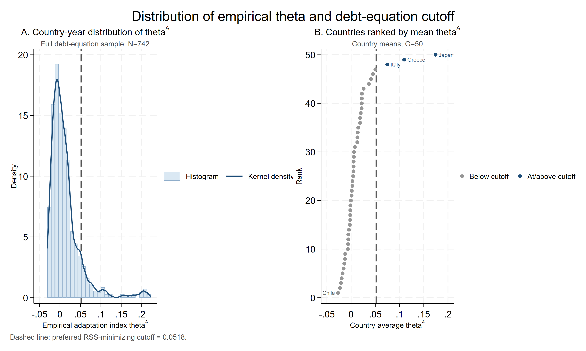
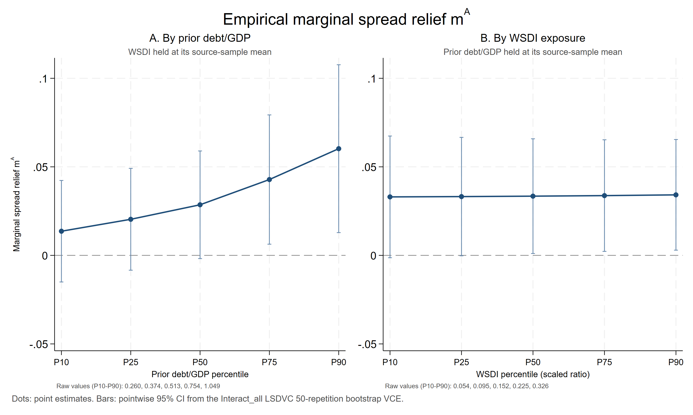
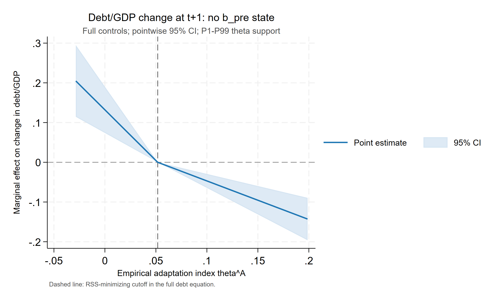
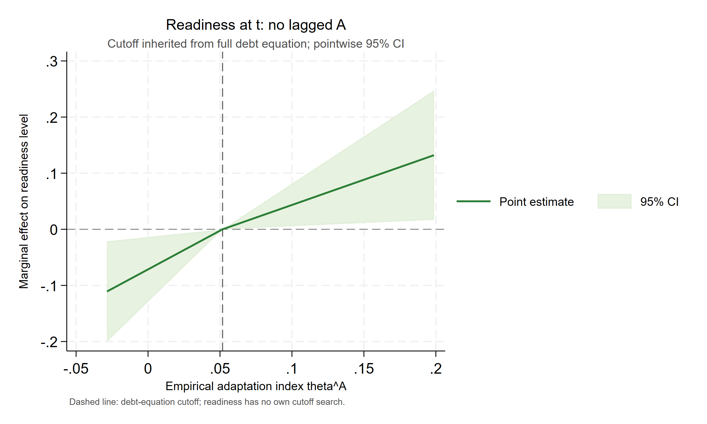

# Paper B：统一回归公式与结果表

> 数据：`data0804/invest_panel_weo.csv` 与 `WSDI/data/processed/wsdi_sovereign61_1995_2018.csv`；整合生成时间：2026-08-18 18:49（Asia/Shanghai）。
> 本文档呈现正式公式、回归表、边际效应、债务 cutoff 与竞争判据结果。数据检查和统计验证见 `paperB_diagnostics.md`。主面板源比率、百分数和 0—100 指数均先除以 100；WSDI 天数乘以 0.01 后作为 X 进入回归。

## 技术摘要

- Baseline 全交互模型中，A×b-pre 系数为 -0.059（p=0.024），A×X 系数为 -0.0042（p=0.887）。
- 全控制 T 指标模型的原始尺度适应能力系数为 -0.0331（p=0.155），A×X 系数为 0.1095（p=0.036）。
- 第四节唯一主规格的债务 cutoff 为 0.0518；债务两支联合检验 p=<0.001，使用同一 cutoff 的 readiness 两支联合检验 p=0.016。
- 五个替代判据按各自当前变量取完整案例，N 范围为 742–996；完整 theta 的样本内 RSS=1.068936。因样本量可能不同，RSS 不作跨判据排名。
- 第 2—3 节为含国家与年份效应的动态面板 LSDVC 相关性估计，采用 Blundell–Bond 初始化、`bias(2)` 与 50 次 bootstrap 标准误；第 4 节仍为双向固定效应并报告国家聚类标准误。theta 和 cutoff 是生成量，末阶段聚类标准误仍未覆盖完整上游估计与 cutoff 搜索不确定性。

## 1. 统一符号、控制变量与估计口径

令 $s_{it}$ 为主权利差比率，$A_{it}$ 为适应能力比率，$X_{it}=wsdi\_days_{it}\times0.01$，$b^{pre}_{it}=b_{i,t-1}=debt\_gdp_{i,t-1}$。Baseline 的宏观控制为 Growth、Inflation，不控制 $\ln(ConstantGDP)$；T 指标方程的宏观控制仅为 Inflation，不控制 Growth；Doomloop 的宏观控制仍为 Growth、Inflation。外部控制为 Reserves、Terms of trade。全部模型含国家和年份效应。第 2—3 节使用 `xtlsdvc, initial(bb) bias(2) vcov(50)`：偏差修正精度为 $O((NT)^{-1})$，标准误来自 50 次 bootstrap；动态滞后因变量由 LSDVC 自动加入。第 4 节使用按 `country_id` 聚类的双向固定效应。每个回归使用其因变量、动态滞后项与当前右侧变量的联合非缺失样本，不再设置跨模型或跨阶段固定样本。生成量不向来源回归样本外外推：$\widehat m^A$ 限于 Spread_Interact_all 的实际样本，$\widehat T^A$ 限于 T10_interact_full 的实际样本，theta 限于两个来源样本的交集。`bias(2)` 在代表性规格中与 `bias(1)` 数值接近且稳定；`bias(3)` 曾在当前短而不平衡的面板上产生爆炸性动态系数，因此不作为主规格。

## 2. Baseline：主权利差回归

### 2.1 回归公式

$$s_{it}=\alpha_i+\lambda_t+\rho_s s_{i,t-1}+\beta_AA_{it}+\beta_Bb^{pre}_{it}+\beta_XX_{it}+\beta_{AB}A_{it}b^{pre}_{it}+\beta_{AX}A_{it}X_{it}+\Gamma_m'W^m_{it}+\varepsilon^m_{it}.$$

交互回归在对应完整交互式的实际样本内中心化。原始尺度适应能力斜率和边际利差节约为

$$\widehat\beta_A^{raw}=\widehat\beta_A^c-\widehat\beta_{AB}\overline{b^{pre}}_s-\widehat\beta_{AX}\bar X_s,$$

$$\widehat m^A_{it}=-\left(\widehat\beta_A^{raw}+\widehat\beta_{AB}b^{pre}_{it}+\widehat\beta_{AX}X_{it}\right).$$

### 2.2 逐步回归表

系数下方括号为基于 50 次 bootstrap 标准误的 z 值；`***`、`**`、`*` 分别表示 1%、5%、10% 显著性。

**Panel A：核心变量与控制变量**

| 变量/统计量 | (A_X_only) 仅 X | (A_A_only) 仅 A | (A_b_only) 仅 b-pre | (B_all_core) 三核心 | (C_macro) +宏观 | (Layer1_X) 第一层 | (Layer2_A) 第二层 |
| --- | ---: | ---: | ---: | ---: | ---: | ---: | ---: |
| WSDI 天数×0.01 $X_{it}$ | 0.0114** (2.042) | — | — | 0.0102* (1.854) | 0.0091* (1.78) | 0.0098* (1.67) | 0.0092 (1.597) |
| 适应能力 $A_{it}$ | — | -0.034*** (-2.685) | — | -0.0418** (-2.176) | -0.03* (-1.675) | — | -0.0269* (-1.776) |
| 前一期债务/GDP $b^{pre}_{it}=b_{i,t-1}$ | — | — | 0.0004 (0.143) | 0.0016 (0.457) | 0.0056* (1.837) | 0.0042 (0.916) | 0.0046 (1.043) |
| 滞后主权利差 $s_{i,t-1}$ | 0.8135*** (28.863) | 0.8004*** (30.763) | 0.8075*** (41.664) | 0.7849*** (27.395) | 0.6617*** (21.969) | 0.6793*** (18.39) | 0.6659*** (17.886) |
| Growth | — | — | — | — | -0.1579*** (-9.264) | -0.1622*** (-8.338) | -0.1597*** (-8.193) |
| Inflation | — | — | — | — | 0.1423*** (6.886) | 0.1468*** (5.925) | 0.15*** (6.149) |
| Reserves | — | — | — | — | — | -0.0089 (-1.29) | -0.0081 (-1.189) |
| Terms of trade | — | — | — | — | — | 0.0037 (0.765) | 0.0038 (0.819) |
| 宏观控制 | 否 | 否 | 否 | 否 | 是 | 是 | 是 |
| 外部控制 | 否 | 否 | 否 | 否 | 否 | 是 | 是 |
| 国家固定效应 | 是 | 是 | 是 | 是 | 是 | 是 | 是 |
| 年份固定效应 | 是 | 是 | 是 | 是 | 是 | 是 | 是 |
| 估计量 | LSDVC | LSDVC | LSDVC | LSDVC | LSDVC | LSDVC | LSDVC |
| 初始化 | Blundell-Bond | Blundell-Bond | Blundell-Bond | Blundell-Bond | Blundell-Bond | Blundell-Bond | Blundell-Bond |
| 偏差修正阶数 | 2 | 2 | 2 | 2 | 2 | 2 | 2 |
| Bootstrap 次数 | 50 | 50 | 50 | 50 | 50 | 50 | 50 |
| 标准误 | bootstrap | bootstrap | bootstrap | bootstrap | bootstrap | bootstrap | bootstrap |
| 动态滞后项 | L.bond_spreads | L.bond_spreads | L.bond_spreads | L.bond_spreads | L.bond_spreads | L.bond_spreads | L.bond_spreads |
| 国家数 | 50 | 61 | 63 | 50 | 50 | 50 | 50 |
| 年份数 | 23 | 28 | 28 | 23 | 23 | 20 | 20 |
| 样本量 | 823 | 1,213 | 1,245 | 812 | 811 | 742 | 742 |

**Panel B：交互模型**

| 变量/统计量 | (Interact_AB) A×b-pre | (Interact_AX) A×X | (Interact_all) 双交互 |
| --- | ---: | ---: | ---: |
| $A^c_{it}$ | -0.034** (-2.126) | -0.0258* (-1.688) | -0.0335** (-2.047) |
| $X^c_{it}$ | 0.0092 (1.604) | 0.0089 (1.553) | 0.0091 (1.59) |
| $(b^{pre}_{it})^c$ | 0.007 (1.552) | 0.0048 (1.088) | 0.007 (1.571) |
| $A^c_{it}\times(b^{pre}_{it})^c$ | -0.0599** (-2.394) | — | -0.059** (-2.263) |
| $A^c_{it}\times X^c_{it}$ | — | -0.0166 (-0.586) | -0.0042 (-0.142) |
| 滞后主权利差 $s_{i,t-1}$ | 0.6392*** (16.812) | 0.6642*** (17.81) | 0.6385*** (16.715) |
| Growth | -0.157*** (-7.921) | -0.1596*** (-8.178) | -0.157*** (-7.897) |
| Inflation | 0.1567*** (6.229) | 0.1502*** (6.151) | 0.1568*** (6.211) |
| Reserves | -0.0089 (-1.3) | -0.008 (-1.167) | -0.0088 (-1.288) |
| Terms of trade | 0.0025 (0.544) | 0.0038 (0.817) | 0.0025 (0.543) |
| 宏观控制 | 是 | 是 | 是 |
| 外部控制 | 是 | 是 | 是 |
| 国家固定效应 | 是 | 是 | 是 |
| 年份固定效应 | 是 | 是 | 是 |
| 估计量 | LSDVC | LSDVC | LSDVC |
| 初始化 | Blundell-Bond | Blundell-Bond | Blundell-Bond |
| 偏差修正阶数 | 2 | 2 | 2 |
| Bootstrap 次数 | 50 | 50 | 50 |
| 标准误 | bootstrap | bootstrap | bootstrap |
| 动态滞后项 | L.bond_spreads | L.bond_spreads | L.bond_spreads |
| 国家数 | 50 | 50 | 50 |
| 年份数 | 20 | 20 | 20 |
| 样本量 | 742 | 742 | 742 |

### 2.3 构造用原始尺度系数

| 参数 | 估计值 | Bootstrap SE | z | p | 95% CI |
| --- | ---: | ---: | ---: | ---: | ---: |
| beta_A_raw | 0.0024 | 0.0169 | 0.144 | 0.886 | [-0.0307, 0.0356] |
| beta_AB | -0.059 | 0.0261 | -2.263 | 0.024 | [-0.1102, -0.0079] |
| beta_AX | -0.0042 | 0.0299 | -0.142 | 0.887 | [-0.0628, 0.0543] |

展开：baseline 点边际效应

| 模型 | 点 | 调节变量 | 边际效应 | SE | p | 95% CI |
| --- | ---: | ---: | ---: | ---: | ---: | ---: |
| Interact_AB | P10 | 0.26 | -0.0138 | 0.0146 | 0.344 | [-0.0424, 0.0148] |
| Interact_AB | P25 | 0.3741 | -0.0206 | 0.0145 | 0.156 | [-0.0491, 0.0079] |
| Interact_AB | P50 | 0.5128 | -0.0289 | 0.0152 | 0.057 | [-0.0587, 0.0009] |
| Interact_AB | P75 | 0.7541 | -0.0434 | 0.018 | 0.016 | [-0.0787, -0.0081] |
| Interact_AB | P90 | 1.0494 | -0.0611 | 0.0232 | 0.008 | [-0.1065, -0.0157] |
| Interact_AB | Mean_minus_1SD | 0.255 | -0.0135 | 0.0146 | 0.355 | [-0.0421, 0.0151] |
| Interact_AB | Mean | 0.5967 | -0.034 | 0.016 | 0.034 | [-0.0653, -0.0026] |
| Interact_AB | Mean_plus_1SD | 0.9385 | -0.0544 | 0.0211 | 0.010 | [-0.0957, -0.0132] |
| Interact_AX | P10 | 0.0544 | -0.0239 | 0.0161 | 0.137 | [-0.0554, 0.0076] |
| Interact_AX | P25 | 0.0951 | -0.0245 | 0.0157 | 0.118 | [-0.0554, 0.0063] |
| Interact_AX | P50 | 0.1523 | -0.0255 | 0.0154 | 0.097 | [-0.0556, 0.0046] |
| Interact_AX | P75 | 0.2251 | -0.0267 | 0.0152 | 0.078 | [-0.0564, 0.003] |
| Interact_AX | P90 | 0.3256 | -0.0284 | 0.0153 | 0.064 | [-0.0584, 0.0017] |
| Interact_AX | Mean_minus_1SD | 0.0658 | -0.0241 | 0.016 | 0.132 | [-0.0553, 0.0072] |
| Interact_AX | Mean | 0.1709 | -0.0258 | 0.0153 | 0.091 | [-0.0558, 0.0042] |
| Interact_AX | Mean_plus_1SD | 0.2761 | -0.0275 | 0.0152 | 0.070 | [-0.0573, 0.0022] |
| Interact_all | P10 | 0.26 | -0.0136 | 0.0146 | 0.351 | [-0.0423, 0.015] |
| Interact_all | P25 | 0.3741 | -0.0204 | 0.0147 | 0.165 | [-0.0491, 0.0084] |
| Interact_all | P50 | 0.5128 | -0.0286 | 0.0155 | 0.065 | [-0.059, 0.0018] |
| Interact_all | P75 | 0.7541 | -0.0428 | 0.0186 | 0.021 | [-0.0793, -0.0063] |
| Interact_all | P90 | 1.0494 | -0.0603 | 0.0242 | 0.013 | [-0.1077, -0.0129] |
| Interact_all | Mean_minus_1SD | 0.255 | -0.0133 | 0.0146 | 0.362 | [-0.042, 0.0153] |
| Interact_all | Mean | 0.5967 | -0.0335 | 0.0164 | 0.041 | [-0.0656, -0.0014] |
| Interact_all | Mean_plus_1SD | 0.9385 | -0.0537 | 0.0219 | 0.014 | [-0.0967, -0.0107] |
| Interact_all | P10 | 0.0544 | -0.033 | 0.0175 | 0.060 | [-0.0674, 0.0013] |
| Interact_all | P25 | 0.0951 | -0.0332 | 0.0171 | 0.052 | [-0.0666, 0.0002] |
| Interact_all | P50 | 0.1523 | -0.0334 | 0.0165 | 0.043 | [-0.0658, -0.0011] |
| Interact_all | P75 | 0.2251 | -0.0338 | 0.0161 | 0.036 | [-0.0653, -0.0022] |
| Interact_all | P90 | 0.3256 | -0.0342 | 0.0159 | 0.032 | [-0.0654, -0.003] |
| Interact_all | Mean_minus_1SD | 0.0658 | -0.0331 | 0.0174 | 0.057 | [-0.0672, 0.001] |
| Interact_all | Mean | 0.1709 | -0.0335 | 0.0164 | 0.041 | [-0.0656, -0.0014] |
| Interact_all | Mean_plus_1SD | 0.2761 | -0.034 | 0.0159 | 0.033 | [-0.0652, -0.0027] |

## 3. Empirical theta：边际 T 收益与经验指标

### 3.1 T 指标回归公式与时序

$$T_{it}=\frac{(ConstantGDP_{it})}{(ConstantGDP_{i,t-1})},\qquad T_{i,t+1}=\frac{(ConstantGDP_{i,t+1})}{(ConstantGDP_{it})}=F.T_{it}.$$

$$T_{i,t+1}=\alpha_i+\lambda_t+\gamma_AA_{it}+\gamma_XX_{it}+\gamma_{AX}A_{it}X_{it}+\rho_TT_{it}+\Gamma_T'W^T_{it}+\varepsilon^T_{i,t+1}.$$

T 指标交互模型在全控制交互式的实际样本内中心化，故 $\widehat\gamma_A^{raw}=\widehat\gamma_A^c-\widehat\gamma_{AX}\bar X_T$，且

$$\widehat T^A_{it}=\widehat\gamma_A^{raw}+\widehat\gamma_{AX}X_{it}=\widehat\gamma_A^c+\widehat\gamma_{AX}X^c_{it}.$$

### 3.2 T 指标逐步回归表

系数下方括号为基于 50 次 bootstrap 标准误的 z 值。所有规格均由 LSDVC 自动加入 $L.T_{i,t+1}=T_{it}$。

**Panel A：核心变量与控制变量**

| 变量/统计量 | (T1_X_only) 仅 X | (T2_A_only) 仅 A | (T3_persistence) 仅当期 T 指标 | (T4_all_core) 核心项 | (T5_macro) +宏观 | (T6_layer1_X) 第一层 | (T7_layer2_A) 第二层 |
| --- | ---: | ---: | ---: | ---: | ---: | ---: | ---: |
| WSDI 天数×0.01 $X_{it}$ | -0.002 (-0.173) | — | — | -0.0023 (-0.2) | -0.0027 (-0.239) | -0.0025 (-0.264) | -0.0029 (-0.311) |
| 适应能力 $A_{it}$ | — | -0.0227 (-1.331) | — | -0.0103 (-0.458) | -0.0117 (-0.522) | — | -0.0082 (-0.34) |
| $T_{it}=ConstantGDP_{it}/ConstantGDP_{i,t-1}$ | 0.3719*** (13.457) | 0.3595*** (14.561) | 0.3504*** (12.215) | 0.3711*** (13.518) | 0.3638*** (13.408) | 0.3427*** (10.549) | 0.3425*** (10.5) |
| Inflation | — | — | — | — | -0.0139 (-1.571) | -0.0197 (-1.374) | -0.0185 (-1.279) |
| Reserves | — | — | — | — | — | 0.0245** (2.51) | 0.0253*** (2.582) |
| Terms of trade | — | — | — | — | — | -0.0077 (-1.52) | -0.0081 (-1.535) |
| 宏观控制 | 否 | 否 | 否 | 否 | 是 | 是 | 是 |
| 外部控制 | 否 | 否 | 否 | 否 | 否 | 是 | 是 |
| 国家固定效应 | 是 | 是 | 是 | 是 | 是 | 是 | 是 |
| 年份固定效应 | 是 | 是 | 是 | 是 | 是 | 是 | 是 |
| 估计量 | LSDVC | LSDVC | LSDVC | LSDVC | LSDVC | LSDVC | LSDVC |
| 初始化 | Blundell-Bond | Blundell-Bond | Blundell-Bond | Blundell-Bond | Blundell-Bond | Blundell-Bond | Blundell-Bond |
| 偏差修正阶数 | 2 | 2 | 2 | 2 | 2 | 2 | 2 |
| Bootstrap 次数 | 50 | 50 | 50 | 50 | 50 | 50 | 50 |
| 标准误 | bootstrap | bootstrap | bootstrap | bootstrap | bootstrap | bootstrap | bootstrap |
| 动态滞后项 | L.T_lead | L.T_lead | L.T_lead | L.T_lead | L.T_lead | L.T_lead | L.T_lead |
| 国家数 | 52 | 61 | 63 | 52 | 52 | 52 | 52 |
| 年份数 | 23 | 27 | 27 | 23 | 23 | 23 | 23 |
| 样本量 | 1,179 | 1,645 | 1,699 | 1,179 | 1,178 | 1,024 | 1,024 |

**Panel B：交互模型**

| 变量/统计量 | (T8_interact_core) 交互核心 | (T9_interact_macro) 交互+宏观 | (T10_interact_full) 交互+全控制 |
| --- | ---: | ---: | ---: |
| $A^c_{it}$ | -0.0122 (-0.555) | -0.014 (-0.635) | -0.0149 (-0.645) |
| $X^c_{it}$ | -0.0015 (-0.131) | -0.0018 (-0.161) | -0.0005 (-0.05) |
| $A^c_{it}\times X^c_{it}$ | 0.0313 (0.564) | 0.0362 (0.649) | 0.1095** (2.098) |
| $T_{it}=ConstantGDP_{it}/ConstantGDP_{i,t-1}$ | 0.3708*** (13.439) | 0.3633*** (13.319) | 0.3401*** (10.418) |
| Inflation | — | -0.0143 (-1.611) | -0.0186 (-1.291) |
| Reserves | — | — | 0.0252** (2.572) |
| Terms of trade | — | — | -0.0086 (-1.642) |
| 宏观控制 | 否 | 是 | 是 |
| 外部控制 | 否 | 否 | 是 |
| 国家固定效应 | 是 | 是 | 是 |
| 年份固定效应 | 是 | 是 | 是 |
| 估计量 | LSDVC | LSDVC | LSDVC |
| 初始化 | Blundell-Bond | Blundell-Bond | Blundell-Bond |
| 偏差修正阶数 | 2 | 2 | 2 |
| Bootstrap 次数 | 50 | 50 | 50 |
| 标准误 | bootstrap | bootstrap | bootstrap |
| 动态滞后项 | L.T_lead | L.T_lead | L.T_lead |
| 国家数 | 52 | 52 | 52 |
| 年份数 | 23 | 23 | 23 |
| 样本量 | 1,179 | 1,178 | 1,024 |

### 3.3 边际 T 收益与 theta 构造

| 参数 | 估计值 | Bootstrap SE | z | p | 95% CI |
| --- | ---: | ---: | ---: | ---: | ---: |
| gamma_A_raw | -0.0331 | 0.0233 | -1.423 | 0.155 | [-0.0787, 0.0125] |
| gamma_AX | 0.1095 | 0.0522 | 2.098 | 0.036 | [0.0072, 0.2118] |

$$\widehat\theta^A_{it}=b^{pre}_{it}\widehat m^A_{it}+\widehat T^A_{it},\qquad b^{pre}_{it}=debt\_gdp_{i,t-1}.$$

构造支持集严格继承来源回归：`mA_hat` 仅在 Spread_Interact_all 的 `e(sample)` 内生成，`TA_hat` 仅在 T10_interact_full 的 `e(sample)` 内生成，theta 仅在二者共同覆盖时生成。

| 构造量 | 样本 | N | 均值 | SD | P10 | P50 | P90 |
| --- | ---: | ---: | ---: | ---: | ---: | ---: | ---: |
| mA_hat | theta_support | 742 | 0.0335 | 0.0202 | 0.0134 | 0.0287 | 0.0602 |
| spread_saving_component | theta_support | 742 | 0.0269 | 0.0353 | 0.0035 | 0.0148 | 0.0632 |
| TA_hat | theta_support | 742 | -0.0144 | 0.0115 | -0.0272 | -0.0164 | 0.0025 |
| theta_hat_A | theta_support | 742 | 0.0125 | 0.0381 | -0.02 | 0.003 | 0.0523 |
| theta_hat_A | all_constructible | 742 | 0.0125 | 0.0381 | -0.02 | 0.003 | 0.0523 |

**图 1：theta 分布、债务方程 cutoff 与国家均值排序**

[PNG](figures/figure1_theta_distribution_cutoff.png) · [PDF](figures/figure1_theta_distribution_cutoff.pdf) · 绘图数据：`doomloop/stata_outputs/theta_distribution_cutoff_plot_data.csv`、`theta_country_rank_plot_data.csv`

**图 2：经验边际利差节约 $m^A$ 随债务与 WSDI 的变化**

图中 $m^A=-\partial Spread/\partial A$ 来自 `Interact_all`；每个面板分别改变一个调节变量的 P10、P25、P50、P75、P90，并将另一调节变量固定在该来源样本均值。误差棒为 LSDVC 50 次 bootstrap VCE 的点估计 95% 置信区间。

[PNG](figures/figure2_mA_by_debt_wsdi.png) · [PDF](figures/figure2_mA_by_debt_wsdi.pdf) · 绘图数据：`doomloop/stata_outputs/mA_by_debt_wsdi_plot_data.csv`

## 4. Doomloop：一期去状态变量主规格

### 4.1 方程与 cutoff 口径

$$\Delta debt_{i,t+1}=debt\_gdp_{i,t+1}-debt\_gdp_{it}.$$

$$\Delta debt_{i,t+1}=\alpha_i+\lambda_t+\beta_LA_{it}(c-\widehat\theta^A_{it})_++\beta_HA_{it}(\widehat\theta^A_{it}-c)_++\gamma_XX_{it}+\Gamma_B'W^B_{it}+\varepsilon^B_{i,t+1}.$$

$$A_{it}-A_{i,t-1}=\alpha_i+\lambda_t+\delta_LFT_{it}(\widehat c_B^\theta-\widehat\theta^A_{it})_++\delta_HFT_{it}(\widehat\theta^A_{it}-\widehat c_B^\theta)_++\gamma_XX_{it}+\Gamma_A'W^A_{it}+\varepsilon^A_{it}.$$

债务方程不另加入 $b^{pre}_{it}$ 状态项，readiness 方程不加入 $A_{i,t-1}$。$\widehat c_B^\theta$ 仅由债务全控制方程在 theta 的 P10—P90 观测值中按最小 RSS 选择；readiness 不进行独立 cutoff 搜索。两类方程均显式控制 $X_{it}$，并依次加入 Growth、Inflation、Reserves 与 Terms of trade。

### 4.2 债务变化方程

| 变量/统计量 | (DN1_core) 核心项 | (DN2_macro) +宏观 | (DN3_full) +全控制 |
| --- | ---: | ---: | ---: |
| $A_{it}(c-\widehat\theta^A_{it})_+$ | 2.7344*** (4.652) | 2.5507*** (4.339) | 2.5496*** (4.561) |
| $A_{it}(\widehat\theta^A_{it}-c)_+$ | -0.8852*** (-4.849) | -0.9979*** (-5.352) | -0.9722*** (-5.379) |
| WSDI 天数×0.01 $X_{it}$ | 0.1777*** (3.858) | 0.1675*** (3.731) | 0.169*** (3.747) |
| Growth | — | -0.5046*** (-5.638) | -0.5073*** (-5.919) |
| Inflation | — | -0.1428 (-0.91) | -0.1164 (-0.741) |
| Reserves | — | — | -0.0493 (-0.919) |
| Terms of trade | — | — | 0.0299 (0.818) |
| 宏观控制 | 否 | 是 | 是 |
| 外部控制 | 否 | 否 | 是 |
| 国家固定效应 | 是 | 是 | 是 |
| 年份固定效应 | 是 | 是 | 是 |
| 聚类变量 | country_id | country_id | country_id |
| 聚类数 | 50 | 50 | 50 |
| 国家数 | 50 | 50 | 50 |
| 年份数 | 20 | 20 | 20 |
| 样本量 | 742 | 742 | 742 |
| Within $R^2$ | 0.336 | 0.378 | 0.384 |
| Overall $R^2$ | 0.062 | 0.093 | 0.104 |

### 4.3 Readiness 一阶差分方程：固定使用债务 cutoff

| 变量/统计量 | (RDN1_core) 核心项 | (RDN2_macro) +宏观 | (RDN3_full) +全控制 |
| --- | ---: | ---: | ---: |
| $FT_{it}(\widehat c_B^\theta-\widehat\theta^A_{it})_+$ | -1.4095** (-2.529) | -1.3666** (-2.46) | -1.3801** (-2.491) |
| $FT_{it}(\widehat\theta^A_{it}-\widehat c_B^\theta)_+$ | 0.6237* (1.689) | 0.9261** (2.311) | 0.8992** (2.303) |
| WSDI 天数×0.01 $X_{it}$ | 0.0009 (0.116) | 0.0011 (0.146) | 0.0011 (0.145) |
| Growth | — | 0.0723*** (2.697) | 0.0727** (2.676) |
| Inflation | — | -0.0573 (-1.552) | -0.0599 (-1.675) |
| Reserves | — | — | 0.0026 (0.324) |
| Terms of trade | — | — | -0.0044 (-0.592) |
| 宏观控制 | 否 | 是 | 是 |
| 外部控制 | 否 | 否 | 是 |
| 国家固定效应 | 是 | 是 | 是 |
| 年份固定效应 | 是 | 是 | 是 |
| 聚类变量 | country_id | country_id | country_id |
| 聚类数 | 50 | 50 | 50 |
| 国家数 | 50 | 50 | 50 |
| 年份数 | 20 | 20 | 20 |
| 样本量 | 742 | 742 | 742 |
| Within $R^2$ | 0.203 | 0.212 | 0.213 |
| Overall $R^2$ | 0.191 | 0.198 | 0.197 |

### 4.4 全控制结果、边际效应与图形

| 结果方程 | cutoff 来源 | cutoff | RSS | 候选数 | N_low | N_high | 低支系数 | p_L | 高支系数 | p_H |
| --- | ---: | ---: | ---: | ---: | ---: | ---: | ---: | ---: | ---: | ---: |
| 债务变化 | 债务全控制 RSS | 0.0518 | 1.068936 | 592 | 666 | 76 | 2.5496 | <0.001 | -0.9722 | <0.001 |
| Readiness | 继承债务 cutoff | 0.0518 | 0.196899 | — | — | — | -1.3801 | 0.016 | 0.8992 | 0.026 |

点边际效应按 $m(\theta;c)=a(c-\theta)_++b(\theta-c)_+$ 计算；在 cutoff 处定义为 0。

展开：主规格点边际效应

| 方程 | 点 | $\theta$ | 边际效应 | 国家聚类 SE | p 值 | 95% CI |
| --- | ---: | ---: | ---: | ---: | ---: | ---: |
| 债务变化 | P10 | -0.02 | 0.1831 | 0.0401 | <0.001 | [0.1024, 0.2638] |
| 债务变化 | P25 | -0.0107 | 0.1593 | 0.0349 | <0.001 | [0.0891, 0.2295] |
| 债务变化 | P50 | 0.003 | 0.1245 | 0.0273 | <0.001 | [0.0696, 0.1793] |
| 债务变化 | Mean | 0.0125 | 0.1001 | 0.0219 | <0.001 | [0.056, 0.1442] |
| 债务变化 | Cutoff | 0.0518 | 0 | 0 | — | [0, 0] |
| 债务变化 | P75 | 0.0217 | 0.0767 | 0.0168 | <0.001 | [0.0429, 0.1105] |
| 债务变化 | P90 | 0.0523 | -0.0005 | 0.0001 | <0.001 | [-0.0007, -0.0003] |
| Readiness（债务 cutoff） | P10 | -0.02 | -0.0991 | 0.0398 | 0.016 | [-0.1791, -0.0191] |
| Readiness（债务 cutoff） | P25 | -0.0107 | -0.0862 | 0.0346 | 0.016 | [-0.1558, -0.0167] |
| Readiness（债务 cutoff） | P50 | 0.003 | -0.0674 | 0.0271 | 0.016 | [-0.1217, -0.013] |
| Readiness（债务 cutoff） | Mean | 0.0125 | -0.0542 | 0.0218 | 0.016 | [-0.0979, -0.0105] |
| Readiness（债务 cutoff） | Cutoff | 0.0518 | 0 | 0 | — | [0, 0] |
| Readiness（债务 cutoff） | P75 | 0.0217 | -0.0415 | 0.0167 | 0.016 | [-0.075, -0.008] |
| Readiness（债务 cutoff） | P90 | 0.0523 | 0.0005 | 0.0002 | 0.026 | [0.0001, 0.0009] |

| 债务变化 | Readiness（债务 cutoff） |
| --- | --- |
|  |  |

合并版：[PNG](figures/kink_marginal_effects_no_state.png) · [PDF](figures/kink_marginal_effects_no_state.pdf)

## 5. Criterion Decomposition / Competing Criterion Test

令阈值判据为 $q_{it}$，每个判据均在其因变量、分支构造量和全套控制变量共同非缺失的样本上估计

$$\Delta debt_{i,t+1}=\alpha_i+\lambda_t+\beta_LA_{it}(c-q_{it})_++\beta_HA_{it}(q_{it}-c)_++\gamma_XX_{it}+\Gamma_B'W^B_{it}+\varepsilon^B_{i,t+1},$$

$$q_{it}\in\left\{\widehat\theta^A_{it},\ b^{pre}_{it},\ \widehat m^A_{it},\ \widehat T^A_{it},\ b^{pre}_{it}\widehat m^A_{it}\right\}.$$

每种判据分别在自身 P10—P90 候选值上搜索最小 RSS cutoff。理论方向为 $\beta_L>0$、$\beta_H<0$；$N_{low}=\#\{q_{it}\le c\}$，$N_{high}=\#\{q_{it}>c\}$。

| Criterion | cutoff | beta_L | p_L | beta_H | p_H | theoretical signs | RSS | Within R2 | N | N_low | N_high |
| --- | ---: | ---: | ---: | ---: | ---: | ---: | ---: | ---: | ---: | ---: | ---: |
| $\widehat\theta^A_{it}$ | 0.0518 | 2.5496 | <0.001 | -0.9722 | <0.001 | Match (+,-) | 1.068936 | 0.3844 | 742 | 666 | 76 |
| $b^{pre}_{it}$ | 0.211 | 0.0735 | 0.658 | -0.2005 | <0.001 | Match (+,-) | 1.35845 | 0.3634 | 984 | 99 | 885 |
| $\widehat m^A_{it}$ | 0.0134 | 1.0865 | 0.685 | -3.8477 | <0.001 | Match (+,-) | 1.044169 | 0.3987 | 742 | 75 | 667 |
| $\widehat T^A_{it}$ | -0.0106 | 0.5343 | 0.634 | -3.3752 | 0.001 | Match (+,-) | 1.688265 | 0.2564 | 996 | 705 | 291 |
| $b^{pre}_{it}\widehat m^A_{it}$ | 0.036 | 3.2475 | <0.001 | -1.3756 | 0.002 | Match (+,-) | 1.075131 | 0.3809 | 742 | 573 | 169 |

各判据的 cutoff、分支系数和 RSS 均处于自身尺度与自身完整案例样本中。由于 N 可能不同，cutoff、系数和 RSS 不作跨行绝对排名；表格用于报告各判据内部的拟合、显著性、理论方向与阈值两侧覆盖。

## 6. 结果解释边界

这些结果是相关性估计，不应表述为因果效应。第 2—3 节的 50 次 LSDVC bootstrap 标准误只对应各上游方程；第 4 节的国家聚类标准误处理国家内相关，但没有计入 theta 生成误差或 cutoff 搜索不确定性。正式联合推断仍应采用按国家重抽样、每次重估完整流程的 bootstrap。竞争判据使用各自完整案例样本，既不是同样本 RSS 比较，也不是非嵌套模型的正式显著性检验。
