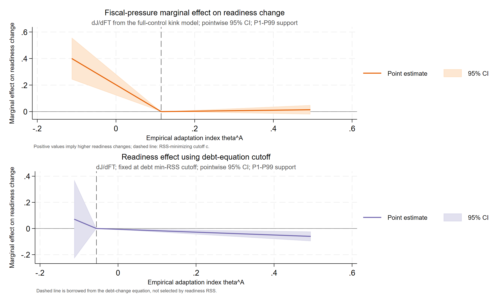

# Paper B：统一回归公式与结果表

> 数据：`data0804/invest_panel_weo.csv`；整合生成时间：2026-08-06 19:24（Asia/Shanghai）。
> 本文档只放回归公式、正式系数表、边际效应、cutoff 与经验指标构造结果。数据检查和统计检验见 `paperB_diagnostics.md`。所有源比率、百分数和 0—100 指数均先除以 100，以 0—1 比率进入回归；`CurrentGDP` 保留原始金额尺度。

## 技术摘要

- Baseline 完整二阶模型中，$\beta_{AA}$=0.4444（p=0.001）、$\beta_{Ab}$=-0.1516（p<0.001）、$\beta_{AX}$=0.5114（p=0.033）；六个二阶项联合检验 p<0.001。
- 完整二阶税基模型的原始尺度适应能力线性项为 0.2673（p=0.123），A² 与 A×X 系数分别为 -0.3985（p=0.026）、-0.1708（p=0.471）。
- Kink 全控制模型中，原始债务方程两支联合检验 p=0.123；readiness 使用自身 min-RSS cutoff 与债务方程 cutoff 时分别为 p=<0.001、p=0.005；去状态变量后债务与 readiness 分别为 p=0.112、p=0.004。
- 所有结果均为双向固定效应相关性估计。theta 和 cutoff 都是生成量，当前常规稳健标准误未覆盖完整上游估计与 cutoff 搜索不确定性。

## 1. 统一符号、控制变量与估计口径

令 $s_{it}$ 为主权利差比率，$A_{it}$ 为适应能力比率，$X_{it}$ 为气候脆弱性比率，$b_{it}=debt_{it}/CurrentGDP_{it}$。宏观控制为 Growth、Inflation，外部控制为 Reserves、Terms of trade。规模控制 $\ln(CurrentGDP_{it})$ 纳入利差和 readiness 回归，但不纳入税基和债务变化回归（ln(CurrentGDP) is included in spread/readiness and excluded from tax/debt-change）。全部模型含国家固定效应与年份固定效应，推断采用观测层面异方差稳健标准误（不是国家聚类标准误）。

## 2. Baseline：主权利差回归

### 2.1 回归公式

$$\begin{aligned}s_{it}^{g}={}&\alpha_i+\lambda_t+\beta_A A_{it}^{c}+\beta_b b_{it}^{c}+\beta_X X_{it}^{c} \\ &+\frac{1}{2}\beta_{AA}(A_{it}^{c})^2+\frac{1}{2}\beta_{bb}(b_{it}^{c})^2+\frac{1}{2}\beta_{XX}(X_{it}^{c})^2 \\ &+\beta_{Ab}A_{it}^{c}b_{it}^{c}+\beta_{AX}A_{it}^{c}X_{it}^{c}+\beta_{bX}b_{it}^{c}X_{it}^{c}+\eta_G\ln(CurrentGDP_{it})+\Gamma_s^{\prime}W_{it}^{s}+\varepsilon_{it}^{s}.\end{aligned}$$

完整二阶回归使用 baseline 固定样本均值中心化：$A^c=A-\bar A_s$、$b^c=b-\bar b_s$、$X^c=X-\bar X_s$。二阶项采用 $\frac12\beta_{jj}(j^c)^2$ 记法，因此对 $j$ 求导后的系数直接是 $\beta_{jj}j^c$。从中心化系数还原原始尺度线性系数：

$$\begin{aligned}\widehat\beta_A^{raw}&=\widehat\beta_A^c-\widehat\beta_{AA}\bar A_s-\widehat\beta_{Ab}\bar b_s-\widehat\beta_{AX}\bar X_s,\\ \widehat\beta_b^{raw}&=\widehat\beta_b^c-\widehat\beta_{bb}\bar b_s-\widehat\beta_{Ab}\bar A_s-\widehat\beta_{bX}\bar X_s,\\ \widehat\beta_X^{raw}&=\widehat\beta_X^c-\widehat\beta_{XX}\bar X_s-\widehat\beta_{AX}\bar A_s-\widehat\beta_{bX}\bar b_s.\end{aligned}$$

二阶和交叉项系数在中心化前后不变；常数平移由固定效应吸收。适应能力的边际利差节约为

$$\widehat m^A_{it}=-\left(\widehat\beta_A^{raw}+\widehat\beta_{AA}A_{it}+\widehat\beta_{Ab}b_{it}+\widehat\beta_{AX}X_{it}\right)=-\left(\widehat\beta_A^c+\widehat\beta_{AA}A^c_{it}+\widehat\beta_{Ab}b^c_{it}+\widehat\beta_{AX}X^c_{it}\right).$$

### 2.2 逐步回归表

系数下方括号为稳健 t 值；`***`、`**`、`*` 分别表示 1%、5%、10% 显著性。所有列使用同一共同样本。

**Panel A：核心变量与控制变量逐步检验**

| 变量/统计量 | (A_X_only) 仅 X | (A_A_only) 仅 A | (A_b_only) 仅 b | (B_all_core) 三核心 | (C_macro) +宏观 | (Layer1_X) 第一层 | (Layer2_A) 第二层 |
| --- | ---: | ---: | ---: | ---: | ---: | ---: | ---: |
| 气候脆弱性 $X_{it}$ | 0.0853 (1.06) | — | — | 0.3033*** (3.697) | 0.1456** (2.008) | 0.1995*** (2.665) | 0.2044*** (2.758) |
| 适应能力 $A_{it}$ | — | -0.0539*** (-2.997) | — | -0.0639*** (-3.784) | -0.0594*** (-3.994) | — | -0.062*** (-4.134) |
| $b_{it}=debt_{it}/CurrentGDP_{it}$ | — | — | 0.0588*** (10.273) | 0.0617*** (10.522) | 0.0515*** (9.969) | 0.0519*** (9.971) | 0.0527*** (10.152) |
| Growth | — | — | — | — | -0.1755*** (-5.405) | -0.1787*** (-5.413) | -0.1734*** (-5.404) |
| Inflation | — | — | — | — | 0.1589*** (5.446) | 0.1541*** (5.093) | 0.1555*** (5.292) |
| Reserves | — | — | — | — | — | 0.0178*** (3.744) | 0.0196*** (4.382) |
| Terms of trade | — | — | — | — | — | 0.0011 (0.278) | 0.0005 (0.122) |
| $\ln(CurrentGDP_{it})$ | 0.022*** (6.69) | 0.0204*** (6.216) | 0.0274*** (9.294) | 0.0314*** (9.846) | 0.022*** (7.48) | 0.0239*** (7.689) | 0.0238*** (7.778) |
| 宏观控制 | 否 | 否 | 否 | 否 | 是 | 是 | 是 |
| 外部控制 | 否 | 否 | 否 | 否 | 否 | 是 | 是 |
| 国家固定效应 | 是 | 是 | 是 | 是 | 是 | 是 | 是 |
| 年份固定效应 | 是 | 是 | 是 | 是 | 是 | 是 | 是 |
| 国家数 | 65 | 65 | 65 | 65 | 65 | 65 | 65 |
| 年份数 | 26 | 26 | 26 | 26 | 26 | 26 | 26 |
| 样本量 | 1,286 | 1,286 | 1,286 | 1,286 | 1,286 | 1,286 | 1,286 |
| Within $R^2$ | 0.187 | 0.193 | 0.336 | 0.354 | 0.47 | 0.466 | 0.475 |
| Overall $R^2$ | 0.072 | 0.087 | 0.036 | 0.125 | 0.149 | 0.112 | 0.157 |

**Panel B：交互模型**

| 变量/统计量 | (Interact_AB) A×b | (Interact_AX) A×X | (Interact_all) 双交互 |
| --- | ---: | ---: | ---: |
| $A^c_{it}$ | -0.0804*** (-4.974) | -0.064*** (-4.004) | -0.0816*** (-4.86) |
| $b^c_{it}$ | 0.0555*** (12.77) | 0.0527*** (10.147) | 0.0555*** (12.76) |
| $X^c_{it}$ | 0.2449*** (3.326) | 0.2096*** (2.894) | 0.248*** (3.454) |
| $A^c_{it}\times b^c_{it}$ | -0.1848*** (-6.468) | — | -0.1847*** (-6.47) |
| $A^c_{it}\times X^c_{it}$ | — | 0.0576 (0.364) | 0.0346 (0.215) |
| Growth | -0.1574*** (-5.167) | -0.1738*** (-5.374) | -0.1576*** (-5.138) |
| Inflation | 0.1625*** (5.961) | 0.1558*** (5.333) | 0.1627*** (5.991) |
| Reserves | 0.0229*** (4.874) | 0.0199*** (4.421) | 0.0231*** (4.868) |
| Terms of trade | -0.0018 (-0.464) | 0.0005 (0.123) | -0.0018 (-0.462) |
| $\ln(CurrentGDP_{it})$ | 0.0187*** (6.36) | 0.0236*** (7.634) | 0.0186*** (6.199) |
| 宏观控制 | 是 | 是 | 是 |
| 外部控制 | 是 | 是 | 是 |
| 国家固定效应 | 是 | 是 | 是 |
| 年份固定效应 | 是 | 是 | 是 |
| 国家数 | 65 | 65 | 65 |
| 年份数 | 26 | 26 | 26 |
| 样本量 | 1,286 | 1,286 | 1,286 |
| Within $R^2$ | 0.518 | 0.475 | 0.518 |
| Overall $R^2$ | 0.234 | 0.158 | 0.236 |

**Panel C：用于构造 $m^A_{it}$ 的完整二阶模型**

| 变量/统计量 | (Quadratic_all) 完整二阶 |
| --- | ---: |
| $A^c_{it}$ | -0.0756*** (-4.633) |
| $b^c_{it}$ | 0.0483*** (12.68) |
| $X^c_{it}$ | 0.2872*** (4.494) |
| $\frac{1}{2}(A^c_{it})^2$ | 0.4444*** (3.231) |
| $\frac{1}{2}(b^c_{it})^2$ | 0.0254** (2.447) |
| $\frac{1}{2}(X^c_{it})^2$ | -0.0672 (-0.092) |
| $A^c_{it}\times b^c_{it}$ | -0.1516*** (-4.382) |
| $A^c_{it}\times X^c_{it}$ | 0.5114** (2.137) |
| $b^c_{it}\times X^c_{it}$ | 0.278*** (3.329) |
| Growth | -0.1529*** (-4.939) |
| Inflation | 0.1634*** (6.637) |
| Reserves | 0.0189*** (4.008) |
| Terms of trade | 0.0011 (0.295) |
| $\ln(CurrentGDP_{it})$ | 0.0147*** (4.469) |
| 宏观控制 | 是 |
| 外部控制 | 是 |
| 国家固定效应 | 是 |
| 年份固定效应 | 是 |
| 国家数 | 65 |
| 年份数 | 26 |
| 样本量 | 1,286 |
| Within $R^2$ | 0.546 |
| Overall $R^2$ | 0.268 |

### 2.3 构造用原始尺度系数

| 参数 | 估计值 | 稳健 SE | t | p | 95% CI |
| --- | ---: | ---: | ---: | ---: | ---: |
| beta_A_raw | -0.4086 | 0.1463 | -2.793 | 0.005 | [-0.6956, -0.1215] |
| beta_b_raw | 0.0122 | 0.041 | 0.298 | 0.766 | [-0.0683, 0.0928] |
| beta_X_raw | -0.1309 | 0.3366 | -0.389 | 0.697 | [-0.7914, 0.5296] |
| beta_AA | 0.4444 | 0.1375 | 3.231 | 0.001 | [0.1746, 0.7143] |
| beta_bb | 0.0254 | 0.0104 | 2.447 | 0.015 | [0.005, 0.0458] |
| beta_XX | -0.0672 | 0.7329 | -0.092 | 0.927 | [-1.5052, 1.3708] |
| beta_AB | -0.1516 | 0.0346 | -4.382 | <0.001 | [-0.2195, -0.0837] |
| beta_AX | 0.5114 | 0.2393 | 2.137 | 0.033 | [0.0419, 0.9809] |
| beta_bX | 0.278 | 0.0835 | 3.329 | <0.001 | [0.1142, 0.4419] |

展开：baseline 交互模型的点边际效应

| 模型 | 调节变量 | 点 | 调节变量/$\theta$ | 边际效应 | 稳健 SE | p 值 | 95% CI |
| --- | ---: | ---: | ---: | ---: | ---: | ---: | ---: |
| Interact_AB | b_it | P10 | 0.2477 | -0.0139 | 0.0156 | 0.373 | [-0.0446, 0.0168] |
| Interact_AB | b_it | P25 | 0.3758 | -0.0376 | 0.015 | 0.013 | [-0.0671, -0.0081] |
| Interact_AB | b_it | P50 | 0.5315 | -0.0664 | 0.0155 | <0.001 | [-0.0968, -0.036] |
| Interact_AB | b_it | P75 | 0.7722 | -0.1109 | 0.0184 | <0.001 | [-0.147, -0.0747] |
| Interact_AB | b_it | P90 | 1.0511 | -0.1624 | 0.0239 | <0.001 | [-0.2094, -0.1154] |
| Interact_AB | b_it | Mean_minus_1SD | 0.2539 | -0.0151 | 0.0156 | 0.334 | [-0.0457, 0.0155] |
| Interact_AB | b_it | Mean | 0.6076 | -0.0804 | 0.0162 | <0.001 | [-0.1122, -0.0487] |
| Interact_AB | b_it | Mean_plus_1SD | 0.9613 | -0.1458 | 0.022 | <0.001 | [-0.189, -0.1026] |
| Interact_AX | vulnerability100 | P10 | 0.2871 | -0.0685 | 0.0234 | 0.003 | [-0.1145, -0.0226] |
| Interact_AX | vulnerability100 | P25 | 0.3122 | -0.0671 | 0.0205 | 0.001 | [-0.1073, -0.0268] |
| Interact_AX | vulnerability100 | P50 | 0.3494 | -0.0649 | 0.0171 | <0.001 | [-0.0984, -0.0315] |
| Interact_AX | vulnerability100 | P75 | 0.4034 | -0.0618 | 0.015 | <0.001 | [-0.0913, -0.0324] |
| Interact_AX | vulnerability100 | P90 | 0.4836 | -0.0572 | 0.0199 | 0.004 | [-0.0963, -0.0181] |
| Interact_AX | vulnerability100 | Mean_minus_1SD | 0.295 | -0.0681 | 0.0225 | 0.003 | [-0.1121, -0.024] |
| Interact_AX | vulnerability100 | Mean | 0.366 | -0.064 | 0.016 | <0.001 | [-0.0953, -0.0326] |
| Interact_AX | vulnerability100 | Mean_plus_1SD | 0.437 | -0.0599 | 0.0161 | <0.001 | [-0.0914, -0.0283] |
| Interact_all | b_it | P10 | 0.2477 | -0.0151 | 0.0159 | 0.342 | [-0.0463, 0.0161] |
| Interact_all | b_it | P25 | 0.3758 | -0.0388 | 0.0155 | 0.012 | [-0.0691, -0.0085] |
| Interact_all | b_it | P50 | 0.5315 | -0.0676 | 0.0161 | <0.001 | [-0.0991, -0.036] |
| Interact_all | b_it | P75 | 0.7722 | -0.112 | 0.0191 | <0.001 | [-0.1496, -0.0745] |
| Interact_all | b_it | P90 | 1.0511 | -0.1636 | 0.0247 | <0.001 | [-0.212, -0.1152] |
| Interact_all | b_it | Mean_minus_1SD | 0.2539 | -0.0163 | 0.0159 | 0.305 | [-0.0474, 0.0148] |
| Interact_all | b_it | Mean | 0.6076 | -0.0816 | 0.0168 | <0.001 | [-0.1146, -0.0487] |
| Interact_all | b_it | Mean_plus_1SD | 0.9613 | -0.147 | 0.0227 | <0.001 | [-0.1916, -0.1024] |
| Interact_all | vulnerability100 | P10 | 0.2871 | -0.0843 | 0.0237 | <0.001 | [-0.1308, -0.0379] |
| Interact_all | vulnerability100 | P25 | 0.3122 | -0.0835 | 0.0209 | <0.001 | [-0.1245, -0.0425] |
| Interact_all | vulnerability100 | P50 | 0.3494 | -0.0822 | 0.0177 | <0.001 | [-0.117, -0.0474] |
| Interact_all | vulnerability100 | P75 | 0.4034 | -0.0803 | 0.0162 | <0.001 | [-0.1121, -0.0485] |
| Interact_all | vulnerability100 | P90 | 0.4836 | -0.0776 | 0.0216 | <0.001 | [-0.12, -0.0351] |
| Interact_all | vulnerability100 | Mean_minus_1SD | 0.295 | -0.0841 | 0.0228 | <0.001 | [-0.1287, -0.0394] |
| Interact_all | vulnerability100 | Mean | 0.366 | -0.0816 | 0.0168 | <0.001 | [-0.1146, -0.0487] |
| Interact_all | vulnerability100 | Mean_plus_1SD | 0.437 | -0.0792 | 0.0175 | <0.001 | [-0.1136, -0.0447] |
| Quadratic_all | readiness100 | P10 | 0.3449 | -0.1603 | 0.0358 | <0.001 | [-0.2306, -0.09] |
| Quadratic_all | readiness100 | P25 | 0.4307 | -0.1221 | 0.0256 | <0.001 | [-0.1724, -0.0719] |
| Quadratic_all | readiness100 | P50 | 0.5296 | -0.0782 | 0.0166 | <0.001 | [-0.1108, -0.0455] |
| Quadratic_all | readiness100 | P75 | 0.6629 | -0.0189 | 0.0188 | 0.313 | [-0.0557, 0.0179] |
| Quadratic_all | readiness100 | P90 | 0.7172 | 0.0052 | 0.024 | 0.828 | [-0.0419, 0.0523] |
| Quadratic_all | readiness100 | Mean_minus_1SD | 0.3943 | -0.1383 | 0.0298 | <0.001 | [-0.1968, -0.0798] |
| Quadratic_all | readiness100 | Mean | 0.5353 | -0.0756 | 0.0163 | <0.001 | [-0.1077, -0.0436] |
| Quadratic_all | readiness100 | Mean_plus_1SD | 0.6763 | -0.013 | 0.0199 | 0.514 | [-0.0521, 0.0261] |
| Quadratic_all | b_it | P10 | 0.2477 | -0.0211 | 0.0158 | 0.184 | [-0.0521, 0.01] |
| Quadratic_all | b_it | P25 | 0.3758 | -0.0405 | 0.0149 | 0.007 | [-0.0696, -0.0113] |
| Quadratic_all | b_it | P50 | 0.5315 | -0.0641 | 0.0154 | <0.001 | [-0.0943, -0.0339] |
| Quadratic_all | b_it | P75 | 0.7722 | -0.1006 | 0.0194 | <0.001 | [-0.1387, -0.0625] |
| Quadratic_all | b_it | P90 | 1.0511 | -0.1429 | 0.0267 | <0.001 | [-0.1953, -0.0905] |
| Quadratic_all | b_it | Mean_minus_1SD | 0.2539 | -0.022 | 0.0158 | 0.163 | [-0.0529, 0.0089] |
| Quadratic_all | b_it | Mean | 0.6076 | -0.0756 | 0.0163 | <0.001 | [-0.1077, -0.0436] |
| Quadratic_all | b_it | Mean_plus_1SD | 0.9613 | -0.1293 | 0.0242 | <0.001 | [-0.1767, -0.0818] |
| Quadratic_all | vulnerability100 | P10 | 0.2871 | -0.116 | 0.0299 | <0.001 | [-0.1747, -0.0573] |
| Quadratic_all | vulnerability100 | P25 | 0.3122 | -0.1031 | 0.0249 | <0.001 | [-0.1519, -0.0543] |
| Quadratic_all | vulnerability100 | P50 | 0.3494 | -0.0841 | 0.0184 | <0.001 | [-0.1203, -0.048] |
| Quadratic_all | vulnerability100 | P75 | 0.4034 | -0.0565 | 0.0147 | <0.001 | [-0.0854, -0.0276] |
| Quadratic_all | vulnerability100 | P90 | 0.4836 | -0.0155 | 0.0255 | 0.543 | [-0.0656, 0.0346] |
| Quadratic_all | vulnerability100 | Mean_minus_1SD | 0.295 | -0.1119 | 0.0283 | <0.001 | [-0.1675, -0.0564] |
| Quadratic_all | vulnerability100 | Mean | 0.366 | -0.0756 | 0.0163 | <0.001 | [-0.1077, -0.0436] |
| Quadratic_all | vulnerability100 | Mean_plus_1SD | 0.437 | -0.0393 | 0.0176 | 0.026 | [-0.0738, -0.0048] |

## 3. Empirical theta：边际税基收益与经验指标

### 3.1 税基回归公式与时序

$$\widetilde T_{i,t+1}^{(t)}=\frac{revenue_{i,t+1}}{CurrentGDP_{it}},\qquad \widetilde T_{it}^{(t-1)}=\frac{revenue_{it}}{CurrentGDP_{i,t-1}}.$$

以上两个税基变量都不乘 100，直接以比率进入回归。

$$\begin{aligned}\widetilde T_{i,t+1}^{(t)}={}&\alpha_i+\lambda_t+\gamma_A A_{it}^{c}+\gamma_X X_{it}^{c} \\ &+\frac{1}{2}\gamma_{AA}(A_{it}^{c})^2+\frac{1}{2}\gamma_{XX}(X_{it}^{c})^2+\gamma_{AX}A_{it}^{c}X_{it}^{c} \\ &+\rho_T\widetilde T_{it}^{(t-1)}+\phi_b b_{it}+\Gamma_T^{\prime}W_{it}^{T}+\varepsilon_{i,t+1}^{T}.\end{aligned}$$

该税基方程及其 T1–T11 逐步规格均不控制 $\ln(CurrentGDP_{it})$；$b_{it}=debt_{it}/CurrentGDP_{it}$。T11 是构造边际税基收益的正式模型。

税基完整二阶模型在固定 tax 样本内中心化。适应能力线性项还原为 $\widehat\gamma_A^{raw}=\widehat\gamma_A^c-\widehat\gamma_{AA}\bar A_T-\widehat\gamma_{AX}\bar X_T$，故

$$\widehat T^A_{it}=\widehat\gamma_A^{raw}+\widehat\gamma_{AA}A_{it}+\widehat\gamma_{AX}X_{it}=\widehat\gamma_A^c+\widehat\gamma_{AA}A^c_{it}+\widehat\gamma_{AX}X^c_{it}.$$

### 3.2 税基逐步回归表

**Panel A：核心变量与控制变量逐步检验**

| 变量/统计量 | (T1_X_only) 仅 X | (T2_A_only) 仅 A | (T3_persistence) 仅滞后税基 | (T4_all_core) 核心项 | (T5_macro) +宏观 | (T6_layer1_X) 第一层 | (T7_layer2_A) 第二层 |
| --- | ---: | ---: | ---: | ---: | ---: | ---: | ---: |
| 气候脆弱性 $X_{it}$ | 0.2258** (1.992) | — | — | 0.1046 (1.361) | 0.1405* (1.789) | 0.0784 (0.987) | 0.0715 (0.893) |
| 适应能力 $A_{it}$ | — | 0.0855*** (3.289) | — | 0.0286* (1.735) | 0.0251 (1.504) | — | 0.0135 (0.822) |
| $\widetilde T_{it}^{(t-1)}$ | — | — | 0.6781*** (14.463) | 0.6741*** (14.327) | 0.7078*** (12.62) | 0.7128*** (13.539) | 0.7113*** (13.404) |
| Growth | — | — | — | — | -0.1019*** (-3.275) | -0.0999*** (-3.26) | -0.0993*** (-3.22) |
| Inflation | — | — | — | — | -0.0347 (-1.624) | -0.0484** (-2.376) | -0.0479** (-2.338) |
| Reserves | — | — | — | — | — | 0.0014 (0.225) | 0.001 (0.156) |
| Terms of trade | — | — | — | — | — | -0.0242*** (-4.022) | -0.0239*** (-3.973) |
| 宏观控制 | 否 | 否 | 否 | 否 | 是 | 是 | 是 |
| 外部控制 | 否 | 否 | 否 | 否 | 否 | 是 | 是 |
| 国家固定效应 | 是 | 是 | 是 | 是 | 是 | 是 | 是 |
| 年份固定效应 | 是 | 是 | 是 | 是 | 是 | 是 | 是 |
| 国家数 | 65 | 65 | 65 | 65 | 65 | 65 | 65 |
| 年份数 | 27 | 27 | 27 | 27 | 27 | 27 | 27 |
| 样本量 | 1,538 | 1,538 | 1,538 | 1,538 | 1,538 | 1,538 | 1,538 |
| Within $R^2$ | 0.199 | 0.204 | 0.574 | 0.576 | 0.582 | 0.595 | 0.595 |
| Overall $R^2$ | 0.248 | 0.282 | 0.968 | 0.964 | 0.965 | 0.968 | 0.969 |

**Panel B：交互模型**

| 变量/统计量 | (T8_interact_core) 交互核心 | (T9_interact_macro) 交互+宏观 | (T10_interact_full) 交互+全控制 |
| --- | ---: | ---: | ---: |
| $A^c_{it}$ | 0.026 (1.546) | 0.0225 (1.329) | 0.0096 (0.567) |
| $X^c_{it}$ | 0.1239 (1.563) | 0.1607** (2.015) | 0.1002 (1.249) |
| $A^c_{it}\times X^c_{it}$ | 0.1144 (0.682) | 0.1197 (0.708) | 0.1671 (0.992) |
| $\widetilde T_{it}^{(t-1)}$ | 0.6733*** (14.189) | 0.7069*** (12.512) | 0.71*** (13.286) |
| Growth | — | -0.1022*** (-3.297) | -0.0997*** (-3.249) |
| Inflation | — | -0.0344 (-1.602) | -0.0475** (-2.312) |
| Reserves | — | — | 0.002 (0.306) |
| Terms of trade | — | — | -0.024*** (-3.975) |
| 宏观控制 | 否 | 是 | 是 |
| 外部控制 | 否 | 否 | 是 |
| 国家固定效应 | 是 | 是 | 是 |
| 年份固定效应 | 是 | 是 | 是 |
| 国家数 | 65 | 65 | 65 |
| 年份数 | 27 | 27 | 27 |
| 样本量 | 1,538 | 1,538 | 1,538 |
| Within $R^2$ | 0.576 | 0.582 | 0.595 |
| Overall $R^2$ | 0.963 | 0.963 | 0.968 |

**Panel C：用于构造边际税基收益的完整二阶模型**

| 变量/统计量 | (T11_quadratic_full) 完整二阶+滞后税基+b+全控制 |
| --- | ---: |
| $A^c_{it}$ | 0.0003 (0.018) |
| $X^c_{it}$ | 0.1116 (1.256) |
| $\frac{1}{2}(A^c_{it})^2$ | -0.3985** (-2.236) |
| $\frac{1}{2}(X^c_{it})^2$ | -0.3454 (-0.419) |
| $A^c_{it}\times X^c_{it}$ | -0.1708 (-0.721) |
| $\widetilde T_{it}^{(t-1)}$ | 0.6769*** (11.871) |
| $b_{it}=debt_{it}/CurrentGDP_{it}$ | 0.0206*** (3.616) |
| Growth | -0.0687** (-2.008) |
| Inflation | -0.0433** (-2.042) |
| Reserves | 0.0058 (0.812) |
| Terms of trade | -0.0219*** (-3.7) |
| 宏观控制 | 是 |
| 外部控制 | 是 |
| 国家固定效应 | 是 |
| 年份固定效应 | 是 |
| 国家数 | 65 |
| 年份数 | 27 |
| 样本量 | 1,538 |
| Within $R^2$ | 0.605 |
| Overall $R^2$ | 0.958 |

### 3.3 边际税基收益与 theta 构造

| 参数 | 估计值 | 稳健 SE | t | p | 95% CI |
| --- | ---: | ---: | ---: | ---: | ---: |
| gamma_A_raw | 0.2673 | 0.1734 | 1.542 | 0.123 | [-0.0728, 0.6075] |
| gamma_AA | -0.3985 | 0.1782 | -2.236 | 0.026 | [-0.7481, -0.0488] |
| gamma_XX | -0.3454 | 0.8237 | -0.419 | 0.675 | [-1.9611, 1.2704] |
| gamma_AX | -0.1708 | 0.237 | -0.721 | 0.471 | [-0.6357, 0.2941] |
| phi_b | 0.0206 | 0.0057 | 3.616 | <0.001 | [0.0094, 0.0317] |

最终经验指标为

$$\widehat\theta^A_{it}=b_{it}\widehat m^A_{it}+\widehat T^A_{it},\qquad b_{it}=\frac{debt_{it}}{CurrentGDP_{it}}.$$

| 构造量 | 样本 | N | 均值 | SD | P10 | P50 | P90 |
| --- | ---: | ---: | ---: | ---: | ---: | ---: | ---: |
| mA_hat | theta_support | 1,221 | 0.0748 | 0.0627 | -0.0095 | 0.0763 | 0.1537 |
| spread_saving_component | theta_support | 1,221 | 0.0616 | 0.0865 | -0.0015 | 0.036 | 0.1547 |
| TA_hat | theta_support | 1,221 | -0.0087 | 0.0476 | -0.0747 | -0.0002 | 0.0558 |
| theta_hat_A | theta_support | 1,221 | 0.0529 | 0.1029 | -0.0633 | 0.0491 | 0.1629 |
| theta_hat_A | all_constructible | 1,819 | 0.062 | 0.1013 | -0.0504 | 0.0572 | 0.1666 |

`theta_support` 是 spread 与 tax 估计样本的交集；`all_constructible` 是三项构造输入均非缺失的所有观测。联合 theta 标准误未报告，因为跨方程协方差需要联合 bootstrap 或系统估计。

展开：税基交互模型的点边际效应

| 模型 | 调节变量 | 点 | 调节变量/$\theta$ | 边际效应 | 稳健 SE | p 值 | 95% CI |
| --- | ---: | ---: | ---: | ---: | ---: | ---: | ---: |
| T8_interact_core | vulnerability100 | P10 | 0.301 | 0.0168 | 0.0237 | 0.478 | [-0.0296, 0.0632] |
| T8_interact_core | vulnerability100 | P25 | 0.3177 | 0.0187 | 0.0218 | 0.390 | [-0.0239, 0.0614] |
| T8_interact_core | vulnerability100 | P50 | 0.3671 | 0.0244 | 0.0175 | 0.164 | [-0.01, 0.0587] |
| T8_interact_core | vulnerability100 | P75 | 0.4335 | 0.032 | 0.0173 | 0.065 | [-0.002, 0.0659] |
| T8_interact_core | vulnerability100 | P90 | 0.5029 | 0.0399 | 0.0236 | 0.091 | [-0.0064, 0.0862] |
| T8_interact_core | vulnerability100 | Mean_minus_1SD | 0.3039 | 0.0171 | 0.0233 | 0.463 | [-0.0286, 0.0629] |
| T8_interact_core | vulnerability100 | Mean | 0.3817 | 0.026 | 0.0168 | 0.122 | [-0.007, 0.0591] |
| T8_interact_core | vulnerability100 | Mean_plus_1SD | 0.4595 | 0.0349 | 0.0191 | 0.067 | [-0.0025, 0.0724] |
| T9_interact_macro | vulnerability100 | P10 | 0.301 | 0.0128 | 0.0234 | 0.584 | [-0.0331, 0.0588] |
| T9_interact_macro | vulnerability100 | P25 | 0.3177 | 0.0148 | 0.0215 | 0.491 | [-0.0274, 0.0571] |
| T9_interact_macro | vulnerability100 | P50 | 0.3671 | 0.0207 | 0.0175 | 0.236 | [-0.0136, 0.0551] |
| T9_interact_macro | vulnerability100 | P75 | 0.4335 | 0.0287 | 0.0177 | 0.106 | [-0.0061, 0.0634] |
| T9_interact_macro | vulnerability100 | P90 | 0.5029 | 0.037 | 0.0243 | 0.128 | [-0.0107, 0.0847] |
| T9_interact_macro | vulnerability100 | Mean_minus_1SD | 0.3039 | 0.0132 | 0.0231 | 0.569 | [-0.0321, 0.0585] |
| T9_interact_macro | vulnerability100 | Mean | 0.3817 | 0.0225 | 0.0169 | 0.184 | [-0.0107, 0.0557] |
| T9_interact_macro | vulnerability100 | Mean_plus_1SD | 0.4595 | 0.0318 | 0.0196 | 0.105 | [-0.0067, 0.0703] |
| T10_interact_full | vulnerability100 | P10 | 0.301 | -0.0039 | 0.0242 | 0.872 | [-0.0513, 0.0435] |
| T10_interact_full | vulnerability100 | P25 | 0.3177 | -0.0011 | 0.0222 | 0.960 | [-0.0446, 0.0424] |
| T10_interact_full | vulnerability100 | P50 | 0.3671 | 0.0071 | 0.0177 | 0.686 | [-0.0275, 0.0418] |
| T10_interact_full | vulnerability100 | P75 | 0.4335 | 0.0182 | 0.017 | 0.283 | [-0.0151, 0.0516] |
| T10_interact_full | vulnerability100 | P90 | 0.5029 | 0.0298 | 0.023 | 0.196 | [-0.0154, 0.075] |
| T10_interact_full | vulnerability100 | Mean_minus_1SD | 0.3039 | -0.0034 | 0.0238 | 0.886 | [-0.0501, 0.0433] |
| T10_interact_full | vulnerability100 | Mean | 0.3817 | 0.0096 | 0.0169 | 0.571 | [-0.0236, 0.0427] |
| T10_interact_full | vulnerability100 | Mean_plus_1SD | 0.4595 | 0.0226 | 0.0186 | 0.226 | [-0.014, 0.0591] |
| T11_quadratic_full | vulnerability100 | P10 | 0.301 | 0.0141 | 0.0321 | 0.660 | [-0.0488, 0.077] |
| T11_quadratic_full | vulnerability100 | P25 | 0.3177 | 0.0113 | 0.0287 | 0.695 | [-0.045, 0.0675] |
| T11_quadratic_full | vulnerability100 | P50 | 0.3671 | 0.0028 | 0.02 | 0.888 | [-0.0363, 0.042] |
| T11_quadratic_full | vulnerability100 | P75 | 0.4335 | -0.0085 | 0.0161 | 0.596 | [-0.0401, 0.023] |
| T11_quadratic_full | vulnerability100 | P90 | 0.5029 | -0.0204 | 0.0254 | 0.422 | [-0.0701, 0.0294] |
| T11_quadratic_full | vulnerability100 | Mean_minus_1SD | 0.3039 | 0.0136 | 0.0315 | 0.665 | [-0.0481, 0.0754] |
| T11_quadratic_full | vulnerability100 | Mean | 0.3817 | 0.0003 | 0.018 | 0.986 | [-0.035, 0.0357] |
| T11_quadratic_full | vulnerability100 | Mean_plus_1SD | 0.4595 | -0.013 | 0.0184 | 0.482 | [-0.0491, 0.0232] |
| T11_quadratic_full | readiness100 | P10 | 0.3268 | 0.0719 | 0.0406 | 0.077 | [-0.0077, 0.1515] |
| T11_quadratic_full | readiness100 | P25 | 0.3759 | 0.0524 | 0.0329 | 0.112 | [-0.0122, 0.1169] |
| T11_quadratic_full | readiness100 | P50 | 0.5018 | 0.0022 | 0.0183 | 0.904 | [-0.0336, 0.038] |
| T11_quadratic_full | readiness100 | P75 | 0.6253 | -0.047 | 0.024 | 0.051 | [-0.0942, 0.0001] |
| T11_quadratic_full | readiness100 | P90 | 0.7076 | -0.0798 | 0.0358 | 0.026 | [-0.15, -0.0097] |
| T11_quadratic_full | readiness100 | Mean_minus_1SD | 0.3629 | 0.0575 | 0.0349 | 0.099 | [-0.0109, 0.1259] |
| T11_quadratic_full | readiness100 | Mean | 0.5065 | 0.0003 | 0.018 | 0.986 | [-0.035, 0.0357] |
| T11_quadratic_full | readiness100 | Mean_plus_1SD | 0.65 | -0.0569 | 0.0273 | 0.037 | [-0.1103, -0.0034] |

## 4. Doomloop：Single-Crossing Kink Marginal-Effect Model

### 4.1 两个方程、readiness 双 cutoff 与去状态规格

$$\Delta d_{i,t+1}^{(t)}=\frac{debt_{i,t+1}-debt_{it}}{CurrentGDP_{it}}.$$

$$\Delta d_{i,t+1}^{(t)}=\alpha_i+\lambda_t+\beta_LA_{it}(c-\widehat\theta^A_{it})_++\beta_HA_{it}(\widehat\theta^A_{it}-c)_++\rho_bb_{it}+\gamma_XX_{it}+\Gamma_B'W^B_{it}+\varepsilon^B_{i,t+1}.$$

债务变化方程（D1–D3 与 DN1–DN3）均不控制 $\ln(CurrentGDP_{it})$。

$$J_{it}=A_{it}-A_{i,t-1}.$$

$$J_{it}=\alpha_i+\lambda_t+\delta_LFT_{it}(c-\widehat\theta^A_{it})_++\delta_HFT_{it}(\widehat\theta^A_{it}-c)_++\rho_AA_{i,t-1}+\gamma_XX_{it}+\eta_G\ln(CurrentGDP_{it})+\Gamma_A'W^A_{it}+\varepsilon^A_{it}.$$

第二个方程的低、高两支都只乘 `FT=interest_revenue`，不再乘适应能力 A。readiness 主方程并列报告两套 cutoff：第一套使用 readiness 方程自身的 min-RSS cutoff；第二套固定使用主债务变化方程的 min-RSS cutoff（debt-equation cutoff）。后者是外部施加的比较情景，不称为 readiness 的最优 cutoff。每套均完成核心、宏观和全控制三列回归。

**债务变化方程（含 b）**

| 变量/统计量 | (D1_core) 核心项 | (D2_macro) +宏观 | (D3_full) +全控制 |
| --- | ---: | ---: | ---: |
| $A_{it}(c-\widehat\theta^A_{it})_+$ | 0.2312 (0.858) | 0.1362 (0.5) | 0.1715 (0.608) |
| $A_{it}(\widehat\theta^A_{it}-c)_+$ | -0.2794** (-2.429) | -0.2312** (-1.974) | -0.2357** (-2.013) |
| $b_{it}=debt_{it}/CurrentGDP_{it}$ | 0.0352* (1.679) | 0.0176 (0.845) | 0.0196 (0.936) |
| $X_{it}$ | -0.6278*** (-3.074) | -0.5917*** (-2.93) | -0.5894*** (-2.955) |
| Growth | — | -0.2453*** (-3.583) | -0.2447*** (-3.573) |
| Inflation | — | 0.1348* (1.683) | 0.1384* (1.691) |
| Reserves | — | — | -0.0166 (-0.973) |
| Terms of trade | — | — | 0.0071 (0.638) |
| 宏观控制 | 否 | 是 | 是 |
| 外部控制 | 否 | 否 | 是 |
| 国家固定效应 | 是 | 是 | 是 |
| 年份固定效应 | 是 | 是 | 是 |
| 国家数 | 65 | 65 | 65 |
| 年份数 | 28 | 28 | 28 |
| 样本量 | 1,552 | 1,552 | 1,552 |
| Within $R^2$ | 0.139 | 0.161 | 0.161 |
| Overall $R^2$ | 0.006 | 0.002 | 0.002 |

**债务变化方程（去 b）**

| 变量/统计量 | (DN1_core) 核心项（无 b） | (DN2_macro) +宏观（无 b） | (DN3_full) +全控制（无 b） |
| --- | ---: | ---: | ---: |
| $A_{it}(c-\widehat\theta^A_{it})_+$ | 0.2218 (0.82) | 0.1284 (0.472) | 0.1569 (0.558) |
| $A_{it}(\widehat\theta^A_{it}-c)_+$ | -0.094 (-1.315) | -0.1403** (-2.07) | -0.1363** (-1.998) |
| $X_{it}$ | -0.587*** (-2.838) | -0.5697*** (-2.84) | -0.5699*** (-2.873) |
| Growth | — | -0.2569*** (-3.839) | -0.2574*** (-3.848) |
| Inflation | — | 0.1384* (1.716) | 0.1415* (1.714) |
| Reserves | — | — | -0.0165 (-0.952) |
| Terms of trade | — | — | 0.0052 (0.469) |
| 宏观控制 | 否 | 是 | 是 |
| 外部控制 | 否 | 否 | 是 |
| 国家固定效应 | 是 | 是 | 是 |
| 年份固定效应 | 是 | 是 | 是 |
| 国家数 | 65 | 65 | 65 |
| 年份数 | 28 | 28 | 28 |
| 样本量 | 1,552 | 1,552 | 1,552 |
| Within $R^2$ | 0.135 | 0.16 | 0.16 |
| Overall $R^2$ | 0.008 | 0.003 | 0.003 |

**Readiness 变化方程（含 A 滞后）**

| 变量/统计量 | (R1_core) 核心项 | (R2_macro) +宏观 | (R3_full) +全控制 |
| --- | ---: | ---: | ---: |
| $FT_{it}(c-\widehat\theta^A_{it})_+$ | 1.7608*** (5.049) | 1.7613*** (5.003) | 1.7613*** (4.989) |
| $FT_{it}(\widehat\theta^A_{it}-c)_+$ | 0.0282 (0.661) | 0.0424 (0.921) | 0.037 (0.796) |
| $A_{i,t-1}$ | -0.2092*** (-6.079) | -0.2091*** (-6.03) | -0.2101*** (-6.042) |
| $X_{it}$ | -0.12*** (-2.779) | -0.119*** (-2.769) | -0.1192*** (-2.706) |
| Growth | — | 0.0079 (0.518) | 0.0086 (0.57) |
| Inflation | — | -0.0052 (-0.611) | -0.0066 (-0.827) |
| Reserves | — | — | 0.0022 (0.462) |
| Terms of trade | — | — | -0.0038 (-1.09) |
| $\ln(CurrentGDP_{it})$ | -0.0031** (-2.004) | -0.0031** (-1.974) | -0.0026* (-1.676) |
| 宏观控制 | 否 | 是 | 是 |
| 外部控制 | 否 | 否 | 是 |
| 国家固定效应 | 是 | 是 | 是 |
| 年份固定效应 | 是 | 是 | 是 |
| 国家数 | 64 | 64 | 64 |
| 年份数 | 28 | 28 | 28 |
| 样本量 | 1,571 | 1,571 | 1,571 |
| Within $R^2$ | 0.263 | 0.263 | 0.264 |
| Overall $R^2$ | 0.022 | 0.023 | 0.023 |

**Readiness 变化方程（使用债务方程 cutoff）**

| 变量/统计量 | (RD1_debtcut) 核心项（债务 cutoff） | (RD2_debtcut) +宏观（债务 cutoff） | (RD3_debtcut) +全控制（债务 cutoff） |
| --- | ---: | ---: | ---: |
| $FT_{it}(c_D-\widehat\theta^A_{it})_+$ | 0.8833 (0.335) | 0.9179 (0.349) | 1.2504 (0.463) |
| $FT_{it}(\widehat\theta^A_{it}-c_D)_+$ | -0.1052*** (-3.29) | -0.1077*** (-3.123) | -0.1093*** (-3.203) |
| $A_{i,t-1}$ | -0.1555*** (-5.76) | -0.1554*** (-5.702) | -0.1566*** (-5.712) |
| $X_{it}$ | -0.1043** (-2.457) | -0.1069** (-2.527) | -0.1086** (-2.509) |
| Growth | — | 0.0058 (0.391) | 0.0066 (0.446) |
| Inflation | — | 0.0063 (0.874) | 0.0046 (0.682) |
| Reserves | — | — | 0.001 (0.193) |
| Terms of trade | — | — | -0.004 (-1.153) |
| $\ln(CurrentGDP_{it})$ | -0.0016 (-1.134) | -0.0016 (-1.106) | -0.0011 (-0.766) |
| 宏观控制 | 否 | 是 | 是 |
| 外部控制 | 否 | 否 | 是 |
| 国家固定效应 | 是 | 是 | 是 |
| 年份固定效应 | 是 | 是 | 是 |
| 国家数 | 64 | 64 | 64 |
| 年份数 | 28 | 28 | 28 |
| 样本量 | 1,571 | 1,571 | 1,571 |
| Within $R^2$ | 0.206 | 0.206 | 0.207 |
| Overall $R^2$ | 0.04 | 0.04 | 0.041 |

**Readiness 变化方程（去 A 滞后）**

| 变量/统计量 | (RN1_core) 核心项（无 A 滞后） | (RN2_macro) +宏观（无 A 滞后） | (RN3_full) +全控制（无 A 滞后） |
| --- | ---: | ---: | ---: |
| $FT_{it}(c-\widehat\theta^A_{it})_+$ | 0.7099*** (3.365) | 0.7098*** (3.354) | 0.7105*** (3.355) |
| $FT_{it}(\widehat\theta^A_{it}-c)_+$ | 0.0579 (1.103) | 0.0792 (1.389) | 0.0763 (1.309) |
| $X_{it}$ | -0.1537*** (-3.398) | -0.1558*** (-3.462) | -0.156*** (-3.363) |
| Growth | — | 0.0225 (1.595) | 0.0229 (1.64) |
| Inflation | — | -0.0011 (-0.135) | -0.0019 (-0.251) |
| Reserves | — | — | 0.0012 (0.244) |
| Terms of trade | — | — | -0.0021 (-0.591) |
| $\ln(CurrentGDP_{it})$ | -8.74e-06 (-0.007) | 0.0001 (0.044) | 0.0003 (0.266) |
| 宏观控制 | 否 | 是 | 是 |
| 外部控制 | 否 | 否 | 是 |
| 国家固定效应 | 是 | 是 | 是 |
| 年份固定效应 | 是 | 是 | 是 |
| 国家数 | 64 | 64 | 64 |
| 年份数 | 28 | 28 | 28 |
| 样本量 | 1,571 | 1,571 | 1,571 |
| Within $R^2$ | 0.157 | 0.158 | 0.158 |
| Overall $R^2$ | 0.065 | 0.067 | 0.069 |

### 4.2 Cutoff 与全控制分支系数

| 规格 | 方程 | cutoff | 最小 RSS | 候选数 | 低支 N | 高支 N | a | b | 异号 |
| --- | ---: | ---: | ---: | ---: | ---: | ---: | ---: | ---: | ---: |
| 原始 | debt | -0.0554 | 3.9507 | 1,240 | 156 | 1,396 | 0.1715 | -0.2357 | 是 |
| 原始 | ready | 0.1148 | 0.3835 | 1,257 | 1,244 | 327 | 1.7613 | 0.037 | 否 |
| 去状态变量 | debt | -0.0554 | 3.9555 | 1,240 | 156 | 1,396 | 0.1569 | -0.1363 | 是 |
| 去状态变量 | ready | 0.147 | 0.4385 | 1,257 | 1,382 | 189 | 0.7105 | 0.0763 | 否 |

**Readiness 主方程的两种 cutoff 情景**

| 情景 | cutoff 来源 | cutoff | readiness RSS | readiness 最小 RSS | RSS 差 | a | b | 异号 |
| --- | ---: | ---: | ---: | ---: | ---: | ---: | ---: | ---: |
| readiness_minRSS | readiness_equation | 0.1148 | 0.3835 | 0.3835 | 0 | 1.7613 | 0.037 | 否 |
| debt_equation_cutoff | debt_change_equation | -0.0554 | 0.4129 | 0.3835 | 0.0295 | 1.2504 | -0.1093 | 是 |

点边际效应统一按 $m(\theta;c)=a(c-\theta)_++b(\theta-c)_+$ 计算；在 cutoff 处定义为 0。正值表示当前解释变量改善与更高的结果变量变化相关，负值表示与更低的结果变量变化相关。

展开：含双 cutoff 情景的 kink 点边际效应

| 方程/规格 | 点 | 调节变量/$\theta$ | 边际效应 | 稳健 SE | p 值 | 95% CI |
| --- | ---: | ---: | ---: | ---: | ---: | ---: |
| 原始-debt | P10 | -0.0555 | 0 | 0 | 0.543 | [-0, 0.0001] |
| 原始-debt | P25 | 0.0002 | -0.0131 | 0.0065 | 0.044 | [-0.0259, -0.0003] |
| 原始-debt | P50 | 0.0555 | -0.0261 | 0.013 | 0.044 | [-0.0516, -0.0007] |
| 原始-debt | Mean | 0.0596 | -0.0271 | 0.0135 | 0.044 | [-0.0535, -0.0007] |
| 原始-debt | Cutoff | -0.0554 | 0 | 0 | — | [0, 0] |
| 原始-debt | P75 | 0.1001 | -0.0367 | 0.0182 | 0.044 | [-0.0724, -0.0009] |
| 原始-debt | P90 | 0.1587 | -0.0505 | 0.0251 | 0.044 | [-0.0996, -0.0013] |
| 原始-ready | P10 | -0.0535 | 0.2964 | 0.0594 | <0.001 | [0.1798, 0.4129] |
| 原始-ready | P25 | 0.0023 | 0.1981 | 0.0397 | <0.001 | [0.1202, 0.2759] |
| 原始-ready | P50 | 0.0577 | 0.1005 | 0.0201 | <0.001 | [0.061, 0.14] |
| 原始-ready | Mean | 0.0618 | 0.0934 | 0.0187 | <0.001 | [0.0567, 0.1301] |
| 原始-ready | Cutoff | 0.1148 | 0 | 0 | — | [0, 0] |
| 原始-ready | P75 | 0.1027 | 0.0213 | 0.0043 | <0.001 | [0.0129, 0.0297] |
| 原始-ready | P90 | 0.1629 | 0.0018 | 0.0022 | 0.426 | [-0.0026, 0.0062] |
| 原始-ready_debt | P10 | -0.0535 | -0.0002 | 0.0001 | 0.001 | [-0.0003, -0.0001] |
| 原始-ready_debt | P25 | 0.0023 | -0.0063 | 0.002 | 0.001 | [-0.0102, -0.0024] |
| 原始-ready_debt | P50 | 0.0577 | -0.0124 | 0.0039 | 0.001 | [-0.0199, -0.0048] |
| 原始-ready_debt | Mean | 0.0618 | -0.0128 | 0.004 | 0.001 | [-0.0207, -0.005] |
| 原始-ready_debt | Cutoff | -0.0554 | 0 | 0 | — | [0, 0] |
| 原始-ready_debt | P75 | 0.1027 | -0.0173 | 0.0054 | 0.001 | [-0.0279, -0.0067] |
| 原始-ready_debt | P90 | 0.1629 | -0.0239 | 0.0075 | 0.001 | [-0.0385, -0.0093] |
| 去状态-debt | P10 | -0.0555 | 0 | 0 | 0.577 | [-0.0001, 0.0001] |
| 去状态-debt | P25 | 0.0002 | -0.0076 | 0.0038 | 0.046 | [-0.015, -0.0001] |
| 去状态-debt | P50 | 0.0555 | -0.0151 | 0.0076 | 0.046 | [-0.0299, -0.0003] |
| 去状态-debt | Mean | 0.0596 | -0.0157 | 0.0078 | 0.046 | [-0.0311, -0.0003] |
| 去状态-debt | Cutoff | -0.0554 | 0 | 0 | — | [0, 0] |
| 去状态-debt | P75 | 0.1001 | -0.0212 | 0.0106 | 0.046 | [-0.042, -0.0004] |
| 去状态-debt | P90 | 0.1587 | -0.0292 | 0.0146 | 0.046 | [-0.0578, -0.0005] |
| 去状态-ready | P10 | -0.0535 | 0.1425 | 0.0425 | <0.001 | [0.0592, 0.2258] |
| 去状态-ready | P25 | 0.0023 | 0.1028 | 0.0306 | <0.001 | [0.0427, 0.1629] |
| 去状态-ready | P50 | 0.0577 | 0.0635 | 0.0189 | <0.001 | [0.0264, 0.1006] |
| 去状态-ready | Mean | 0.0618 | 0.0606 | 0.0181 | <0.001 | [0.0252, 0.096] |
| 去状态-ready | Cutoff | 0.147 | 0 | 0 | — | [0, 0] |
| 去状态-ready | P75 | 0.1027 | 0.0315 | 0.0094 | <0.001 | [0.0131, 0.0499] |
| 去状态-ready | P90 | 0.1629 | 0.0012 | 0.0009 | 0.191 | [-0.0006, 0.003] |

### 4.3 边际效应图

每张图绘制同一分段线性函数。min-RSS 图的竖直虚线是该方程自身选择的 cutoff；债务-cutoff 图的虚线来自债务变化方程，不是 readiness RSS 最优点。横轴与 theta 均为统一比率尺度。

| 原始状态变量规格 | 去状态变量规格 |
| --- | --- |
|  |  |
|  |  |

**Readiness cutoff 情景对比**

## 5. 结果解释边界

这些是双向固定效应相关性估计，不应表述为因果效应。cutoff 是同一样本内按 RSS 选择的生成参数，常规条件于 cutoff 的稳健标准误没有计入搜索不确定性；theta 也是两条上游回归生成的指标。正式推断应进一步采用完整流程 bootstrap，并考虑国家层面聚类或其他适合面板依赖结构的推断。
