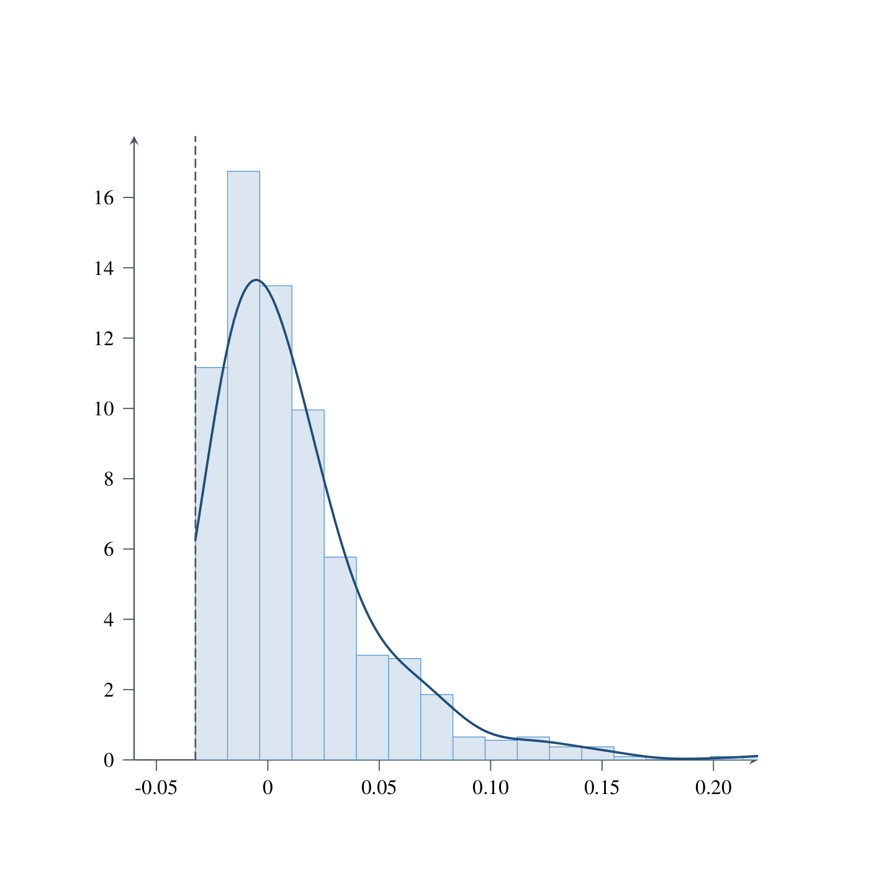
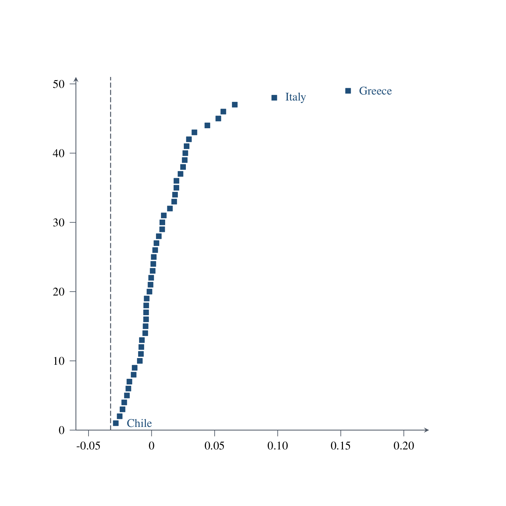
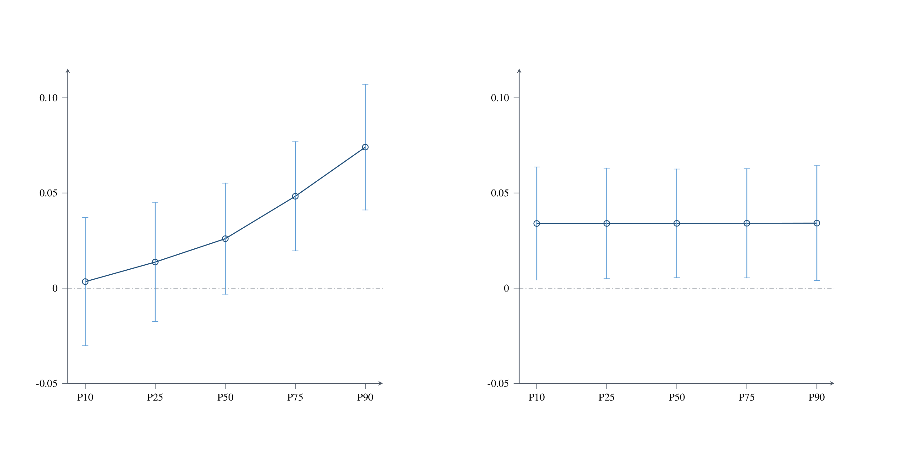
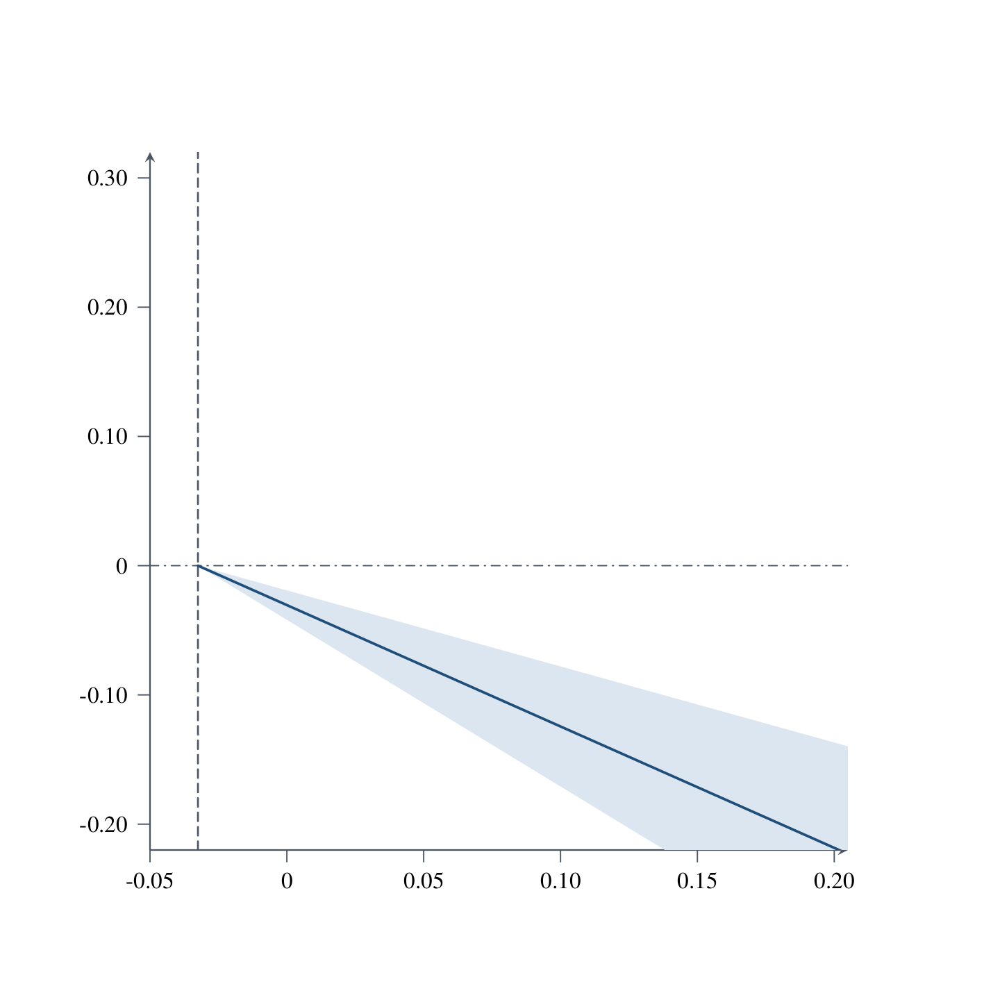
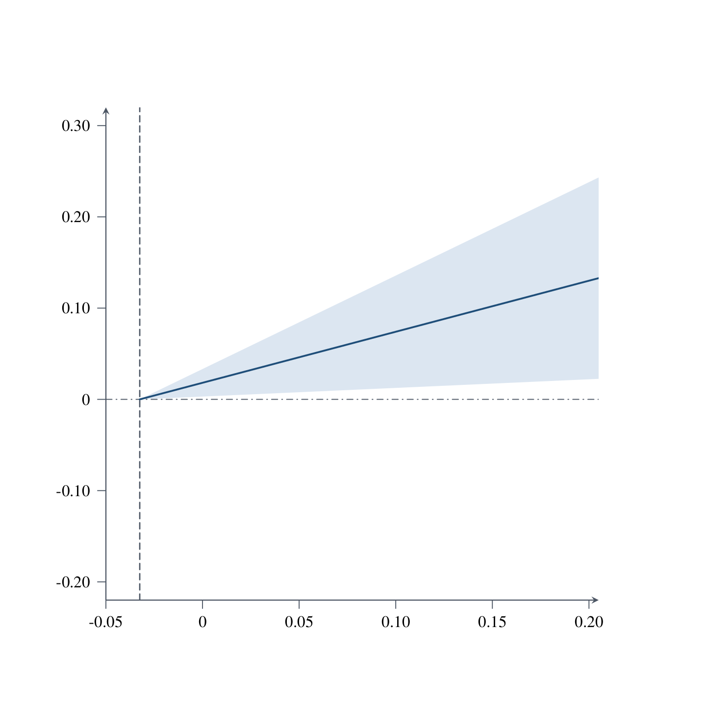
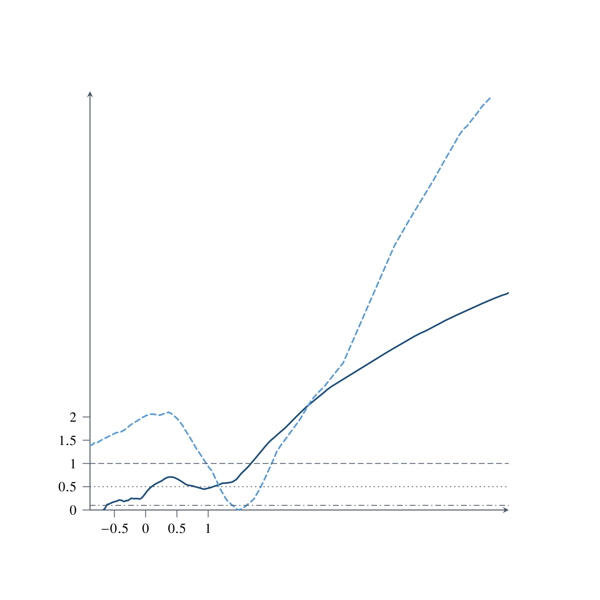

# Paper B：统一回归公式与结果表

> 数据：`data0804/invest_panel_weo.csv` 与 `WSDI/data/processed/wsdi_sovereign61_1995_2018.csv`；整合生成时间：2026-08-30 23:48（Asia/Shanghai）。
> 本文档呈现正式公式、回归表、边际效应、债务 cutoff 与竞争判据结果。数据检查和统计验证见 `paperB_diagnostics.md`。主面板源比率、百分数和 0—100 指数均先除以 100；WSDI 天数乘以 0.01 后作为 X 进入回归。

## 技术摘要

- Baseline 全交互模型中，A×b(t) 系数为 -0.0899（p=<0.001），A×X 系数为 -0.0007（p=0.984）。
- 全控制 T 指标模型的原始尺度适应能力系数为 -0.0331（p=0.155），A×X 系数为 0.1095（p=0.036）。
- 第四节唯一主规格的债务 cutoff 为 -0.0325；债务两支联合检验 p=<0.001，使用同一 cutoff 的 readiness 两支联合检验 p=0.061。
- 五个替代判据按各自当前变量取完整案例，N 范围为 744–1,005；完整 theta 的样本内 RSS=1.14108。因样本量可能不同，RSS 不作跨判据排名。
- 第 2—3 节为含国家与年份效应的动态面板 LSDVC 相关性估计，采用 Blundell–Bond 初始化、`bias(2)` 与 50 次 bootstrap 标准误；第 4 节仍为双向固定效应并报告国家聚类标准误。theta 和 cutoff 是生成量，末阶段聚类标准误仍未覆盖完整上游估计与 cutoff 搜索不确定性。

## 1. 统一符号、控制变量与估计口径

令 $s_{it}$ 为主权利差比率，$A_{it}$ 为适应能力比率，$X_{it}=wsdi\_days_{it}\times0.01$，$b_{it}=debt\_gdp_{it}$ 为当期债务状态。Baseline 的宏观控制为 Growth、Inflation，不控制 $\ln(ConstantGDP)$；T 指标方程的宏观控制仅为 Inflation，不控制 Growth；Doomloop 的宏观控制仍为 Growth、Inflation。外部控制为 Reserves、Terms of trade。全部模型含国家和年份效应。第 2—3 节使用 `xtlsdvc, initial(bb) bias(2) vcov(50)`：偏差修正精度为 $O((NT)^{-1})$，标准误来自 50 次 bootstrap；动态滞后因变量由 LSDVC 自动加入。第 4 节使用按 `country_id` 聚类的双向固定效应。每个回归使用其因变量、动态滞后项与当前右侧变量的联合非缺失样本，不再设置跨模型或跨阶段固定样本。生成量不向来源回归样本外外推：$\widehat m^A$ 限于 Spread_Interact_all 的实际样本，$\widehat T^A$ 限于 T10_interact_full 的实际样本，theta 限于两个来源样本的交集。`bias(2)` 在代表性规格中与 `bias(1)` 数值接近且稳定；`bias(3)` 曾在当前短而不平衡的面板上产生爆炸性动态系数，因此不作为主规格。

## 2. Baseline：主权利差回归

### 2.1 回归公式

$$s_{it}=\alpha_i+\lambda_t+\rho_s s_{i,t-1}+\beta_AA_{it}+\beta_Bb_{it}+\beta_XX_{it}+\beta_{AB}A_{it}b_{it}+\beta_{AX}A_{it}X_{it}+\Gamma_m'W^m_{it}+\varepsilon^m_{it}.$$

交互回归在对应完整交互式的实际样本内中心化。原始尺度适应能力斜率和边际利差节约为

$$\widehat\beta_A^{raw}=\widehat\beta_A^c-\widehat\beta_{AB}\bar b_s-\widehat\beta_{AX}\bar X_s,$$

$$\widehat m^A_{it}=-\left(\widehat\beta_A^{raw}+\widehat\beta_{AB}b_{it}+\widehat\beta_{AX}X_{it}\right).$$

### 2.2 逐步回归表

系数下方括号为基于 50 次 bootstrap 标准误的 z 值；`***`、`**`、`*` 分别表示 1%、5%、10% 显著性。

**Panel A：核心变量与控制变量**

| 变量/统计量 | (A_X_only) 仅 X | (A_A_only) 仅 A | (A_b_only) 仅 b(t) | (B_all_core) 三核心 | (C_macro) +宏观 | (Layer1_X) 第一层 | (Layer2_A) 第二层 |
| --- | ---: | ---: | ---: | ---: | ---: | ---: | ---: |
| WSDI 天数×0.01 $X_{it}$ | 0.0114** (2.042) | — | — | 0.0101* (1.854) | 0.009* (1.776) | 0.0098 (1.591) | 0.0091 (1.529) |
| 适应能力 $A_{it}$ | — | -0.034*** (-2.685) | — | -0.0421*** (-2.669) | -0.0293* (-1.898) | — | -0.0262* (-1.744) |
| 当期债务/GDP $b_{it}=debt\_gdp_{it}$ | — | — | 0.0069** (2.335) | 0.0051 (1.201) | 0.0055 (1.353) | 0.0041 (1.301) | 0.0043 (1.393) |
| 滞后主权利差 $s_{i,t-1}$ | 0.8135*** (28.863) | 0.8004*** (30.763) | 0.7885*** (45.552) | 0.7691*** (30.52) | 0.6608*** (27.218) | 0.6774*** (21.215) | 0.6657*** (20.857) |
| Growth | — | — | — | — | -0.1522*** (-8.803) | -0.1581*** (-9.317) | -0.155*** (-9.067) |
| Inflation | — | — | — | — | 0.1437*** (5.988) | 0.148*** (5.438) | 0.151*** (5.703) |
| Reserves | — | — | — | — | — | -0.009 (-1.388) | -0.0083 (-1.311) |
| Terms of trade | — | — | — | — | — | 0.0036 (0.787) | 0.0036 (0.811) |
| 宏观控制 | 否 | 否 | 否 | 否 | 是 | 是 | 是 |
| 外部控制 | 否 | 否 | 否 | 否 | 否 | 是 | 是 |
| 国家固定效应 | 是 | 是 | 是 | 是 | 是 | 是 | 是 |
| 年份固定效应 | 是 | 是 | 是 | 是 | 是 | 是 | 是 |
| 估计量 | LSDVC | LSDVC | LSDVC | LSDVC | LSDVC | LSDVC | LSDVC |
| 初始化 | Blundell-Bond | Blundell-Bond | Blundell-Bond | Blundell-Bond | Blundell-Bond | Blundell-Bond | Blundell-Bond |
| 偏差修正阶数 | 2 | 2 | 2 | 2 | 2 | 2 | 2 |
| Bootstrap 次数 | 50 | 50 | 50 | 50 | 50 | 50 | 50 |
| 标准误 | bootstrap | bootstrap | bootstrap | bootstrap | bootstrap | bootstrap | bootstrap |
| 动态滞后项 | L.bond_spreads | L.bond_spreads | L.bond_spreads | L.bond_spreads | L.bond_spreads | L.bond_spreads | L.bond_spreads |
| 国家数 | 50 | 61 | 63 | 50 | 50 | 50 | 50 |
| 年份数 | 23 | 28 | 28 | 23 | 23 | 20 | 20 |
| 样本量 | 823 | 1,213 | 1,248 | 814 | 813 | 744 | 744 |

**Panel B：交互模型**

| 变量/统计量 | (Interact_AB) A×b(t) | (Interact_AX) A×X | (Interact_all) 双交互 |
| --- | ---: | ---: | ---: |
| $A^c_{it}$ | -0.0342** (-2.329) | -0.0251* (-1.686) | -0.0341** (-2.343) |
| $X^c_{it}$ | 0.0092 (1.544) | 0.0088 (1.454) | 0.0092 (1.506) |
| $b^c_{it}$ | 0.0084*** (2.598) | 0.0044 (1.447) | 0.0084*** (2.623) |
| $A^c_{it}\times b^c_{it}$ | -0.0903*** (-4.164) | — | -0.0899*** (-3.954) |
| $A^c_{it}\times X^c_{it}$ | — | -0.0165 (-0.507) | -0.0007 (-0.021) |
| 滞后主权利差 $s_{i,t-1}$ | 0.6235*** (19.21) | 0.6642*** (20.867) | 0.6228*** (19.15) |
| Growth | -0.1482*** (-8.717) | -0.1547*** (-8.979) | -0.1481*** (-8.685) |
| Inflation | 0.1666*** (6.315) | 0.1512*** (5.708) | 0.1668*** (6.273) |
| Reserves | -0.0089 (-1.42) | -0.0081 (-1.278) | -0.0088 (-1.402) |
| Terms of trade | 0.0014 (0.329) | 0.0036 (0.81) | 0.0014 (0.327) |
| 宏观控制 | 是 | 是 | 是 |
| 外部控制 | 是 | 是 | 是 |
| 国家固定效应 | 是 | 是 | 是 |
| 年份固定效应 | 是 | 是 | 是 |
| 估计量 | LSDVC | LSDVC | LSDVC |
| 初始化 | Blundell-Bond | Blundell-Bond | Blundell-Bond |
| 偏差修正阶数 | 2 | 2 | 2 |
| Bootstrap 次数 | 50 | 50 | 50 |
| 标准误 | bootstrap | bootstrap | bootstrap |
| 动态滞后项 | L.bond_spreads | L.bond_spreads | L.bond_spreads |
| 国家数 | 50 | 50 | 50 |
| 年份数 | 20 | 20 | 20 |
| 样本量 | 744 | 744 | 744 |

### 2.3 构造用原始尺度系数

| 参数 | 估计值 | Bootstrap SE | z | p | 95% CI |
| --- | ---: | ---: | ---: | ---: | ---: |
| beta_A_raw | 0.0205 | 0.0204 | 1.005 | 0.315 | [-0.0195, 0.0604] |
| beta_AB | -0.0899 | 0.0227 | -3.954 | <0.001 | [-0.1345, -0.0454] |
| beta_AX | -0.0007 | 0.034 | -0.021 | 0.984 | [-0.0674, 0.066] |

展开：baseline 点边际效应

| 模型 | 点 | 调节变量 | 边际效应 | SE | p | 95% CI |
| --- | ---: | ---: | ---: | ---: | ---: | ---: |
| Interact_AB | P10 | 0.2645 | -0.0035 | 0.0174 | 0.842 | [-0.0376, 0.0307] |
| Interact_AB | P25 | 0.379 | -0.0138 | 0.0162 | 0.394 | [-0.0455, 0.0179] |
| Interact_AB | P50 | 0.5155 | -0.0261 | 0.0151 | 0.084 | [-0.0558, 0.0035] |
| Interact_AB | P75 | 0.7633 | -0.0485 | 0.0146 | <0.001 | [-0.0771, -0.02] |
| Interact_AB | P90 | 1.0503 | -0.0744 | 0.0163 | <0.001 | [-0.1064, -0.0425] |
| Interact_AB | Mean_minus_1SD | 0.2583 | -0.0029 | 0.0175 | 0.868 | [-0.0372, 0.0314] |
| Interact_AB | Mean | 0.6052 | -0.0342 | 0.0147 | 0.020 | [-0.063, -0.0054] |
| Interact_AB | Mean_plus_1SD | 0.952 | -0.0656 | 0.0155 | <0.001 | [-0.0959, -0.0353] |
| Interact_AX | P10 | 0.0539 | -0.0231 | 0.0153 | 0.131 | [-0.0531, 0.0069] |
| Interact_AX | P25 | 0.0945 | -0.0238 | 0.015 | 0.114 | [-0.0533, 0.0057] |
| Interact_AX | P50 | 0.1519 | -0.0248 | 0.0149 | 0.096 | [-0.0539, 0.0044] |
| Interact_AX | P75 | 0.2239 | -0.0259 | 0.015 | 0.083 | [-0.0553, 0.0034] |
| Interact_AX | P90 | 0.3256 | -0.0276 | 0.0158 | 0.079 | [-0.0585, 0.0032] |
| Interact_AX | Mean_minus_1SD | 0.0653 | -0.0233 | 0.0152 | 0.126 | [-0.0532, 0.0065] |
| Interact_AX | Mean | 0.1706 | -0.0251 | 0.0149 | 0.092 | [-0.0542, 0.0041] |
| Interact_AX | Mean_plus_1SD | 0.2758 | -0.0268 | 0.0153 | 0.080 | [-0.0568, 0.0032] |
| Interact_all | P10 | 0.2645 | -0.0034 | 0.0172 | 0.841 | [-0.0371, 0.0302] |
| Interact_all | P25 | 0.379 | -0.0137 | 0.0159 | 0.388 | [-0.0449, 0.0175] |
| Interact_all | P50 | 0.5155 | -0.026 | 0.0149 | 0.081 | [-0.0552, 0.0032] |
| Interact_all | P75 | 0.7633 | -0.0483 | 0.0146 | <0.001 | [-0.077, -0.0196] |
| Interact_all | P90 | 1.0503 | -0.0741 | 0.0168 | <0.001 | [-0.1071, -0.0411] |
| Interact_all | Mean_minus_1SD | 0.2583 | -0.0029 | 0.0172 | 0.867 | [-0.0367, 0.0309] |
| Interact_all | Mean | 0.6052 | -0.0341 | 0.0145 | 0.019 | [-0.0626, -0.0056] |
| Interact_all | Mean_plus_1SD | 0.952 | -0.0653 | 0.0158 | <0.001 | [-0.0963, -0.0343] |
| Interact_all | P10 | 0.0539 | -0.034 | 0.0151 | 0.025 | [-0.0637, -0.0043] |
| Interact_all | P25 | 0.0945 | -0.034 | 0.0148 | 0.022 | [-0.063, -0.005] |
| Interact_all | P50 | 0.1519 | -0.0341 | 0.0146 | 0.019 | [-0.0626, -0.0055] |
| Interact_all | P75 | 0.2239 | -0.0341 | 0.0146 | 0.020 | [-0.0628, -0.0054] |
| Interact_all | P90 | 0.3256 | -0.0342 | 0.0154 | 0.026 | [-0.0644, -0.004] |
| Interact_all | Mean_minus_1SD | 0.0653 | -0.034 | 0.015 | 0.024 | [-0.0635, -0.0045] |
| Interact_all | Mean | 0.1706 | -0.0341 | 0.0145 | 0.019 | [-0.0626, -0.0056] |
| Interact_all | Mean_plus_1SD | 0.2758 | -0.0341 | 0.0149 | 0.022 | [-0.0634, -0.0049] |

## 3. Empirical theta：边际 T 收益与经验指标

### 3.1 T 指标回归公式与时序

$$T_{it}=\frac{(ConstantGDP_{it})}{(ConstantGDP_{i,t-1})},\qquad T_{i,t+1}=\frac{(ConstantGDP_{i,t+1})}{(ConstantGDP_{it})}=F.T_{it}.$$

$$T_{i,t+1}=\alpha_i+\lambda_t+\gamma_AA_{it}+\gamma_XX_{it}+\gamma_{AX}A_{it}X_{it}+\rho_TT_{it}+\Gamma_T'W^T_{it}+\varepsilon^T_{i,t+1}.$$

T 指标交互模型在全控制交互式的实际样本内中心化，故 $\widehat\gamma_A^{raw}=\widehat\gamma_A^c-\widehat\gamma_{AX}\bar X_T$，且

$$\widehat T^A_{it}=\widehat\gamma_A^{raw}+\widehat\gamma_{AX}X_{it}=\widehat\gamma_A^c+\widehat\gamma_{AX}X^c_{it}.$$

### 3.2 T 指标逐步回归表

系数下方括号为基于 50 次 bootstrap 标准误的 z 值。所有规格均由 LSDVC 自动加入 $L.T_{i,t+1}=T_{it}$。

**Panel A：核心变量与控制变量**

| 变量/统计量 | (T1_X_only) 仅 X | (T2_A_only) 仅 A | (T3_persistence) 仅当期 T 指标 | (T4_all_core) 核心项 | (T5_macro) +宏观 | (T6_layer1_X) 第一层 | (T7_layer2_A) 第二层 |
| --- | ---: | ---: | ---: | ---: | ---: | ---: | ---: |
| WSDI 天数×0.01 $X_{it}$ | -0.002 (-0.173) | — | — | -0.0023 (-0.2) | -0.0027 (-0.239) | -0.0025 (-0.264) | -0.0029 (-0.311) |
| 适应能力 $A_{it}$ | — | -0.0227 (-1.331) | — | -0.0103 (-0.458) | -0.0117 (-0.522) | — | -0.0082 (-0.34) |
| $T_{it}=ConstantGDP_{it}/ConstantGDP_{i,t-1}$ | 0.3719*** (13.457) | 0.3595*** (14.561) | 0.3504*** (12.215) | 0.3711*** (13.518) | 0.3638*** (13.408) | 0.3427*** (10.549) | 0.3425*** (10.5) |
| Inflation | — | — | — | — | -0.0139 (-1.571) | -0.0197 (-1.374) | -0.0185 (-1.279) |
| Reserves | — | — | — | — | — | 0.0245** (2.51) | 0.0253*** (2.582) |
| Terms of trade | — | — | — | — | — | -0.0077 (-1.52) | -0.0081 (-1.535) |
| 宏观控制 | 否 | 否 | 否 | 否 | 是 | 是 | 是 |
| 外部控制 | 否 | 否 | 否 | 否 | 否 | 是 | 是 |
| 国家固定效应 | 是 | 是 | 是 | 是 | 是 | 是 | 是 |
| 年份固定效应 | 是 | 是 | 是 | 是 | 是 | 是 | 是 |
| 估计量 | LSDVC | LSDVC | LSDVC | LSDVC | LSDVC | LSDVC | LSDVC |
| 初始化 | Blundell-Bond | Blundell-Bond | Blundell-Bond | Blundell-Bond | Blundell-Bond | Blundell-Bond | Blundell-Bond |
| 偏差修正阶数 | 2 | 2 | 2 | 2 | 2 | 2 | 2 |
| Bootstrap 次数 | 50 | 50 | 50 | 50 | 50 | 50 | 50 |
| 标准误 | bootstrap | bootstrap | bootstrap | bootstrap | bootstrap | bootstrap | bootstrap |
| 动态滞后项 | L.T_lead | L.T_lead | L.T_lead | L.T_lead | L.T_lead | L.T_lead | L.T_lead |
| 国家数 | 52 | 61 | 63 | 52 | 52 | 52 | 52 |
| 年份数 | 23 | 27 | 27 | 23 | 23 | 23 | 23 |
| 样本量 | 1,179 | 1,645 | 1,699 | 1,179 | 1,178 | 1,024 | 1,024 |

**Panel B：交互模型**

| 变量/统计量 | (T8_interact_core) 交互核心 | (T9_interact_macro) 交互+宏观 | (T10_interact_full) 交互+全控制 |
| --- | ---: | ---: | ---: |
| $A^c_{it}$ | -0.0122 (-0.555) | -0.014 (-0.635) | -0.0149 (-0.645) |
| $X^c_{it}$ | -0.0015 (-0.131) | -0.0018 (-0.161) | -0.0005 (-0.05) |
| $A^c_{it}\times X^c_{it}$ | 0.0313 (0.564) | 0.0362 (0.649) | 0.1095** (2.098) |
| $T_{it}=ConstantGDP_{it}/ConstantGDP_{i,t-1}$ | 0.3708*** (13.439) | 0.3633*** (13.319) | 0.3401*** (10.418) |
| Inflation | — | -0.0143 (-1.611) | -0.0186 (-1.291) |
| Reserves | — | — | 0.0252** (2.572) |
| Terms of trade | — | — | -0.0086 (-1.642) |
| 宏观控制 | 否 | 是 | 是 |
| 外部控制 | 否 | 否 | 是 |
| 国家固定效应 | 是 | 是 | 是 |
| 年份固定效应 | 是 | 是 | 是 |
| 估计量 | LSDVC | LSDVC | LSDVC |
| 初始化 | Blundell-Bond | Blundell-Bond | Blundell-Bond |
| 偏差修正阶数 | 2 | 2 | 2 |
| Bootstrap 次数 | 50 | 50 | 50 |
| 标准误 | bootstrap | bootstrap | bootstrap |
| 动态滞后项 | L.T_lead | L.T_lead | L.T_lead |
| 国家数 | 52 | 52 | 52 |
| 年份数 | 23 | 23 | 23 |
| 样本量 | 1,179 | 1,178 | 1,024 |

### 3.3 边际 T 收益与 theta 构造

| 参数 | 估计值 | Bootstrap SE | z | p | 95% CI |
| --- | ---: | ---: | ---: | ---: | ---: |
| gamma_A_raw | -0.0331 | 0.0233 | -1.423 | 0.155 | [-0.0787, 0.0125] |
| gamma_AX | 0.1095 | 0.0522 | 2.098 | 0.036 | [0.0072, 0.2118] |

$$\widehat\theta^A_{it}=b_{it}\widehat m^A_{it}+\widehat T^A_{it},\qquad b_{it}=debt\_gdp_{it}.$$

构造支持集严格继承来源回归：`mA_hat` 仅在 Spread_Interact_all 的 `e(sample)` 内生成，`TA_hat` 仅在 T10_interact_full 的 `e(sample)` 内生成，theta 仅在二者共同覆盖时生成。

| 构造量 | 样本 | N | 均值 | SD | P10 | P50 | P90 |
| --- | ---: | ---: | ---: | ---: | ---: | ---: | ---: |
| mA_hat | theta_support | 744 | 0.0341 | 0.0312 | 0.0034 | 0.026 | 0.074 |
| spread_saving_component | theta_support | 744 | 0.0314 | 0.05 | 0.0009 | 0.0134 | 0.0778 |
| TA_hat | theta_support | 744 | -0.0144 | 0.0115 | -0.0272 | -0.0165 | 0.0025 |
| theta_hat_A | theta_support | 744 | 0.017 | 0.0521 | -0.0219 | 0.0028 | 0.0665 |
| theta_hat_A | all_constructible | 744 | 0.017 | 0.0521 | -0.0219 | 0.0028 | 0.0665 |

**图 1a：theta 分布与债务方程 cutoff**

[PNG](figures/figure1a_theta_distribution_cutoff.png) · [PDF](figures/figure1a_theta_distribution_cutoff.pdf) · 绘图数据：`doomloop/stata_outputs/theta_distribution_cutoff_plot_data.csv`

**图 1b：国家平均 theta 排序与债务方程 cutoff**

[PNG](figures/figure1b_theta_country_rank_cutoff.png) · [PDF](figures/figure1b_theta_country_rank_cutoff.pdf) · 绘图数据：`doomloop/stata_outputs/theta_country_rank_plot_data.csv`

**图 2：经验边际利差节约 $m^A$ 随债务与 WSDI 的变化**

图中 $m^A=-\partial Spread/\partial A$ 来自 `Interact_all`；每个面板分别改变一个调节变量的 P10、P25、P50、P75、P90，并将另一调节变量固定在该来源样本均值。误差棒为 LSDVC 50 次 bootstrap VCE 的点估计 95% 置信区间。

[PNG](figures/figure2_mA_by_debt_wsdi.png) · [PDF](figures/figure2_mA_by_debt_wsdi.pdf) · 绘图数据：`doomloop/stata_outputs/mA_by_debt_wsdi_plot_data.csv`

## 4. Doomloop：一期去状态变量主规格

### 4.1 方程与 cutoff 口径

$$\Delta debt_{i,t+1}=debt\_gdp_{i,t+1}-debt\_gdp_{it}.$$

$$\Delta debt_{i,t+1}=\alpha_i+\lambda_t+\beta_LA_{it}(c-\widehat\theta^A_{it})_++\beta_HA_{it}(\widehat\theta^A_{it}-c)_++\gamma_XX_{it}+\Gamma_B'W^B_{it}+\varepsilon^B_{i,t+1}.$$

$$A_{it}-A_{i,t-1}=\alpha_i+\lambda_t+\delta_LFT_{it}(\widehat c_B^\theta-\widehat\theta^A_{it})_++\delta_HFT_{it}(\widehat\theta^A_{it}-\widehat c_B^\theta)_++\gamma_XX_{it}+\Gamma_A'W^A_{it}+\varepsilon^A_{it}.$$

债务方程不另加入 $b_{it}$ 状态项，readiness 方程不加入 $A_{i,t-1}$。$\widehat c_B^\theta$ 仅由债务全控制方程在 theta 的全部可估观测值中按最小 RSS 选择；不设置 P10—P90 搜索范围或10%最小分支约束，只排除会使一侧 hinge 恒为零的样本最小值和最大值。readiness 不进行独立 cutoff 搜索。两类方程均显式控制 $X_{it}$，并依次加入 Growth、Inflation、Reserves 与 Terms of trade。

### 4.2 债务变化方程

| 变量/统计量 | (DN1_core) 核心项 | (DN2_macro) +宏观 | (DN3_full) +全控制 |
| --- | ---: | ---: | ---: |
| $A_{it}(c-\widehat\theta^A_{it})_+$ | -5802.4386*** (-5.116) | -4319.9713*** (-3.169) | -4143.3993*** (-3.239) |
| $A_{it}(\widehat\theta^A_{it}-c)_+$ | -0.8663*** (-4.345) | -0.9694*** (-5.175) | -0.9392*** (-5.382) |
| WSDI 天数×0.01 $X_{it}$ | 0.0808*** (3.203) | 0.085*** (3.483) | 0.0836*** (3.318) |
| Growth | — | -0.6003*** (-6.076) | -0.6046*** (-6.292) |
| Inflation | — | -0.1479 (-0.92) | -0.1238 (-0.764) |
| Reserves | — | — | -0.0345 (-0.665) |
| Terms of trade | — | — | 0.0383 (1.032) |
| 宏观控制 | 否 | 是 | 是 |
| 外部控制 | 否 | 否 | 是 |
| 国家固定效应 | 是 | 是 | 是 |
| 年份固定效应 | 是 | 是 | 是 |
| 聚类变量 | country_id | country_id | country_id |
| 聚类数 | 50 | 50 | 50 |
| 国家数 | 50 | 50 | 50 |
| 年份数 | 20 | 20 | 20 |
| 样本量 | 744 | 744 | 744 |
| Within $R^2$ | 0.278 | 0.337 | 0.343 |
| Overall $R^2$ | 0.072 | 0.119 | 0.133 |

### 4.3 Readiness 一阶差分方程：固定使用债务 cutoff

| 变量/统计量 | (RDN1_core) 核心项 | (RDN2_macro) +宏观 | (RDN3_full) +全控制 |
| --- | ---: | ---: | ---: |
| $FT_{it}(\widehat c_B^\theta-\widehat\theta^A_{it})_+$ | -734.9471 (-0.93) | -606.7113 (-0.72) | -704.3527 (-0.751) |
| $FT_{it}(\widehat\theta^A_{it}-\widehat c_B^\theta)_+$ | 0.3752 (1.397) | 0.5625** (2.427) | 0.5594** (2.419) |
| WSDI 天数×0.01 $X_{it}$ | 0.0082 (1.229) | 0.0074 (1.067) | 0.0073 (1.045) |
| Growth | — | 0.0862*** (3.269) | 0.0865*** (3.228) |
| Inflation | — | -0.0527 (-1.508) | -0.0551 (-1.627) |
| Reserves | — | — | 0.0044 (0.511) |
| Terms of trade | — | — | -0.0031 (-0.403) |
| 宏观控制 | 否 | 是 | 是 |
| 外部控制 | 否 | 否 | 是 |
| 国家固定效应 | 是 | 是 | 是 |
| 年份固定效应 | 是 | 是 | 是 |
| 聚类变量 | country_id | country_id | country_id |
| 聚类数 | 50 | 50 | 50 |
| 国家数 | 50 | 50 | 50 |
| 年份数 | 20 | 20 | 20 |
| 样本量 | 744 | 744 | 744 |
| Within $R^2$ | 0.198 | 0.209 | 0.21 |
| Overall $R^2$ | 0.171 | 0.173 | 0.173 |

### 4.4 全控制结果、边际效应与图形

| 结果方程 | cutoff 来源 | cutoff | RSS | 候选数 | N_low | N_high | 低支系数 | p_L | 高支系数 | p_H |
| --- | ---: | ---: | ---: | ---: | ---: | ---: | ---: | ---: | ---: | ---: |
| 债务变化 | 债务全控制 RSS | -0.0325 | 1.14108 | 742 | 1 | 743 | -4143.3994 | 0.002 | -0.9392 | <0.001 |
| Readiness | 继承债务 cutoff | -0.0325 | 0.197716 | — | — | — | -704.3527 | 0.456 | 0.5594 | 0.019 |

cutoff 搜索不设最小分支规模；若最优点只由极少数观测识别，相关分支系数可能非常大且不稳定，必须结合 N_low、N_high、RSS profile 与全管线 bootstrap 解读，不能仅依据条件 p 值作结构性解释。

点边际效应按 $m(\theta;c)=a(c-\theta)_++b(\theta-c)_+$ 计算；在 cutoff 处定义为 0。

展开：主规格点边际效应

| 方程 | 点 | $\theta$ | 边际效应 | 国家聚类 SE | p 值 | 95% CI |
| --- | ---: | ---: | ---: | ---: | ---: | ---: |
| 债务变化 | P10 | -0.0219 | -0.0099 | 0.0018 | <0.001 | [-0.0136, -0.0062] |
| 债务变化 | P25 | -0.0132 | -0.0181 | 0.0034 | <0.001 | [-0.0249, -0.0114] |
| 债务变化 | P50 | 0.0028 | -0.0331 | 0.0061 | <0.001 | [-0.0455, -0.0207] |
| 债务变化 | Mean | 0.017 | -0.0465 | 0.0086 | <0.001 | [-0.0638, -0.0291] |
| 债务变化 | Cutoff | -0.0325 | 0 | 0 | — | [0, 0] |
| 债务变化 | P75 | 0.0263 | -0.0552 | 0.0103 | <0.001 | [-0.0758, -0.0346] |
| 债务变化 | P90 | 0.0665 | -0.093 | 0.0173 | <0.001 | [-0.1277, -0.0583] |
| Readiness（债务 cutoff） | P10 | -0.0219 | 0.0059 | 0.0024 | 0.019 | [0.001, 0.0108] |
| Readiness（债务 cutoff） | P25 | -0.0132 | 0.0108 | 0.0045 | 0.019 | [0.0018, 0.0198] |
| Readiness（债务 cutoff） | P50 | 0.0028 | 0.0197 | 0.0081 | 0.019 | [0.0033, 0.0361] |
| Readiness（债务 cutoff） | Mean | 0.017 | 0.0277 | 0.0114 | 0.019 | [0.0047, 0.0507] |
| Readiness（债务 cutoff） | Cutoff | -0.0325 | 0 | 0 | — | [0, 0] |
| Readiness（债务 cutoff） | P75 | 0.0263 | 0.0329 | 0.0136 | 0.019 | [0.0056, 0.0602] |
| Readiness（债务 cutoff） | P90 | 0.0665 | 0.0554 | 0.0229 | 0.019 | [0.0094, 0.1014] |

| 债务变化 | Readiness（债务 cutoff） |
| --- | --- |
|  |  |

合并版：[PNG](figures/kink_marginal_effects_no_state.png) · [PDF](figures/kink_marginal_effects_no_state.pdf)

## 5. Criterion Decomposition / Competing Criterion Test

令阈值判据为 $q_{it}$，每个判据均在其因变量、分支构造量和全套控制变量共同非缺失的样本上估计

$$\Delta debt_{i,t+1}=\alpha_i+\lambda_t+\beta_LA_{it}(c-q_{it})_++\beta_HA_{it}(q_{it}-c)_++\gamma_XX_{it}+\Gamma_B'W^B_{it}+\varepsilon^B_{i,t+1},$$

$$q_{it}\in\left\{\widehat\theta^A_{it},\ b_{it},\ \widehat m^A_{it},\ \widehat T^A_{it},\ b_{it}\widehat m^A_{it}\right\}.$$

每种判据分别在自身全部可估观测值上搜索最小 RSS cutoff；不设置分位数范围或最小分支比例，仅排除使一侧 hinge 恒为零的两个端点。理论方向为 $\beta_L>0$、$\beta_H<0$；$N_{low}=\#\{q_{it}\le c\}$，$N_{high}=\#\{q_{it}>c\}$。

| Criterion | cutoff | beta_L | p_L | beta_H | p_H | theoretical signs | RSS | Within R2 | N | N_low | N_high |
| --- | ---: | ---: | ---: | ---: | ---: | ---: | ---: | ---: | ---: | ---: | ---: |
| $\widehat\theta^A_{it}$ | -0.0325 | -4143.3993 | 0.002 | -0.9392 | <0.001 | Partial (-,-) | 1.14108 | 0.3429 | 744 | 1 | 743 |
| $b_{it}$ | 0.081 | -0.9553 | 0.259 | -0.1467 | <0.001 | Partial (-,-) | 1.605584 | 0.298 | 1,005 | 11 | 994 |
| $\widehat m^A_{it}$ | -0.0086 | -10.1851 | 0.018 | -1.766 | <0.001 | Partial (-,-) | 1.126268 | 0.3515 | 744 | 20 | 724 |
| $\widehat T^A_{it}$ | -0.0326 | -415.2532 | <0.001 | -1.4537 | 0.147 | Partial (-,-) | 1.682063 | 0.2591 | 996 | 11 | 985 |
| $b_{it}\widehat m^A_{it}$ | 0.0023 | 10.8822 | 0.168 | -0.9699 | <0.001 | Match (+,-) | 1.139543 | 0.3438 | 744 | 119 | 625 |

各判据的 cutoff、分支系数和 RSS 均处于自身尺度与自身完整案例样本中。由于 N 可能不同，cutoff、系数和 RSS 不作跨行绝对排名；表格用于报告各判据内部的拟合、显著性、理论方向与阈值两侧覆盖。

## 6. 债务时点稳健性与全管线诊断

### 6.1 标准化 RSS profile 与近最优 cutoff 区间

标准化横轴为 $(c-median(\theta))/sd(\theta)$；纵轴为 $100\times(RSS/RSS_{min}-1)$。近最优区间保留超额 RSS 不超过 0.1%、0.5% 或 1.0% 的候选 cutoff。

| 规格 | 超额 RSS 阈值 | 最优 cutoff | 近优 cutoff 区间 | 标准化区间 | 候选数 | 候选占比 |
| --- | ---: | ---: | ---: | ---: | ---: | ---: |
| 当期债务 | 0.1% | -0.0325 | [-0.0325, -0.0299] | [-0.677, -0.627] | 12/742 | 1.6% |
| 当期债务 | 0.5% | -0.0325 | [-0.0325, 0.0588] | [-0.677, 1.077] | 448/742 | 60.4% |
| 当期债务 | 1% | -0.0325 | [-0.0325, 0.0888] | [-0.677, 1.653] | 702/742 | 94.6% |
| 滞后一期债务 | 0.1% | 0.0593 | [0.0559, 0.0639] | [1.388, 1.597] | 15/740 | 2.0% |
| 滞后一期债务 | 0.5% | 0.0593 | [0.048, 0.0721] | [1.183, 1.814] | 42/740 | 5.7% |
| 滞后一期债务 | 1% | 0.0593 | [0.0404, 0.0796] | [0.981, 2.01] | 77/740 | 10.4% |

深色实线为当期债务规格，浅蓝虚线为滞后一期债务规格；水平参考线对应 0.1%、0.5% 与 1.0% 超额 RSS。[PNG](figures/figure3_standardized_rss_profiles.png) · [PDF](figures/figure3_standardized_rss_profiles.pdf) · 数据：`robustness/standardized_rss_profile.csv`。

### 6.2 固定旧/new cutoff 的交叉敏感性

| theta 规格 | 固定 cutoff 来源 | cutoff | beta_L | p_L | beta_H | p_H | RSS | N | N_low | N_high |
| --- | ---: | ---: | ---: | ---: | ---: | ---: | ---: | ---: | ---: | ---: |
| 当期债务 | 当期债务 | -0.0325 | -4143.3496 | 0.002 | -0.9392 | <0.001 | 1.14108 | 744 | 1 | 743 |
| 当期债务 | 滞后一期债务 | 0.0593 | 1.2742 | <0.001 | -0.6429 | <0.001 | 1.146832 | 744 | 658 | 86 |
| 滞后一期债务 | 当期债务 | -0.0325 | 0 | — | -1.7211 | <0.001 | 1.081058 | 742 | 0 | 742 |
| 滞后一期债务 | 滞后一期债务 | 0.0593 | 2.5277 | <0.001 | -0.8315 | <0.001 | 1.066297 | 742 | 687 | 55 |

交叉固定 cutoff 表明低支符号对阈值位置高度敏感：当期 theta 固定在滞后规格 cutoff 时 beta_L 转为显著为正；滞后 theta 固定在当期 cutoff 时 beta_L 仍为正但不显著。高支在四种组合中均为负。

### 6.3 共同 742 个观测的规格比较

| 规格 | 重选 cutoff | beta_L | p_L | beta_H | p_H | RSS | N | N_low | N_high |
| --- | ---: | ---: | ---: | ---: | ---: | ---: | ---: | ---: | ---: |
| 当期债务 | -0.0325 | -4031.7634 | 0.002 | -0.9465 | <0.001 | 1.140116 | 742 | 1 | 741 |
| 滞后一期债务 | 0.0593 | 2.5277 | <0.001 | -0.8315 | <0.001 | 1.066297 | 742 | 687 | 55 |

共同 742 比较只固定末阶段债务方程的 country-year 样本，并沿用两套主流程各自在自然样本上生成的 theta；它未在共同 742 样本上重估上游 baseline 与 T 方程。因此该结果排除了末阶段两条额外观测的直接构成效应，但不能排除它们通过上游系数与 theta 的间接影响。

### 6.4 30 次配对国家块全管线 bootstrap

| 规格 | 有效/请求 | cutoff 最小 | P25 | 中位数 | P75 | 最大 | P(beta_L>0) | P(beta_H<0) | P(两支理论符号) | 较小分支中位占比 | P(较小分支<10%) | P(较小分支≤5个观测) |
| --- | ---: | ---: | ---: | ---: | ---: | ---: | ---: | ---: | ---: | ---: | ---: | ---: |
| 当期债务 | 30/30 | -0.0867 | -0.0297 | 0.0105 | 0.0575 | 0.1866 | 53.3% | 100.0% | 53.3% | 11.6% | 43.3% | 20.0% |
| 滞后一期债务 | 30/30 | -0.0793 | -0.0038 | 0.0309 | 0.093 | 0.2052 | 80.0% | 93.3% | 76.7% | 8.8% | 60.0% | 10.0% |

两种规格使用 seed=20260830 的同一国家抽样序列；有效/请求复制为 当期债务 30/30、滞后一期债务 30/30，合计失败 0 个规格复制。每次重新估计两条 theta 来源方程、theta、cutoff 与最终债务方程，但不在外层抽样内再嵌套 50 次 LSDVC VCE。搜索不设分位数范围或最小分支约束；较小分支频率直接报告，以揭示极端 cutoff 对系数稳定性的影响。cutoff 分布很宽，说明单一点 cutoff 的定位不稳定；本实验仅是小规模稳定性诊断，不是正式置信区间。

## 7. 结果解释边界

这些结果是相关性估计，不应表述为因果效应。第 2—3 节的 50 次 LSDVC bootstrap 标准误只对应各上游方程；第 4 节的国家聚类标准误处理国家内相关。新增 30 次国家块外层 bootstrap 传播了 baseline、T、theta、cutoff 与最终方程的点估计不确定性，但重复次数较少且未在每次抽样内嵌套标准误 bootstrap，因此只作为稳定性诊断。竞争判据使用各自完整案例样本，既不是同样本 RSS 比较，也不是非嵌套模型的正式显著性检验。
